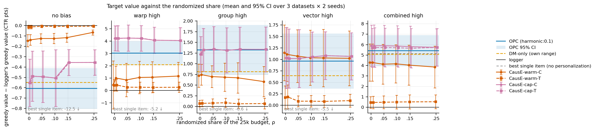
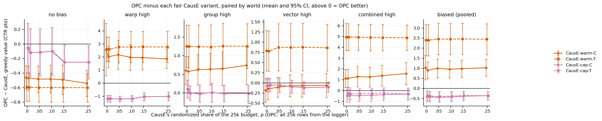
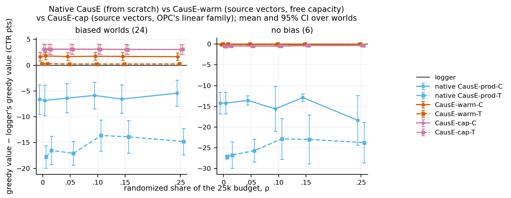
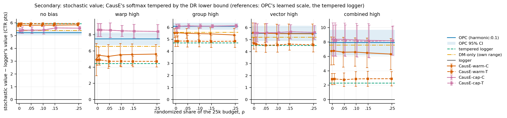
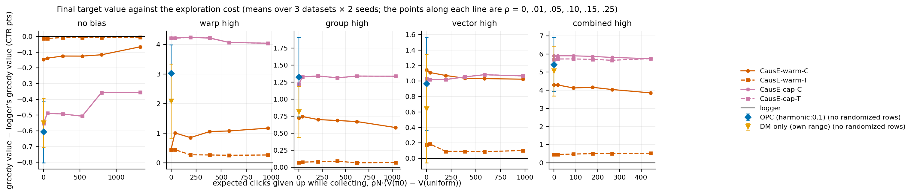

# CausE vs revalidated OPC: the fair 25k comparison (design, then results)

*Development stage, complete (2026-10-05). Branch `cause-fair`: the revalidated `CRM` (d5b4478) with the archived
CausE implementation merged (`origin/cause-baseline` = d31a5dd). The summary below comes first. §0–§7 hold the design,
fixed before the main grid ran: the search spaces of §3.1 were committed before any main-grid run. The results are in
§8–§10. Seeds 100/101 only: nothing here is confirmatory.*

## Summary

**Setup.**
- 30 worlds: ml, kuairand and anime × no bias, warp, group, vector and combined high × seeds 100/101.
- A fixed budget of N = 25,000 target interactions.
- OPC gets all N logger rows with their propensities. CausE gets (1 − ρ)N logger rows plus ρN uniform rows, with
  ρ ∈ {0, .01, .05, .10, .15, .25}.
- Greedy (ranking) value is the primary metric.
- Brackets are 95% CIs, paired by world, over the 24 biased worlds unless stated.

**Headline findings.**
- **At equal capacity, CausE does not lose to OPC: it wins, but not because of the randomized traffic.**
  - CausE-capacity-matched trains OPC's own correction family on the same source vectors with CausE's objective. It
    beats OPC at every ρ: OPC − CausE-cap-C is −0.41 [−0.66, −0.16] at ρ = 0 and −0.36 [−0.57, −0.15] at ρ = 0.25.
    OPC is ahead in only 4–6 of 24 worlds. The stochastic value with fair tempering agrees: −0.33 to −0.40.
  - The randomized rows add nothing. CausE-cap's greedy gain is +3.09 at ρ = 0 and +3.05 at ρ = 0.25, and every ρ
    differs from ρ = 0 by less than 0.05 points, with every CI covering 0.
  - At ρ = 0, CausE-cap uses no randomized rows and no propensities: it is a click-likelihood fit inside OPC's class,
    selected by validation NLL. That alone already beats OPC.
  - The lead comes from warp bias: −1.19 [−1.44, −0.95], CausE-cap ahead in 6/6 worlds. Group and vector are ties
    (+0.10, −0.07). Combined high favors CausE-cap without significance (−0.47 [−1.05, 0.12]).
- **CausE with its native capacity loses to OPC, even with OPC's source vectors.** OPC − CausE-warm is +1.03 [0.43,
  1.63] for the C prediction and +2.40 [1.63, 3.17] for T (24/24 worlds), at every ρ. CausE-warm-T barely leaves the
  logger: its treatment item rows learn only from the few uniform rows.
- **Why native CausE lost in M5: mostly the missing source representation, then capacity.**
  - CausE-warm − native CausE is +8.3 [5.8, 10.8] (C) and +18.1 (T).
  - CausE-cap − CausE-warm is a further +1.4 [0.7, 2.2] (C) and +2.8 (T).
- **Exploration is a pure cost at 25k.** At ρ = 0.25, CausE gives up 932 clicks per world while collecting: 20.6% of
  the clicks the all-logger collection earns. It buys no target value in either fair variant.
- **Capacity does not explain the OPC − CausE-cap gap.** The two share one structural ceiling, the Stage 1 linear-repair
  oracle, and no CausE-cap trial exceeded it. CausE-cap reaches 0.42 [0.35, 0.49] of it; OPC reaches 0.37 [0.31, 0.42].
  CausE-warm has the larger ceiling (all of the loss) yet repairs only 0.15 [0.09, 0.21]. Its deficit is learning from
  25k rows, not capacity.
- **CausE-cap at ρ = 0 also beats DM-only in its own range**, by +0.94 [0.49, 1.38] (22/24). Both learn without
  propensities or randomized rows, so OPC's DM-only arm is not the strongest no-propensity learner in OPC's class.

**What this does and does not show.**
- It does not show that randomized traffic beats propensities. Randomized traffic did nothing measurable here.
- It does show that, at 25k and on these worlds, CausE's learner in OPC's class (likelihood objective plus NLL
  selection) ranks better than OPC's (DR policy objective plus DR lower-bound selection).
- This experiment does not separate the objective from the selection rule.

**Recommendation.** Run 100k, but not as the full CausE grid (§10). The deciding question is now whether the in-class
likelihood learner keeps its lead as OPC improves with n. A secondary question is whether randomized rows start to pay
at 100k. The answers to the ten questions are in §9.

## 0. The question and the protocol

> Given the same useful source representation and the same total target-interaction budget, is it better to adapt
> using partly randomized target traffic, as in CausE, or ordinary warm-logger traffic with propensities, as in OPC?

**Budget.**
- Per world (dataset × bias × seed) and budget N = 25,000:
  - **OPC, DM-only and the tempered logger** see N warm-logger rows. OPC and the tempered logger also use their
    exact propensities.
  - **Every CausE variant at ρ** sees N_c = N − round(ρN) warm rows, the first rows of OPC's training split, plus
    N_t = round(ρN) uniform-random rows (pscore 1/|A|), a separate draw from the same world. So N_c + N_t = N
    exactly (`utils/budget_split.py`, unchanged from M5).
- ρ ∈ {0, 0.01, 0.05, 0.10, 0.15, 0.25}, prespecified and not tuned. N_t ∈ {0, 250, 1,250, 2,500, 3,750, 6,250}.
- The 20,000 warm validation rows are outside N and shared by every arm (decision A8 of `docs/cause_baseline.md`).
  They are the only rows any method selects on.

**Worlds.** Exactly the M5 grid, so valid rows are reused:
- ml, kuairand, anime;
- no bias, warp high, group high, vector high, combined high;
- seeds 100/101.

That is 30 worlds. Their logs are the corrected logs: on all 30, the tempered logger has exactly the same value in
M5 and in the corrected Stage 2 (revalidation Table R14).

**Notation.**
- x_i, a_j ∈ ℝ³² are the **source vectors**: the logger's biased user and item vectors (`our_x`, `our_a`; BPR v2
  after the representation bias).
- The logger is π0(j | i) = softmax_j(⟨x_i, a_j⟩ / T).
- The truth is q(i, j) = σ(s·⟨x*_i, a*_j⟩ + c) on the clean vectors. No method sees it.
- S_c and S_t are the warm and uniform training rows; V is the validation rows.

## 1. The three CausE variants

All three use the SP2V prediction model of CausE (eq. 21), z(i, k) = α⟨u_i, p_k⟩ + b_i + b_k + b with ŷ = σ(z). They
are trained by the released CausE objective (`docs/cause_baseline.md` §2.4), with momentum and linear decay (decision
A2). Each is selected by validation NLL on V, and evaluated exactly.

### 1.1 Native CausE (M5, reused unchanged)

- **Parameters:** U ∈ ℝ^{n_u×32}; an item table P with 2·n_a rows (row j = control θ^c_j, row j + n_a = treatment
  θ^t_j), each row with its own bias; user biases; b; α.
- **Initialization:** Xavier-uniform U and P, biases 0, α = 1e-8. CausE never sees the source vectors.
- **Loss** (one minibatch B of S_c rows mapped to control rows and S_t rows mapped to treatment rows):

```text
L_B = mean_B CE(y, σ(z(i, k)))
    + l2 · ½(‖U‖² + ‖P‖² + ‖b_users‖² + ‖b_items‖²)
    + cf · mean_B ‖P_k − sg(P_r(k))‖₁,     r(k) = k + n_a for control rows; S_t rows contribute 0
```

- **Rows reused:** `run_cause_dev_25k_cause_20261004`, reported as **Native CausE** (prod-C, prod-T, avg). It answers
  how the published method does natively here. It is not the random-vs-propensity test, because it lacks OPC's source
  information.

### 1.2 CausE-warm: native CausE capacity, OPC's source representation

The same parameters, objective, optimizer and search as native CausE-prod. Only the starting point changes: CausE
starts from the source representation OPC starts from.

| question | CausE-warm |
|---|---|
| fixed or trainable | Everything trainable, as in native CausE: U, both item tables, the per-row item biases, the user biases, b, α. Nothing is frozen |
| user representation | U_i ← x_i (the source user vector), shared by the control and treatment tasks (eq. 12/18), updated by both. Users without training rows keep x_i |
| control items | θ^c_j ← a_j (the source item vector), updated on S_c and by the tie |
| treatment (target) items | θ^t_j ← a_j: the treatment representation starts at the source / control representation. This is CausE's residual reading θ^t = θ^c + θ^Δ (eq. 16) with θ^Δ = 0 at the start. It is updated on S_t (and by the tie under the symmetric form) |
| biases, scale | α = 1e-8 and the per-row biases 0, exactly the native initialization. The intercept b starts at 0 (native) or at the logit of the click rate of CausE's own N training rows; the tuning stage decides (§3). Why it matters: the source vectors' dot products on logged pairs are large and positive, so with b = 0 the model starts at σ(0) = 50% against a ~10% click rate. The scale α then absorbs the miscalibration and can turn negative, inverting the ranking; a smoke test showed this. Native CausE never meets it, because its random initial vectors have near-zero dot products. Starting α at a fitted or logger scale was rejected as an extra, non-CausE step |
| discrepancy regularizer | The released L1 tie cf·mean_B ‖θ^c_k − sg(θ^t_k)‖₁ (one-way: it pulls the control rows toward the treatment rows), or the paper's eq. 18 reading without sg (symmetric). The direction is chosen in the tuning stage (§3) as a structural hyperparameter, then fixed |
| L2 | The native l2·½(‖U‖² + ‖P‖² + biases), which shrinks toward 0, not toward the source. Tuning chooses its strength, 0 included. Shrinking toward the source instead would be an invented advantage |
| ρ = 0 | S_t is empty. Under the one-way tie with l2 = 0 the treatment rows stay at a_j. The T prediction is then ⟨U_trained, a_j⟩: the user vectors are adapted on S_c, the items are the source. Under the symmetric tie the treatment rows follow the control rows. The C prediction is a click model fit on all N warm rows, pulled toward the treatment rows |
| evaluation | Two predictions from one trained model, as native prod. **CausE-warm-C** has logits α⟨U_i, θ^c_j⟩ + b^c_j and **CausE-warm-T** has α⟨U_i, θ^t_j⟩ + b^t_j. Greedy policy = argmax_j; stochastic = softmax_j (§2) |
| capacity | Free per-user and per-item vectors plus per-item biases. The class contains the true click model exactly (U = √s·x*, P = √s·a*, b = c), so its structural ceiling is the target-best value and its fraction of the oracle repair equals its fraction of the mismatch repaired (§4) |

CausE-avg is not warm-started. Its treatment task maps every uniform row to one pooled row, so it has no per-item
target representation to start from the source. Native CausE-avg stays among the native rows.

### 1.3 CausE-capacity-matched: OPC's source representation and OPC's correction family

CausE's objective (control task on S_c, treatment task on S_t, L1 discrepancy) is kept. Each free table is replaced by
OPC's correction family on the frozen source vectors: one global linear map per side, y = (I + D)x + b
(`models/models.py · GlobalLinearCorrection`, which OPC's policy uses).

```text
users:            u_i   = (I + D_u) x_i + b_u
control items:    θ^c_j = (I + D_c) a_j + b_c
treatment items:  θ^t_j = (I + D_t) a_j + b_t
logits:           z_c(i, j) = α⟨u_i, θ^c_j⟩ + b          z_t(i, j) = α⟨u_i, θ^t_j⟩ + b
loss on a batch B of S_c (control) and S_t (treatment) rows:
  mean_B CE(y, σ(z))
  + l2 · ½(‖D_u‖²_F + ‖b_u‖² + ‖D_c‖²_F + ‖b_c‖² + ‖D_t‖²_F + ‖b_t‖²)
  + cf · mean_B 1[k control] ‖θ^c_k − sg(θ^t_k)‖₁        (one-way; symmetric without sg)
init: D = 0, b_u = b_c = b_t = 0, so every vector starts at its source vector; α = 1e-8 (native); the global
      bias at 0 or at the base-rate logit of its own training rows (chosen in tuning, as for CausE-warm)
```

| question | CausE-capacity-matched |
|---|---|
| fixed or trainable | The source vectors x, a are frozen. D_u, b_u, D_c, b_c, D_t, b_t, b and α are trained (3·(32² + 32) + 2 = 3,170 parameters) |
| user representation | u_i = (I + D_u)x_i + b_u, shared by both tasks: OPC's user-side map |
| target item update | Through the treatment map only: (D_t, b_t) moves every item's target vector at once |
| discrepancy | The L1 tie of CausE in the treatment–control difference, ‖(D_t − D_c)a_k + (b_t − b_c)‖₁: CausE's eq. 16 residual restricted to the global linear family. Direction as in 1.2 |
| per-row biases | None. The per-user bias would not change any ranking. Per-item biases would add item offsets, which OPC's class does not have |
| ρ = 0 | No S_t rows. Under the one-way tie (D_t, b_t) gets no data gradient and stays at 0, so the T ranking uses the source items with the adapted user map. Under the symmetric tie it follows the control map. C is a likelihood fit of the user and control-item maps on the N warm rows: OPC's class, fit to the clicks, without propensities |
| evaluation | **CausE-cap-C** (θ^c) and **CausE-cap-T** (θ^t); greedy argmax_j z; stochastic softmax_j z (§2) |

**Relationship to OPC.**
- OPC's policy is softmax_j(s·⟨(I + D_u)x_i + b_u, (I + D_a)a_j + b_a⟩ / T) with learned s, D and b.
- CausE-cap's T policy is softmax_j(α⟨(I + D_u)x_i + b_u, (I + D_t)a_j + b_t⟩ + b); the global b cancels in the
  softmax.
- The two policy families are therefore identical: the same greedy rankings, and the same softmax policies up to the
  scale α ↔ s/T. A unit test checks that the two models give equal logits for the same maps.
- What differs is only the learning principle:
  - OPC maximizes the DR estimate of the policy value on N warm rows with exact propensities. Its selection is the DR
    lower bound with clip:10.
  - CausE-cap maximizes the likelihood of the observed clicks on (1 − ρ)N warm and ρN uniform rows, with the
    discrepancy tie. Its selection is validation NLL.

**Relationship to CausE.** The control and treatment tasks, the tie and the selection are CausE's. Only the residual
family changes:
- native free per-item residuals θ^Δ_j become one global residual map;
- free user vectors become a map of the source user vectors.

**Its structural oracle is OPC's.** Its greedy family equals OPC's, so the Stage-1 linear-repair oracle
(`run_oracle_repair_20260927`, the learner's class trained on the truth) is its oracle too. Its fraction of the
oracle repair is computed against the same bound.

## 2. Sharpness and policy evaluation

- **Primary: greedy (ranking) value.** argmax_j of each method's scores, valued exactly on the truth over every user.
  Sharpness cannot affect it.
- **Secondary: stochastic value.**
  - OPC learns a logit scale. The tempered logger is the logger's logits × s with s chosen by the DR lower bound on V.
  - A click predictor's softmax has no defined temperature (CausE's paper defines none; M5 used τ = 1).
  - CausE therefore gets the same mechanism the tempered logger uses. Its selected model's logits are multiplied by s,
    chosen by the DR lower bound with clip:10 on V. The grid is s ∈ {2⁻², …, 2¹²}, wider than OPC's post-tempering
    grid (0.25–16), because click log-odds are much flatter than a policy's logits. A smoke test hit the old grid's top
    at 16. A choice on the grid's edge is reported. At the top of the grid (2¹²) the softmax is effectively the
    greedy policy, so a choice there means "as sharp as possible".
  - The scale is searched for each prediction's NLL-selected trial. The selection does not depend on the scale, so
    this gives the same selected rows as tempering every trial (a unit test checks this; f72f8ed). The tuning
    stage tempered every trial. Every trial gets the DR estimate of its greedy policy.
  - The q̂ inside that score is fit on CausE's own N rows at that ρ, so the budget stays fair.
  - Both are reported: CausE's raw softmax (τ = 1) and the tempered one.
- **The tempered logger stays as the sharpening-only reference.** No gain that sharpening alone reaches is attributed
  to representation correction.

## 3. Hyperparameter fairness and the tuning protocol

**OPC.** The revalidated configuration (revalidation §2.9): DR, the direct gradient, harmonic:0.1, clip:10 with the
95% lower bound, lr 1e-4–2e-3, 5–30 epochs, the learned logit scale and the paired random sampler. Its rows are the
corrected Stage 2's 25k rows on the same 30 worlds; they are not rerun.

**Raw DR.** A secondary robustness reference: one OPC run with `--train-weights none` at 25k on the 30 worlds. It
does not double the experiment.

**DM-only.** Reported in its own best range, the old space (lr 1e-4–1e-3, 5–25 epochs), which was its best on the
tuning seeds (revalidation 2.3 and R12b). The ml / kuairand rows come from the decomposition runs; anime gets one
small 25k run. The shared-range DM rows are kept beside them.

**CausE.** Every CausE study draws 20 random-search trials per (variant, ρ, world), the same count as OPC's 20 trials
per world. Each is selected by validation NLL. The search space of each new variant is set on **separate tuning
worlds** before the main grid:
- **tuning worlds:** seeds 200/201 (never in the main grid) × ml, kuairand, anime × warp high, vector high, combined
  high; 25k; ρ ∈ {0.05, 0.25} (ρ is not tuned; two values check that the space works across ρ);
- **a wide search:** 40 trials per (variant, ρ, world) over
  - lr log-uniform on [1e-4, 3];
  - epochs {1, 3, 10, 30, 100, 300};
  - l2 {0, 1e-7, 1e-6, 1e-5, 1e-4, 1e-3, 1e-2};
  - cf {0, 0.01, 0.1, 1, 10, 100, 1000};
  - tie {one-way, symmetric};
  - the intercept's initialization {0, base rate} (warm families only);
- **analysis:** where the validation-selected trials and the best-true-value trials fall in each dimension;
  whether any optimum lies on a boundary; and the 20-trial protocol simulated on candidate sub-spaces by resampling
  the logged trials, as for OPC's range (revalidation 2.3);
- **decision rule, fixed now:** the main space for each variant is the candidate with the best mean selected greedy
  value over the tuning worlds. The tie direction and the intercept initialization are chosen the same way. Each
  dimension's range is widened if its optimum sits on an edge.

ρ is never tuned. Nothing is tuned on the 30 main worlds.

### 3.1 Tuning results and the chosen spaces

**Runs.** `run_cause_tune_cap_s200` and `run_cause_tune_warm_s200` (code e6ba2e3, pinned worktree; every trial
tempered). Each covers 18 tuning worlds (ml, kuairand, anime × warp / vector / combined high × seeds 200/201) × ρ
{0.05, 0.25} × 40 trials. The trial configurations depend on the seed, not on the world or ρ, so each family saw 80
distinct configurations. Tables: `artifacts/full_study/cause_fair_25k/tuning/` (`tuning_decision.csv`,
`tuning_marginals.csv`, `tuning_boundaries.csv`).

**How the rule was applied** (`training/analyze_cause_fair.py · tuning_decision`).
- Each candidate is a sub-space of the wide space.
- Its score is the mean, over 18 worlds × 2 ρ × 2 predictions, of the true greedy gain of the trial that a 10-trial
  study inside it selects (lowest validation NLL). The draws are resampled 300 times, and both predictions share them.
- The candidates come in two stages:
  1. the tie direction and the intercept initialization, each fixed or searched;
  2. on the best structure: six 2-decade lr windows, six epoch windows, the best of each combined, and the
     combination without the extreme l2 (1e-2) and cf (1000).
- A candidate needs at least 5 trials per cell on average.
- The chosen candidate is the eligible one with the best score, as fixed above.

**CausE-capacity-matched** (all 18 worlds; selected greedy gain over the logger's greedy value, CTR points):

| candidate | trials per cell | selected gain | minus wide [95% CI over worlds] |
|---|---|---|---|
| wide space | 40 | 3.00 | — |
| tie one-way / symmetric (intercept searched) | 19.5 / 20.5 | 3.06 / 3.10 | +0.06 [−0.13, 0.25] / +0.10 [−0.05, 0.24] |
| intercept 0 (tie searched) | 18.5 | 1.25 | −1.76 [−2.42, −1.09] |
| **intercept at the base rate** (tie searched) | 21.5 | 3.44 | +0.44 [0.29, 0.59] |
| base rate, lr 3e-4–3e-2 | 12.5 | 3.61 | +0.61 [0.39, 0.83] |
| base rate, epochs {30, 100, 300} | 10.5 | 3.60 | +0.60 [0.37, 0.83] |
| **base rate, lr 3e-4–3e-2, epochs {30, 100, 300}, l2 ≤ 1e-3, cf ≤ 100 (chosen)** | 6.0 | 3.64 | +0.64 [0.41, 0.88] |

- **Chosen space:**
  - lr log-uniform on [3e-4, 3e-2];
  - epochs {30, 100, 300};
  - l2 {0, 1e-7, 1e-6, 1e-5, 1e-4, 1e-3};
  - cf {0, 0.01, 0.1, 1, 10, 100};
  - the tie direction searched (one-way, symmetric);
  - the intercept at the base rate.
- **Most of the gain is the intercept.** A zero intercept loses 1.8 points. Fixing the tie direction adds nothing
  over searching it.
- **The windows mostly remove failures.** Above lr 0.1, 72–91% of the trials diverge. Short training underfits:
  trials with lr × steps / 2 ≤ 10 sit a median 5.6 points below their cell's best trial.
- **The top candidates are within 0.04 points of each other.** The rule takes the best of them, the narrowest. It
  is a sub-space of the next ones, so it cannot remove a region they found useful.
- **Boundaries.** What matters is the total step, lr × steps / 2. Inside the chosen space its optimum,
  log10 = 1–2, is interior:
  - 94% of the selected trials and 83% of the best-true trials fall there;
  - every epoch value reaches it within the lr window;
  - the median best-true lr is 8e-3, inside the window.
  - The best-true trial uses 300 epochs in 65% of cells, but half of the sampled trials in the space have 300 epochs,
    and the trials at 30, 100 and 300 epochs sit a similar distance below their cell's best (means −1.5 / −1.1 /
    −1.2 points). The rule's "widen at an
    edge" therefore does not apply.
- **Selection works for this family.** In the chosen space, NLL selection loses 0.11 points against the best of the
  10 drawn trials.

**CausE-warm** (all 18 worlds; the same scale):

| candidate | trials per cell | selected gain (C / T) | minus wide [95% CI over worlds] |
|---|---|---|---|
| wide space | 40 | 1.00 (1.72 / 0.27) | — |
| tie one-way / symmetric (intercept searched) | 19.5 / 20.5 | 0.92 / 1.09 | −0.07 [−0.26, 0.11] / +0.09 [−0.04, 0.22] |
| intercept at the base rate (tie searched) | 19.5 | 0.79 | −0.21 [−0.37, −0.05] |
| **intercept 0** (tie searched) | 20.5 | 1.12 | +0.13 [−0.01, 0.26] |
| intercept 0, lr 0.01–1 | 11.5 | 1.38 | +0.39 [0.15, 0.63] |
| intercept 0, epochs {30, 100, 300} | 10.5 | 1.45 | +0.45 [0.20, 0.70] |
| **intercept 0, epochs {10, 30, 100} (chosen)** | 8.5 | 1.46 (2.26 / 0.66) | +0.47 [0.22, 0.72] |

- **Chosen space:**
  - lr log-uniform on [1e-4, 3] (the full range);
  - epochs {10, 30, 100};
  - l2 and cf as in the wide space;
  - the tie direction searched;
  - the intercept at 0.
  The lr + epoch combination had 4.5 trials per cell and was not eligible.
- **The intercept goes the other way than for CausE-capacity-matched.** For CausE-warm, a base-rate intercept costs
  0.21 points. (CausE-warm has per-row biases, CausE-capacity-matched none; why the sign flips was not tested.)
  The smoke test's negative-α failure did not survive NLL selection.
- **Epochs matter more than lr.** One to three epochs underfit. 10–100 epochs and 30–300 epochs are within 0.02
  points of each other (the rule takes the former).
- **Boundaries.**
  - 100 epochs is the top of the chosen window but not of the wide space: the candidates with 300 epochs were
    evaluated and were no better.
  - The selected lr has median 0.049, and only 10% of the selected trials sit in the top half-decade of the range.
  - The total step lr × steps / 2 of the selected trials is mostly 10–100 (62%).
  - Divergence is 0.7% inside the space.
- **Weaker and less well selected than CausE-capacity-matched.** The selected gain is 2.26 points for C and 0.66 for
  T. NLL selection loses 0.31 points against the best of the 10 drawn trials.
- **Cost.** Without 300 epochs the warm main grid is cheaper than its tuning: the dense updates of 73k anime user
  vectors dominate the training time.

## 4. Capacity diagnostics

| variant | representation family | structural ceiling used |
|---|---|---|
| OPC, DM-only | (I + D)x + b per side on the source | Stage-1 linear-repair oracle (truth-trained) |
| CausE-capacity-matched | the same family (§1.3) | the same Stage-1 oracle, verified by the logit-equivalence test |
| CausE-warm, native CausE | free U, P and per-item biases | the class contains the true click model: ceiling = target-best value (exact, no training needed) |

Every arm reports both the fraction of the representation loss repaired, (V − V_logger) / (V_target_best −
V_logger) greedy, and the fraction of its own family's structural repair.
- **Equal capacity.** A gap between OPC and CausE-cap is about the learning principle and the data, not capacity.
- **Unequal capacity.** A gap between CausE-warm and CausE-cap is about capacity, given CausE's learning principle.

## 5. Measurements

For every arm × world, and for CausE × ρ:
- true greedy and stochastic CTR (CausE's stochastic both raw and tempered);
- gain over the logger;
- the fraction of the representation loss repaired, and the fraction of the arm's structural oracle repair;
- the selected model's validation estimate (OPC: DR lower bound; CausE: validation NLL, plus the DR estimate of its
  greedy and tempered policies);
- selection regret: the best-true-value trial minus the selected one;
- the data composition N_c / N_t and the trial budget.

For CausE also:
- ρ and the number of uniform rows;
- clicks collected (warm and uniform);
- the exploration cost, expected ρN·(V(π0) − V(uniform)) and realized.

## 6. Figures

1. Greedy value against ρ, one panel per bias, with uncertainty. Lines for OPC, DM-only, the logger and the best
   single item.
2. Final value against exploration cost. OPC sits at zero deliberate exploration cost.
3. Native vs warm vs capacity-matched CausE: the contributions of the source representation, the capacity and the
   randomized rows.
4. OPC − CausE against ρ for the two fair variants (paired).

## 7. Not in this stage

- CausE at 100k;
- new ρ values;
- BLOB;
- OPC redesign;
- richer correction architectures.

## 8. Results (25k, the 30 M5 worlds)

All numbers are CTR points over the logger. Greedy gain is measured against the logger's greedy value and stochastic
gain against the logger's own value. Brackets are 95% t-intervals over worlds, paired by world where stated: 24
biased worlds pooled, or 6 per bias type. The tables and figures are in `artifacts/full_study/cause_fair_25k/`
(`tables.md`, `table_*.csv`, `fig*`). Rebuild them with `python -m training.analyze_cause_fair compare …` (the
folder's README has the command).

### 8.1 Runs, budgets and checks

| run | code | content | wall clock (2026-10-05), workers |
|---|---|---|---|
| `run_cause_tune_cap_s200`, `run_cause_tune_warm_s200` | e6ba2e3 | §3.1 tuning (seeds 200/201) | 02:39–03:50 and 02:39–04:30, 2 each |
| `run_cause_fair_cap_25k` | 78b5a42 | CausE-cap main grid: 30 worlds × 6 ρ × 20 trials | 03:52–06:01, 2 then 3 (restarted at 04:02) |
| `run_cause_fair_warm_25k` | da83c7f | CausE-warm main grid: as above | 04:31–06:07, 3 |
| `run_cause_fair_opc_raw_25k` | e6ba2e3 | OPC with raw DR weights (secondary reference) | 02:40–04:51 in three parts, 1 |
| `run_cause_fair_dm_oldspace_anime` | e6ba2e3 | DM-only in its own range on anime | 02:40–03:20, 1 |
| reused: `run_cause_dev_25k_cause_20261004` | 77440c5 | native CausE (M5), unchanged | — |
| reused: `run_reval_stage2_{opc,base}_{mlkr,anime}`, `run_reval_stage2_oldspace_dm_mlkr` | d791849 | OPC (harmonic:0.1), DM-only, no-propensity, tempered logger | — |

| arm | trials per world | its search space came from |
|---|---|---|
| OPC (harmonic:0.1) | 20 | the revalidation's range study on seeds 200/201 (lr 1e-4–2e-3, 5–30 epochs) |
| DM-only, own range | 20 | its best range on the revalidation's tuning seeds (lr 1e-4–1e-3, 5–25 epochs) |
| native CausE | 20 per variant and ρ | pre-specified (`docs/cause_baseline.md` A3); not tuned |
| CausE-warm, CausE-cap | 20 per ρ (C and T come from the same 20 trainings) | §3.1: 40-trial wide studies on 18 tuning worlds × 2 ρ, then the pre-registered rule |

**Checks.**
- **Identical data.** In all 180 (world, ρ) cells, native, warm and cap CausE trained on the same rows: the same N_c
  and N_t, the same click sums of the warm and uniform rows, and the same validation rows (`table_data_identity.csv`).
  The logger's exact value agrees to 2e-8; it is computed in float32.
- **Determinism.** The cap run was restarted with more workers. The two worlds it recomputed are bit-identical to the
  first pass in every summary and trial column. The raw-DR run was stopped at 03:09, so that its anime worlds would not
  overlap the tuning's on the GPU (memory), and resumed with `--skip-completed`.
- **The ceiling.** No CausE-cap trial in any world (any ρ, either prediction) exceeds the Stage 1 linear-repair
  oracle. The closest comes within 1.49 points of it (`table_oracle_check.csv`). This is consistent with the
  logit-equivalence test that makes the oracle its structural ceiling (§1.3).
- **Two fixes during the stage.**
  - `--skip-completed` did not recognize the new families' labels (7823598). The restarted cap run therefore redid two
    worlds, identically.
  - The data-identity check needed a float tolerance (2592fbd).

### 8.2 Target value against ρ (greedy, primary)



*Figure 1. Greedy value against the randomized share, per bias. Mean and 95% CI over 3 datasets × 2 seeds. OPC with its
95% CI band, DM-only in its own range, the logger (0), and the best single item, which is named at the bottom of a
panel when it lies below the axis. Error bars at the same ρ are offset slightly.*

| arm | biased worlds (24) | no bias (6) |
|---|---|---|
| OPC (harmonic:0.1) | +2.69 [1.84, 3.53] | −0.61 [−0.80, −0.41] |
| OPC (raw DR) | +2.31 [1.58, 3.04] | −0.80 [−1.06, −0.54] |
| DM-only (own range) / (OPC's range) | +2.15 [1.30, 3.01] / +2.08 | −0.55 / −0.58 |
| no-propensity | +0.82 [0.58, 1.06] | −0.26 |
| CausE-cap-C, ρ = 0 / .01 / .05 / .10 / .15 / .25 | +3.09 / 3.12 / 3.12 / 3.11 / 3.07 / 3.05 | −0.55 / −0.49 / −0.49 / −0.51 / −0.36 / −0.36 |
| CausE-cap-T | +3.04 / 3.07 / 3.08 / 3.07 / 3.04 / 3.05 | as C |
| CausE-warm-C | +1.65 / 1.79 / 1.69 / 1.74 / 1.71 / 1.66 | −0.15 … −0.07 |
| CausE-warm-T | +0.28 / 0.29 / 0.23 / 0.24 / 0.23 / 0.24 | −0.01 |
| native CausE-prod-C / prod-T / avg (ρ = 0 → 0.25) | −6.6 → −5.4 / −17.8 → −14.8 / −4.9 → −5.1 | −14 … −27 |

- **The fair variants are flat in ρ.** CausE-cap moves by at most 0.05 points from ρ = 0, CausE-warm-C by at most 0.13,
  CausE-warm-T by at most 0.05. Every CI covers 0 (`table_rho_effect.csv`).
- **Only native CausE-prod-T gains from randomized rows:** +4.2 [2.4, 6.0] at ρ = 0.10 and +3.0 [1.3, 4.6] at 0.25. It
  starts from −17.8, and its treatment rows learn only from uniform rows.
- **C and T rank alike in CausE-cap.** They agree exactly in 42% of cells and differ by 0.03 points on average. The
  selected models put almost all their learning into the user map (norm about 1.1). The L1 tie holds the control
  item map on the treatment item map (gap ≈ 0). At ρ = 0 both item maps stay at the source (norm 0.001). At ρ > 0 the
  treatment map learns from the uniform rows (norm 0.06 at ρ = 0.01 up to 0.34 at 0.25) and the control map follows,
  without changing the ranking.

### 8.3 OPC against each CausE variant (paired)



*Figure 4. OPC − CausE, greedy value, paired by world (mean and 95% CI; above 0 means OPC is better).*

| OPC − … (greedy) | ρ = 0 | ρ = 0.05 | ρ = 0.25 |
|---|---|---|---|
| CausE-cap-C | **−0.41 [−0.66, −0.16]** (OPC higher in 6/24) | −0.44 [−0.68, −0.20] (5/24) | −0.36 [−0.57, −0.15] (6/24) |
| CausE-cap-T | −0.36 [−0.60, −0.11] (6/24) | −0.40 [−0.64, −0.16] (5/24) | −0.36 [−0.57, −0.15] (6/24) |
| CausE-warm-C | +1.03 [0.43, 1.63] (19/24) | +1.00 [0.53, 1.46] (19/24) | +1.03 [0.61, 1.44] (19/24) |
| CausE-warm-T | +2.40 [1.63, 3.17] (24/24) | +2.45 [1.68, 3.23] (24/24) | +2.44 [1.68, 3.21] (24/24) |
| native CausE-prod-C | +9.32 [6.86, 11.78] (23/24) | +9.08 (23/24) | +8.11 (23/24) |

By bias type (OPC − CausE-cap-C; ρ = 0, then ρ = 0.25):

| bias | ρ = 0 | ρ = 0.25 |
|---|---|---|
| warp high | −1.19 [−1.44, −0.95] (0/6) | −1.01 [−1.34, −0.69] (0/6) |
| group high | +0.10 [−0.14, 0.34] (3/6) | −0.01 [−0.24, 0.21] (2/6) |
| vector high | −0.07 [−0.22, 0.08] (2/6) | −0.10 [−0.23, 0.02] (2/6) |
| combined high | −0.47 [−1.05, 0.12] (1/6) | −0.32 [−0.86, 0.23] (2/6) |
| no bias | −0.05 [−0.39, 0.28] (2/6) | −0.25 [−0.48, −0.02] (1/6) |

- **By dataset** (biased, ρ = 0): ml −0.32 [−0.82, 0.18], kuairand −0.62 [−1.04, −0.20], anime −0.28 [−0.85, 0.30].
  The direction is the same on all three.
- **Against the other warm-only learners** (CausE-cap-C at ρ = 0, biased):
  - minus DM-only (own range): +0.94 [0.49, 1.38] (22/24);
  - minus no-propensity: +2.27 [1.50, 3.04] (24/24);
  - minus OPC: +0.41 [0.16, 0.66] (18/24).
- **CausE-warm against OPC by bias:** behind by +2.6 under warp, +0.6 under group and +1.1 under combined bias (OPC
  − warm-C, ρ = 0); a tie under vector bias (−0.18 [−0.47, 0.11]). It is ahead without bias (−0.46), where it stays
  near the logger.

### 8.4 Native vs CausE-warm vs CausE-capacity-matched



*Figure 3. The three CausE variants against ρ (greedy; biased worlds pooled, and no bias).*

| contrast, same ρ and prediction side (biased) | ρ = 0 | ρ = 0.25 |
|---|---|---|
| CausE-warm − native, C / T: **the source representation** at CausE's capacity | +8.29 [5.84, 10.75] (23/24) / +18.08 [15.94, 20.23] | +7.08 [5.05, 9.11] / +15.05 |
| CausE-cap − CausE-warm, C / T: **OPC's linear family** instead of free vectors, given the source | +1.44 [0.66, 2.21] (20/24) / +2.76 [1.88, 3.63] (24/24) | +1.39 [0.83, 1.94] / +2.81 |
| CausE-cap − native, C / T: both | +9.73 [7.20, 12.27] (24/24) / +20.84 | +8.47 / +17.86 |

Without bias the order between the two warm-started variants flips: CausE-cap − CausE-warm is −0.41 [−0.62, −0.19]
(C). CausE-warm stays at the logger; CausE-cap's user map moves it slightly below.

### 8.5 Stochastic value (secondary)



*Figure 1b. Stochastic value. CausE's softmax is tempered by the DR lower bound (§2). References: OPC's learned scale,
the tempered logger and DM-only.*

| arm | biased worlds | no bias |
|---|---|---|
| OPC (learned scale) | +6.75 [6.18, 7.33] | +5.22 |
| tempered logger (sharpening alone) | +3.99 [3.53, 4.45] | **+5.92** |
| DM-only (own range) | +6.23 | +5.39 |
| CausE-cap-C tempered, ρ = 0 / 0.25 | **+7.13 [6.36, 7.89]** / +7.08 | +5.38 / +5.58 |
| CausE-warm-C / warm-T tempered, ρ = 0 | +5.70 / +4.33 | +5.80 / +5.93 |
| CausE raw softmax (τ = 1), any variant | −11.7 to −13.7 | −18 to −21 |

- **OPC − CausE-cap-C (OPC's stochastic vs CausE's tempered value):** −0.37 [−0.61, −0.13] at ρ = 0 and −0.33 [−0.51,
  −0.14] at 0.25. This is the same picture as the greedy value.
- **CausE's raw softmax is not a usable policy.** Click log-odds are nearly flat across items. With the fair sharpening,
  about 20% of the selections take the grid's top scale (2¹², effectively greedy). The tempered values sit 0.05–0.07
  points below the greedy ones, so sharpening never adds value beyond the ranking.
- **Without bias, sharpening alone is best:** the tempered logger and CausE-warm-T, which is the logger in effect.
  Every learned arm loses 0.3–0.7 points there.

### 8.6 Exploration cost



*Figure 2. Final greedy value against the expected clicks given up while collecting. OPC and DM-only sit at zero.*

| ρ | uniform rows | expected clicks given up | realized | share of the all-logger collection's clicks |
|---|---|---|---|---|
| 0.01 | 250 | 38 | 41 | 0.9% |
| 0.05 | 1,250 | 190 | 184 | 4.1% |
| 0.10 | 2,500 | 380 | 376 | 8.3% |
| 0.15 | 3,750 | 570 | 557 | 12.3% |
| 0.25 | 6,250 | 950 | 932 | 20.6% |

Means over the 30 worlds. The cost is lower where the logger is worse (combined high), because there V(π0) − V(uniform)
is smaller. None of it buys target value in the fair variants (§8.2).

### 8.7 Capacity, selection and the oracle

| arm (biased) | share of the representation loss repaired | share of its own structural ceiling | ceiling | greedy selection regret |
|---|---|---|---|---|
| OPC (harmonic:0.1) | 0.27 [0.22, 0.33] | 0.37 [0.31, 0.42] | linear-repair oracle | 0.16 |
| OPC (raw DR) | 0.24 | 0.32 | linear-repair oracle | 0.18 |
| DM-only (own range) | 0.20 [0.15, 0.25] | 0.26 [0.20, 0.32] | linear-repair oracle | 0.42 |
| no-propensity | 0.09 | 0.12 | linear-repair oracle | 0.21 |
| CausE-cap-C, ρ = 0 / 0.25 | 0.33 [0.24, 0.41] / 0.32 | 0.42 [0.35, 0.49] / 0.42 | linear-repair oracle | 0.13 / 0.15 |
| CausE-warm-C, ρ = 0 / 0.25 | 0.15 [0.09, 0.21] / 0.16 | = the share of the loss | target best | 0.25 / 0.17 |
| CausE-warm-T | 0.03 | 0.03 | target best | 0.18 / 0.26 |
| native CausE-prod-C | −1.10 / −0.96 | — | target best | 2.67 / 1.69 |

- **Equal capacity: no capacity explanation.** CausE-cap and OPC share a ceiling: on average the oracle repairs 6.69
  of the 9.43 lost points. CausE-cap reaches more of it.
- **Unequal capacity: the larger class learns less.** CausE-warm's class contains the true click model, so its ceiling
  is the whole loss. Its 0.15 share is a learning problem at 25k: free per-user vectors, with about 0.3–4 training
  rows per user. CausE-cap − CausE-warm (+1.4, §8.4) is the price of that extra capacity under CausE's objective.
  This is not a statement about OPC. OPC never ran with free vectors.
- **Selection.** NLL selects well for CausE-cap: it loses 0.13–0.15 points against the best of the 20 trials, about
  OPC's regret (0.16). Selecting CausE-cap by the DR lower bound of each trial's greedy policy would lose 0.19–0.27
  points more (`table_selection_rule.csv`, a diagnostic, not CausE's protocol). For CausE-warm-T it would gain
  0.16–0.21. Among the reference arms, DM-only's selection by its own reward model has the largest regret (0.42).
- **Selected configurations** (main grid):
  - CausE-cap: one-way tie in 66% of cells, cf 0.01–0.1 in 58%, mostly 100 epochs, median lr 0.011, 1.4% of trials
    diverged.
  - CausE-warm: symmetric tie in 56%, cf ≤ 0.1 in 89%, mostly 10 epochs, median lr 0.14, 6.4% diverged.

### 8.8 Caveats and anomalies

- **Scope.** This is a development stage: 25k only, 3 datasets × 2 seeds per bias type, and CIs over worlds.
  Differences of a few tenths of a point rest on 24 paired worlds, and per-bias contrasts on 6.
- **The selection rules differ by design.** CausE uses validation NLL, OPC the DR lower bound. The experiment does not
  separate CausE-cap's training objective from its selection rule.
- **The search spaces were set by different procedures.** OPC's came from its revalidation. Both new CausE variants'
  came from the pre-registered rule on 80 configurations per family, which picked narrow spaces (6–8.5 trials per
  tuning cell). Narrow spaces concentrate the main grid's 20 trials, which helps CausE. Native CausE's space was not
  re-tuned.
- **The tie choice matters for the mechanism, not for the ranking.** CausE-cap's L1 tie makes its two item maps nearly
  equal. Its value therefore comes from the user map, and the randomized rows only move the tied item maps.
- **The no-bias worlds.** Every learned arm sits below the logger's greedy value, by up to 0.8 points: OPC 0.61,
  CausE-cap 0.36–0.55, CausE-warm-C 0.07–0.15. CausE-warm-T is within 0.01.
- **The best single item** is below the logger everywhere except combined high, where one item for everyone beats the
  biased logger by 5.2 points.
- **The DR estimate of a greedy CausE policy** (validation, clip:10) understates its true value by about 1 point. It is
  reported, not used.
- **Reused rows.** Native CausE comes from M5, at code 77440c5 with identical data. OPC, DM-only, no-propensity and the
  tempered logger come from the corrected Stage 2. Raw DR and DM-only's anime rows are new and paired by world.

## 9. The ten questions

All answers are for the 24 biased worlds, greedy value, unless stated.

1. **How much of CausE's weakness was the missing source representation? Most of it.**
   - Starting CausE at OPC's source vectors (CausE-warm) instead of random vectors gains +8.3 [5.8, 10.8] (C) and
     +18.1 [15.9, 20.2] (T) at ρ = 0.
   - Native CausE-prod-C sits at −6.6, CausE-warm-C at +1.65.
2. **Native vs capacity-matched.** CausE-cap − native CausE-prod is +9.7 [7.2, 12.3] (C) and +20.8 (T) at ρ = 0, and
   +8.5 / +17.9 at ρ = 0.25; CausE-cap is higher in 24/24 worlds. The split: about 8.3 from the source representation
   and 1.4 from replacing free vectors by OPC's linear family (§8.4).
3. **At equal capacity, randomized traffic vs propensities: neither the randomized rows nor the propensities decide.**
   - CausE-cap beats OPC by 0.36–0.44 at every ρ, including ρ = 0, where it uses neither.
   - The randomized rows change CausE-cap by at most 0.05 points.
   - So, at equal capacity, the likelihood learner in OPC's class beats OPC's DR learner on these worlds. The
     randomized share is irrelevant to that at 25k.
4. **At which ρ does CausE reach OPC? It depends on the variant, not on ρ.**
   - CausE-cap is above OPC at every ρ, already at 0.
   - CausE-warm and native CausE stay below OPC at every ρ, by +0.9–1.0 (warm-C), +2.4 (warm-T) and +8–9.5 (native
     prod-C).
5. **How close? The fair CausE variants bracket OPC.** CausE-cap is +0.4 above it (stochastic, tempered: +0.33–0.40);
   CausE-warm-C is 1.0 below, CausE-warm-T 2.4 below.
6. **How much online reward is given up?** On average per world, 41 / 184 / 376 / 557 / 932 clicks at ρ = 0.01 /
   .05 / .10 / .15 / .25: 0.9–20.6% of the all-logger collection's clicks. It buys no target value in either fair
   variant (§8.6).
7. **By mismatch type (OPC − CausE-cap-C at ρ = 0).**
   - warp −1.19 [−1.44, −0.95], CausE-cap ahead in 6/6 worlds;
   - combined −0.47 [−1.05, 0.12], not significant;
   - group +0.10 and vector −0.07, ties.
   - CausE-warm-C trails OPC under warp (2.6), combined (1.1) and group (0.6) bias, and ties under vector bias.
   - No bias type shows a ρ effect in the fair variants.
8. **No mismatch.** Every learned arm loses a little against the logger's greedy value: OPC −0.61, DM-only −0.55,
   CausE-cap −0.55 → −0.36, CausE-warm-C −0.15 → −0.07. CausE-warm-T stays at the logger.
   - OPC − CausE-cap is −0.05 [−0.39, 0.28] at ρ = 0 and −0.25 [−0.48, −0.02] at ρ ≥ 0.15.
   - In stochastic value, sharpening the logger is best (+5.92). CausE-warm-T matches it (+5.93), OPC is at +5.22.
9. **Do capacity differences explain the results? Only between CausE-warm and CausE-cap.**
   - OPC and CausE-cap share a structural ceiling, and no CausE-cap trial exceeded it. CausE-cap reaches 0.42 of it,
     OPC 0.37, so their gap is not about capacity.
   - CausE-warm's larger class (ceiling = the whole loss) reaches only 0.15 of the loss. Its gap to CausE-cap
     (+1.4) is learning from 25k rows with free per-user vectors.
   - Selection explains little: CausE-cap's NLL regret is 0.13–0.15, OPC's 0.16.
10. **Does OPC still beat the strongest fair CausE? No, not at 25k.**
    - CausE-capacity-matched leads OPC by 0.41 [0.16, 0.66] at ρ = 0 and 0.36 [0.15, 0.57] at ρ = 0.25, in both
      predictions and in the tempered stochastic value.
    - The lead is concentrated in the warp worlds.
    - "Strongest" picks one of 4 arms × 6 ρ after the fact, but the lead holds for every one of the 12 CausE-cap
      cells, so it is not a selection artifact.
    - OPC does beat CausE at native capacity (warm, native) by 1–9.5 points.

## 10. Is 100k worth running?

**Recommendation: yes, as a targeted run, not the full grid.**

**What 25k left open.**
- (a) Does the in-class likelihood learner (CausE-cap, ρ = 0) keep its lead over OPC as n grows? In the revalidation
  OPC's share of the oracle repair rose from 0.38 at 25k to 0.49 at 100k. If OPC overtakes CausE-cap at 100k, the
  25k result is a small-data effect. If not, the strongest no-propensity baseline in OPC's class is this learner, not
  DM-only. That would matter for every OPC claim against DM-only.
- (b) Do randomized rows start to pay at larger N? At 100k and ρ = 0.25 there would be 25k uniform rows, 2–7 per item.
  CausE-warm-T and native prod-T did gain from uniform rows (native prod-T: +3–4 at ρ ≥ 0.10), but from very low
  levels.

**Suggested scope:**
- CausE-cap, ρ ∈ {0, 0.05, 0.25}, and CausE-warm-T at ρ = 0.25 only;
- on the same 30 worlds at 100k;
- with OPC, DM-only and the tempered logger reused from the corrected Stage 2's 100k rows;
- with the §3.1 search spaces kept fixed.

**Cost.** The 25k main grids took about 2 h each on 3 workers. At 100k the training data per epoch are 4× larger, so
roughly 5–8 h for this subset.

**For a separate decision** (out of scope here: no OPC redesign in this stage):
- an OPC-side check on whether the gap is the objective or the selection, for example OPC's policy class fitted by
  click likelihood and selected by the DR lower bound;
- reporting the in-class likelihood learner as an additional baseline.
