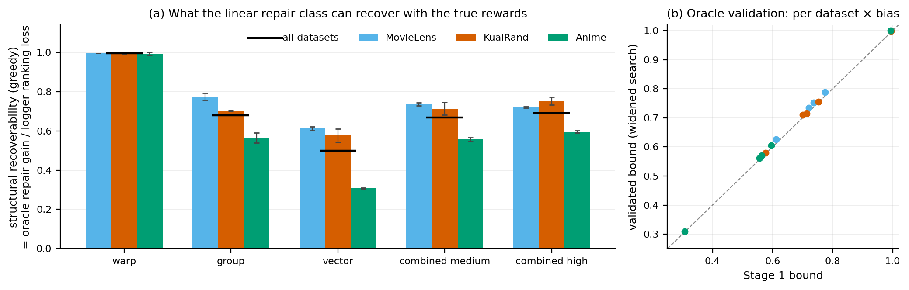
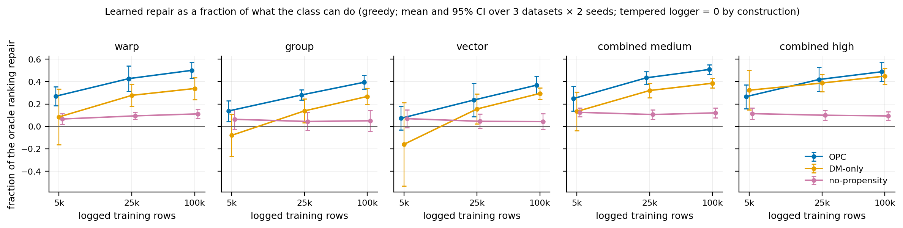
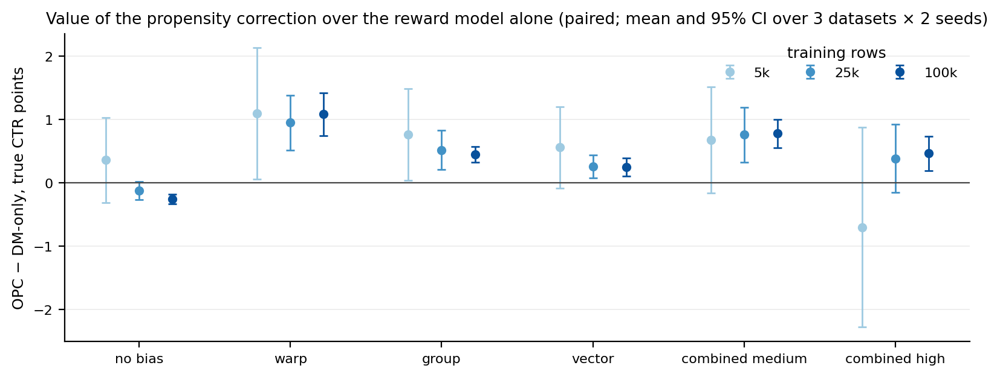
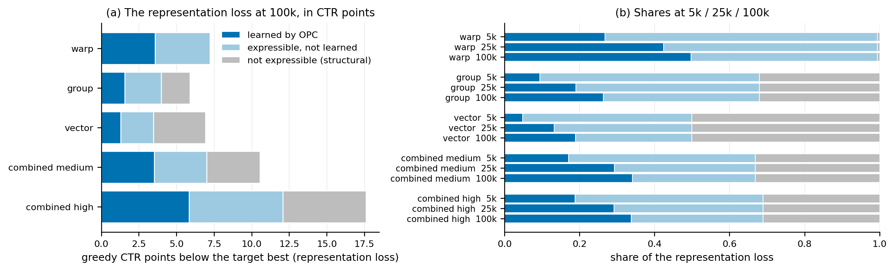
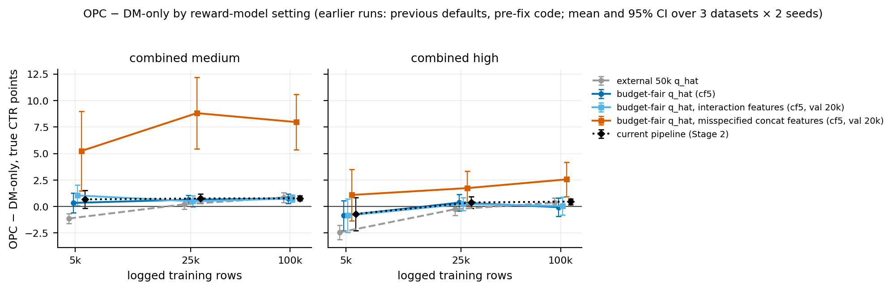
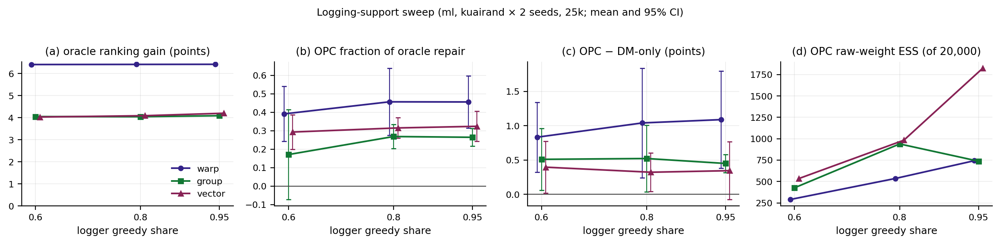
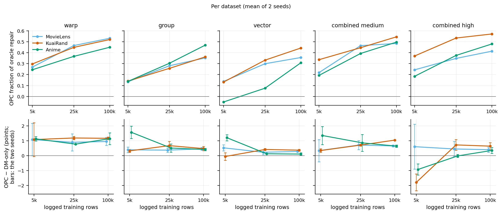

# Correcting a source representation from logged feedback: experimental report (development, 2026-09-28)

> **Historical: buggy logging simulator.**
> - **The bug.** The learned results here were produced by the logging simulator of commits 69fffab..c11b2b3
>   (2026-09-24 to 2026-10-04). In it, each logged action reused the random draw that picked its user. A user
>   therefore received a nearly fixed action, while the stored propensity was the logger's softmax probability.
> - **Scope.** Section C (Stage 1 and its validation) and the structural gap use no logs and are unaffected; every learned result (sections D–J) is affected.
> - **Superseded by** [the revalidation on the fixed simulator](simulator_fix_opc_revalidation_20261004.md).
>   Corrected counterparts of this report's tables (in `artifacts/full_study/opc_revalidation_20261004/report/tables.md`):
>   - Table 2 → R1; Table 3 → R2, and old vs corrected in R4a–c;
>   - Table 4 → R7; Table 5 → R6; Table 6 → R9;
>   - Table 7 → the revalidation's §2.7–2.8; Table 8 → R11; Table 9 → R10.
>
>   Every finding of sections D–J is classified old vs corrected in R13.
> - **This document** is kept unchanged as the record of what was run and concluded at the time.

This is one report of every representation-repair experiment run so far. Everything is **development** evidence
(seeds 100/101), used to design and understand the method; confirmatory runs on fresh seeds are still to come.

**Sources.**
- Figures and tables are built by `training/representation_report.py` from the committed summaries
  (`artifacts/full_study/summaries_20260927/`) and, for the earlier development tests only, from their run folders.
- Each figure's plotted values are in a CSV beside it in `artifacts/full_study/report_20260928/`.
- Background:
  - [representation_repair_dev_20260927.md](representation_repair_dev_20260927.md) (Stages 1–3);
  - [representation_repair_followup_20260927.md](representation_repair_followup_20260927.md) (oracle validation,
    per-dataset views, gap decomposition);
  - [decision_record_opc_objective_weighting.md](decision_record_opc_objective_weighting.md);
  - [training_losses.md](training_losses.md) §9;
  - code changes: [roee_handoff_20260928.md](roee_handoff_20260928.md).

## A. Experimental setup

- **Datasets.** Three implicit-feedback datasets, embedded by BPR v2 (Bayesian Personalized Ranking, 32
  dimensions):
  - MovieLens-1M (ml): 6,038 users × 3,533 items;
  - KuaiRand (kuairand): 27,111 × 7,579;
  - Anime: 73,417 × 10,803.
- **Truth.** The clean BPR vectors define the true click model q(u, a) = sigmoid(α·z + b), where z is the
  standardized clean taste score. α puts each user's best item at a 30% click-through rate (CTR). b sets the CTR of
  a fixed reference policy, the unsharpened logger at medium bias, to 5%. The truth is the same for every bias
  setting of a dataset and seed.
- **Mismatch.** The logger, the reward model and the learned policy see only a distorted ("source") copy of the
  vectors; section B describes the distortions. The target is the true click model.
- **Logger.** A softmax over the distorted vectors, sharpened until its CTR is 80% of its own greedy CTR (the
  "logger greedy share"; 0.6 and 0.95 in Stage 3).
- **Data.** Each training size, 5,000 / 25,000 / 100,000 logged rows, is its own logged sample with known
  propensities. Validation always uses 20,000 further logged rows.
- **Reward model (q̂).**
  - Logistic regression on [x, a, x·a] (interaction features) over the distorted vectors.
  - Budget-fair: it is fit on each size's own training rows, never on extra data.
  - It is cross-fitted by user in 5 folds for the training losses.
- **Policy class.** The frozen distorted vectors, with one linear correction per side, (I + D)x + b, plus a
  learnable logit scale (sharpness). It starts exactly at the logger.
- **Arms** (all train the same class):
  - **OPC** (off-policy correction): the doubly robust (DR) objective DM(q̂) + w(r − q̂). The importance weight w is
    the ratio of the policy's to the logger's probability, transformed by Metelli's harmonic correction with λ =
    0.1, and differentiated directly.
  - **DM-only** (direct method): the reward model's value alone, with no propensities.
  - **No-propensity:** the naive average logged reward.
  - **Tempered logger:** no training; only the logger's sharpness is searched.
- **Search and selection.**
  - 20 trials per size, drawn by a seeded random sampler with no warm start.
  - OPC, DM-only and no-propensity share each trial's configuration and seed, so the arms are paired.
  - Each arm selects a trial by its own score: OPC by the DR lower bound on validation with clip:10 weights, DM-only
    by q̂, no-propensity by the naive score.
- **Evaluation.** Every policy's true value is computed exactly over the user prior: V(π) = Σᵤ prior(u) Σₐ
  π(a|u) q(u, a).
  - **Stochastic value** is that of the softmax policy.
  - **Greedy value** is the true CTR of recommending each user the policy's top item. It compares rankings only;
    sharpening cannot change it.
- **Oracle repair (Stage 1).** The same policy class, trained on the true click model instead of logs: Adam from
  the logger, with no logged data, reward model or selection. It measures what the class can recover in
  principle.
- **Grid.**
  - Stage 2: 6 bias settings × 3 sizes × 3 datasets × 2 seeds × 4 arms.
  - Every "± CI" is a 95% t-interval over the paired dataset × seed conditions (n = 6, or 4 in Stage 3).

## B. The representation mismatches

Each type mixes the clean vectors with a distorted target, x ← (1 − ε)x + ε·target, and rescales to the clean
norm. It is applied to users and items.

| type | target | intended to model | expressible by one linear map per side? |
|---|---|---|---|
| **warp** | x_clean · W for one random matrix W | a globally rotated / sheared embedding space (e.g. a source model trained on a different objective) | yes: the mixture is itself linear, so (I + D) can undo it |
| **group** | one Gaussian offset per k-means cluster | cohort-level shifts (segments or categories displaced together) | partly: a single linear map cannot move clusters by different offsets |
| **vector** | one Gaussian offset per user or item | idiosyncratic per-entity noise | least: independent offsets share no structure |
| **combined** | all three at medium or high | a realistic mix | partly |

**Levels.** ε is calibrated per dataset and seed so that all three types together keep 90 / 75 / 50% of the taste
signal (low / medium / high). "High" on one type alone keeps about 88%.

## C. Structural recoverability (Stage 1)

**Definitions.**
- The target best is the ceiling: each user's truly best item.
- The logger's ranking loss is the ceiling minus the logger's greedy value.
- The oracle repair gain is the oracle's greedy value minus the logger's.
- **Structural recoverability** = oracle repair gain / logger ranking loss.

**Table 1. Structural recoverability (Stage 1, greedy)**

Each cell: logger ranking loss (points) / oracle repair gain (points) / structural recoverability (validated bound in brackets). Datasets: mean of 2 seeds; all: mean of 6.

| bias | MovieLens | KuaiRand | Anime | all |
|---|---|---|---|---|
| warp | 8.01 / 7.96 / 0.994 (0.998) | 4.90 / 4.87 / 0.994 (0.999) | 8.90 / 8.83 / 0.993 (1.000) | 7.27 / 7.22 / 0.994 (0.999) |
| group | 6.94 / 5.37 / 0.775 (0.788) | 3.89 / 2.72 / 0.701 (0.710) | 6.84 / 3.87 / 0.564 (0.571) | 5.89 / 3.99 / 0.680 (0.690) |
| vector | 8.29 / 5.08 / 0.612 (0.626) | 5.37 / 3.11 / 0.576 (0.580) | 7.16 / 2.21 / 0.308 (0.309) | 6.94 / 3.46 / 0.499 (0.505) |
| combined medium | 12.36 / 9.11 / 0.737 (0.752) | 7.49 / 5.35 / 0.713 (0.714) | 11.79 / 6.56 / 0.556 (0.562) | 10.55 / 7.00 / 0.669 (0.676) |
| combined high | 19.18 / 13.82 / 0.721 (0.734) | 15.35 / 11.56 / 0.752 (0.756) | 18.28 / 10.89 / 0.595 (0.605) | 17.60 / 12.09 / 0.689 (0.698) |



*Figure 1.* (a) Greedy structural recoverability per dataset: the bars are the mean of 2 seeds, whiskers the two
seeds, and the black ticks the mean over all 6 worlds. (b) The Stage 1 bound against the validated bound for each
dataset × bias.

**What it shows:**
- **warp is essentially fully recoverable** (0.993–0.994 on every dataset; 0.999 validated).
- **group is partly recoverable** (0.56–0.78), and **vector least** (0.31–0.61).
- **Combined biases** sit near 0.67–0.69.
- **Ordering.** warp > group > vector holds in all 6 dataset × seed pairs.
- **Anime is the least recoverable** for every non-warp type (vector 0.31, against 0.58–0.61 elsewhere).
- **Stochastic ratios would exceed 1,** because the class can also sharpen; the greedy ratio is the measure used.

**Oracle validation (follow-up).**
- **Why it was needed.** The oracle maximizes the stochastic value with Adam (cosine schedule, 3,000 steps,
  learning rates 1e-3 / 3e-3 / 1e-2). The scale-fixed class won at the top rate in 35 of 36 worlds, so the bounds
  could have been conservative.
- **How the search was widened:**
  - The same class, objective, user sample and seeds.
  - Rates extended to 3e-2, 1e-1 and 3e-1, and beyond while the top one won; the lower edge was extended where it
    won.
  - Each class's best rate refit at 3× and 9× the steps (27× in five worlds still rising): 257 fits.
- **Result:**
  - All 60 Stage 1 winners reproduced exactly.
  - Every best rate is now interior: 3e-2 or 1e-2 for the scale-fixed class, 3e-3 or 1e-3 for the scaled one.
  - Greedy recoverability rises by only +0.005 to +0.010 on average, at most +0.025 in any world (the bracketed
    values in Table 1).
  - By the prespecified rule this is not material, so the Stage 1 bounds stand, and the Stage 2 fractions would
    move by ≤ 0.006.
- **Why it is stable.** Most fits plateau by 9× the budget. Where the scale-fixed fit still rose (2 of 5 at 27×),
  it rose by about 0.1 points per tripling, i.e. ≤ 0.013 recoverability. The learnable-scale fit gets *worse*
  with long schedules as its scale runs away. The bounds are therefore close lower bounds on the class optimum,
  within about 0.01–0.02.

## D. Learned repair (Stage 2)

**Table 2. Learned repair (Stage 2), mean over 3 datasets × 2 seeds**

True gain over the logger in CTR points: greedy OPC / DM-only / no-propensity (the tempered logger's greedy gain is 0), stochastic OPC / DM-only / no-propensity / tempered logger, and the greedy fraction of the oracle repair.

| bias | train | greedy gain: OPC / DM / no-prop | stochastic gain: OPC / DM / no-prop / tempered | fraction of oracle repair: OPC / DM / no-prop |
|---|---|---|---|---|
| no bias | 5k | -0.86 / -1.62 / -0.45 | +4.43 / +4.07 / +5.17 / +5.88 | — |
| no bias | 25k | -0.45 / -0.54 / -0.41 | +5.27 / +5.40 / +5.55 / +5.85 | — |
| no bias | 100k | -0.35 / -0.14 / -0.43 | +5.54 / +5.79 / +5.53 / +5.93 | — |
| warp | 5k | +1.92 / +0.71 / +0.44 | +6.08 / +4.98 / +4.64 / +4.39 | 0.27 / 0.08 / 0.07 |
| warp | 25k | +3.04 / +2.07 / +0.64 | +7.50 / +6.54 / +5.12 / +4.42 | 0.43 / 0.28 / 0.09 |
| warp | 100k | +3.58 / +2.49 / +0.76 | +8.04 / +6.96 / +5.24 / +4.48 | 0.50 / 0.34 / 0.11 |
| group | 5k | +0.54 / -0.30 / +0.18 | +5.06 / +4.30 / +4.69 / +4.73 | 0.14 / -0.08 / 0.06 |
| group | 25k | +1.13 / +0.63 / +0.11 | +5.92 / +5.40 / +4.90 / +4.73 | 0.28 / 0.14 / 0.04 |
| group | 100k | +1.56 / +1.10 / +0.13 | +6.31 / +5.86 / +4.91 / +4.70 | 0.39 / 0.27 / 0.05 |
| vector | 5k | +0.34 / -0.31 / +0.23 | +4.66 / +4.11 / +4.55 / +4.49 | 0.07 / -0.16 / 0.07 |
| vector | 25k | +0.90 / +0.65 / +0.15 | +5.46 / +5.20 / +4.70 / +4.48 | 0.24 / 0.16 / 0.05 |
| vector | 100k | +1.28 / +1.03 / +0.14 | +5.83 / +5.57 / +4.70 / +4.56 | 0.37 / 0.29 / 0.04 |
| combined medium | 5k | +1.70 / +0.92 / +0.83 | +5.40 / +4.72 / +4.53 / +3.72 | 0.25 / 0.13 / 0.13 |
| combined medium | 25k | +3.06 / +2.30 / +0.70 | +6.96 / +6.21 / +4.61 / +3.85 | 0.43 / 0.32 / 0.11 |
| combined medium | 100k | +3.52 / +2.74 / +0.83 | +7.40 / +6.62 / +4.73 / +3.89 | 0.51 / 0.39 / 0.12 |
| combined high | 5k | +3.23 / +3.82 / +1.37 | +5.55 / +6.25 / +3.71 / +2.42 | 0.27 / 0.32 / 0.11 |
| combined high | 25k | +5.01 / +4.63 / +1.17 | +7.51 / +7.12 / +3.64 / +2.42 | 0.42 / 0.39 / 0.10 |
| combined high | 100k | +5.84 / +5.38 / +1.10 | +8.34 / +7.87 / +3.60 / +2.48 | 0.49 / 0.45 / 0.09 |



*Figure 2.* Greedy fraction of the oracle ranking repair against logged training rows; mean and 95% CI over 3
datasets × 2 seeds.

**Table 3. OPC minus each baseline (Stage 2), true CTR points, mean and 95% t-interval over the 6 paired conditions**

| bias | train | OPC − DM-only | OPC − no-propensity | OPC − tempered logger |
|---|---|---|---|---|
| no bias | 5k | +0.36 [-0.31, +1.03] | -0.74 [-1.15, -0.34] | -1.46 [-1.74, -1.17] |
| no bias | 25k | -0.13 [-0.27, +0.02] | -0.27 [-0.39, -0.15] | -0.57 [-0.83, -0.31] |
| no bias | 100k | -0.25 [-0.33, -0.18] | +0.01 [-0.19, +0.20] | -0.39 [-0.49, -0.29] |
| warp | 5k | +1.09 [+0.06, +2.13] | +1.43 [+0.89, +1.98] | +1.68 [+1.23, +2.13] |
| warp | 25k | +0.95 [+0.52, +1.38] | +2.37 [+1.51, +3.23] | +3.08 [+2.06, +4.10] |
| warp | 100k | +1.08 [+0.75, +1.42] | +2.80 [+1.89, +3.72] | +3.56 [+2.61, +4.52] |
| group | 5k | +0.76 [+0.04, +1.48] | +0.37 [-0.16, +0.89] | +0.33 [-0.05, +0.72] |
| group | 25k | +0.52 [+0.21, +0.83] | +1.02 [+0.40, +1.63] | +1.19 [+0.76, +1.62] |
| group | 100k | +0.45 [+0.32, +0.57] | +1.40 [+0.68, +2.13] | +1.60 [+1.06, +2.15] |
| vector | 5k | +0.56 [-0.08, +1.20] | +0.11 [-0.23, +0.46] | +0.18 [-0.19, +0.55] |
| vector | 25k | +0.26 [+0.08, +0.44] | +0.76 [+0.13, +1.39] | +0.97 [+0.23, +1.71] |
| vector | 100k | +0.25 [+0.11, +0.40] | +1.12 [+0.62, +1.63] | +1.27 [+0.72, +1.81] |
| combined medium | 5k | +0.68 [-0.16, +1.52] | +0.86 [+0.27, +1.46] | +1.68 [+1.04, +2.31] |
| combined medium | 25k | +0.76 [+0.33, +1.19] | +2.36 [+1.39, +3.33] | +3.11 [+2.09, +4.14] |
| combined medium | 100k | +0.78 [+0.55, +1.00] | +2.67 [+1.99, +3.36] | +3.51 [+2.72, +4.29] |
| combined high | 5k | -0.70 [-2.28, +0.87] | +1.84 [+0.95, +2.74] | +3.13 [+1.74, +4.53] |
| combined high | 25k | +0.39 [-0.16, +0.93] | +3.87 [+2.97, +4.77] | +5.09 [+3.99, +6.18] |
| combined high | 100k | +0.46 [+0.19, +0.74] | +4.73 [+3.96, +5.51] | +5.86 [+4.98, +6.74] |



*Figure 3.* OPC − DM-only in true CTR, paired; mean and 95% CI.

**Table 4. Per dataset (Stage 2, mean of 2 seeds)**

Each cell: fraction of the oracle ranking repair OPC / DM-only; OPC − DM-only / OPC − no-propensity in true CTR points.

| bias | train | MovieLens | KuaiRand | Anime |
|---|---|---|---|---|
| warp | 5k | 0.27 / 0.12; +1.08 / +1.80 | 0.30 / 0.03; +1.08 / +0.96 | 0.24 / 0.10; +1.13 / +1.54 |
| warp | 25k | 0.47 / 0.35; +0.90 / +3.01 | 0.45 / 0.21; +1.18 / +1.63 | 0.37 / 0.27; +0.77 / +2.49 |
| warp | 100k | 0.53 / 0.41; +0.95 / +3.58 | 0.52 / 0.28; +1.16 / +1.79 | 0.45 / 0.32; +1.14 / +3.04 |
| group | 5k | 0.13 / 0.04; +0.39 / +0.77 | 0.14 / -0.00; +0.32 / +0.03 | 0.14 / -0.28; +1.56 / +0.30 |
| group | 25k | 0.28 / 0.21; +0.37 / +1.63 | 0.26 / 0.02; +0.67 / +0.36 | 0.30 / 0.18; +0.51 / +1.07 |
| group | 100k | 0.35 / 0.27; +0.46 / +2.19 | 0.36 / 0.19; +0.47 / +0.68 | 0.47 / 0.34; +0.41 / +1.34 |
| vector | 5k | 0.14 / -0.01; +0.53 / +0.39 | 0.13 / 0.14; -0.05 / +0.02 | -0.05 / -0.60; +1.20 / -0.07 |
| vector | 25k | 0.30 / 0.25; +0.23 / +1.44 | 0.33 / 0.19; +0.41 / +0.69 | 0.08 / 0.02; +0.13 / +0.15 |
| vector | 100k | 0.36 / 0.29; +0.28 / +1.68 | 0.44 / 0.33; +0.37 / +1.00 | 0.31 / 0.27; +0.11 / +0.69 |
| combined medium | 5k | 0.22 / 0.16; +0.34 / +1.05 | 0.34 / 0.27; +0.34 / +1.04 | 0.19 / -0.03; +1.35 / +0.50 |
| combined medium | 25k | 0.46 / 0.38; +0.71 / +3.46 | 0.45 / 0.31; +0.71 / +1.61 | 0.39 / 0.26; +0.86 / +2.00 |
| combined medium | 100k | 0.48 / 0.41; +0.65 / +3.36 | 0.54 / 0.35; +1.04 / +2.07 | 0.50 / 0.39; +0.64 / +2.59 |
| combined high | 5k | 0.24 / 0.19; +0.60 / +1.97 | 0.37 / 0.52; -1.79 / +2.41 | 0.18 / 0.25; -0.92 / +1.15 |
| combined high | 25k | 0.35 / 0.32; +0.45 / +3.94 | 0.53 / 0.47; +0.72 / +4.43 | 0.37 / 0.38; -0.01 / +3.23 |
| combined high | 100k | 0.41 / 0.39; +0.40 / +4.90 | 0.57 / 0.52; +0.64 / +5.03 | 0.48 / 0.45; +0.35 / +4.27 |

**Main findings:**
- **OPC improves with data.** It reaches 0.27 / 0.14 / 0.07 of the oracle's ranking repair at 5k and 0.50 / 0.39 /
  0.37 at 100k (warp / group / vector); the combined biases reach about 0.5.
- **DM-only improves but trails OPC for single-type biases from 25k.**
  - The margins are +0.25 to +1.08 points, every interval above 0.
  - Warp is the steadiest, at about +1 point at every size.
  - Under combined high bias the two tie below 100k.
- **No-propensity learns very little:** at most 0.13 of the oracle repair, and flat with data.
- **The tempered logger changes sharpness, not ranking.** Its greedy gain is 0 by construction. It still earns
  +2.4 to +5.9 stochastic points from sharpening alone, which OPC beats by +1.0 to +5.9 points from 25k in every
  biased setting.
- **Unneeded correction costs value.** With no bias, OPC trails the tempered logger by 1.46 points at 5k and 0.39
  at 100k.
- **Hard cases:**
  - Anime vector: OPC's fraction is −0.05 at 5k and 0.08 at 25k.
  - Combined high at 5k: DM-only leads OPC on KuaiRand (−1.79) and Anime (−0.92).
- **Support diagnostics.**
  - OPC's selected policies have a raw-weight effective sample size (ESS) of about 2,160 to 970 of 20,000
    validation rows, falling with data.
  - 1.7–2.4% of rows carry weights above 10.
  - OPC's DR point estimate is optimistic by 0.4–1.1 points, and its true selection regret is ≤ 0.08 points.

## E. Structural gap vs learning gap

Using greedy values, the representation loss splits exactly into three parts:

```text
representation_loss (V_target_best − V_logger)
  = structural_gap  (V_target_best − V_oracle_repair: not expressible by the linear repair class)
  + learning_gap    (V_oracle_repair − V_OPC: expressible, but not learned from the logs)
  + learned_repair  (V_OPC − V_logger)
```

The target V_target_best is the ceiling, which is the same for every bias setting of a dataset and seed. No
stochastic decomposition is given: its target would be ambiguous (the clean logger's 23.97% or the optimum 29.94%),
and sharpening would enter it.

**Table 5. Structural gap vs learning gap (greedy, CTR %, mean over 3 datasets × 2 seeds)**

| bias | train | V_target_best | V_logger | V_oracle_repair | V_OPC | representation loss | structural gap | learning gap | learned repair | shares: structural / learning / learned |
|---|---|---|---|---|---|---|---|---|---|---|
| warp | 5k | 29.94 | 22.67 | 29.89 | 24.59 | 7.27 | 0.05 | 5.30 | 1.92 | 0.01 / 0.73 / 0.27 |
| warp | 25k | 29.94 | 22.67 | 29.89 | 25.71 | 7.27 | 0.05 | 4.18 | 3.04 | 0.01 / 0.57 / 0.42 |
| warp | 100k | 29.94 | 22.67 | 29.89 | 26.26 | 7.27 | 0.05 | 3.64 | 3.58 | 0.01 / 0.50 / 0.50 |
| group | 5k | 29.94 | 24.06 | 28.04 | 24.60 | 5.89 | 1.90 | 3.45 | 0.54 | 0.32 / 0.59 / 0.09 |
| group | 25k | 29.94 | 24.06 | 28.04 | 25.19 | 5.89 | 1.90 | 2.85 | 1.13 | 0.32 / 0.49 / 0.19 |
| group | 100k | 29.94 | 24.06 | 28.04 | 25.62 | 5.89 | 1.90 | 2.43 | 1.56 | 0.32 / 0.42 / 0.26 |
| vector | 5k | 29.94 | 23.00 | 26.47 | 23.34 | 6.94 | 3.48 | 3.13 | 0.34 | 0.50 / 0.45 / 0.05 |
| vector | 25k | 29.94 | 23.00 | 26.47 | 23.90 | 6.94 | 3.48 | 2.56 | 0.90 | 0.50 / 0.37 / 0.13 |
| vector | 100k | 29.94 | 23.00 | 26.47 | 24.28 | 6.94 | 3.48 | 2.18 | 1.28 | 0.50 / 0.31 / 0.19 |
| combined medium | 5k | 29.94 | 19.40 | 26.40 | 21.10 | 10.55 | 3.54 | 5.31 | 1.70 | 0.33 / 0.50 / 0.17 |
| combined medium | 25k | 29.94 | 19.40 | 26.40 | 22.46 | 10.55 | 3.54 | 3.94 | 3.06 | 0.33 / 0.38 / 0.29 |
| combined medium | 100k | 29.94 | 19.40 | 26.40 | 22.92 | 10.55 | 3.54 | 3.48 | 3.52 | 0.33 / 0.33 / 0.34 |
| combined high | 5k | 29.94 | 12.34 | 24.43 | 15.57 | 17.60 | 5.52 | 8.86 | 3.23 | 0.31 / 0.50 / 0.19 |
| combined high | 25k | 29.94 | 12.34 | 24.43 | 17.35 | 17.60 | 5.52 | 7.07 | 5.01 | 0.31 / 0.40 / 0.29 |
| combined high | 100k | 29.94 | 12.34 | 24.43 | 18.18 | 17.60 | 5.52 | 6.25 | 5.84 | 0.31 / 0.35 / 0.34 |

Shares at 100k by dataset (structural / learning / learned):

| bias | MovieLens | KuaiRand | Anime |
|---|---|---|---|
| warp | 0.01 / 0.47 / 0.53 | 0.01 / 0.48 / 0.52 | 0.01 / 0.55 / 0.45 |
| group | 0.23 / 0.50 / 0.27 | 0.30 / 0.45 / 0.25 | 0.44 / 0.30 / 0.26 |
| vector | 0.39 / 0.39 / 0.22 | 0.42 / 0.32 / 0.26 | 0.69 / 0.21 / 0.09 |
| combined medium | 0.26 / 0.38 / 0.36 | 0.29 / 0.32 / 0.39 | 0.44 / 0.28 / 0.28 |
| combined high | 0.28 / 0.42 / 0.30 | 0.25 / 0.32 / 0.43 | 0.40 / 0.31 / 0.29 |



*Figure 4.* (a) The representation loss at 100k in greedy CTR points; (b) the shares at 5k / 25k / 100k.

**What it shows:**
- **warp is almost entirely expressible.** Its structural gap is 0.05 points (share 0.01). Yet even at 100k,
  statistical learning leaves half of it: the learning gap is 3.64 of 7.27 points.
- **vector has a large structural limitation.** Half its loss (3.48 of 6.94 points) cannot be expressed by the
  linear class, and on Anime 0.69 cannot. The learning gap shrinks from 0.45 to 0.31 of the loss.
- **group and the combined biases** are about a third structural (0.31–0.33). Their learning gap falls from
  0.50–0.59 of the loss at 5k to 0.33–0.42 at 100k.
- **OPC never exceeds the class bound.** The smallest learning gap in any condition is +1.28 points.
- **Sensitivity.** On the validated bounds the structural gaps shrink by at most 0.17 points, and no share moves by
  more than 0.01.

## F. Value of the propensity correction

The evidence comes from two pipelines, and the table labels which one produced each row:
- **Current pipeline:** Stage 2, fixed code, DR + direct gradient + harmonic:0.1, random sampler, budget-fair
  cross-fitted interaction q̂.
- **Earlier development tests:** previous defaults (legacy minibatch SNDR, log trick, shrink:100, TPE re-tuning).
  They are **pre-fix**: they predate the short-batch fix, which affects DM-only's and no-propensity's last batch.
  They cover combined medium and high bias.

**Compact summary: OPC − DM-only, true CTR points.**

| condition | pipeline | 5k | 25k | 100k | interpretation |
|---|---|---|---|---|---|
| well-specified, budget-fair q̂, single-type biases | current | +0.56 to +1.09 | +0.26 to +0.95 | +0.25 to +1.08 | propensities add value even in the case most favourable to DM-only, from 25k with every interval above 0 |
| same q̂, combined medium / high | current | +0.68 / −0.70 | +0.76 / +0.39 | +0.78 / +0.46 | combined high: a tie below 100k |
| external 50k-row q̂ (extra data for q̂ only) | earlier | −1.13 / −2.44 | +0.21 / −0.25 | +0.86 / +0.37 | a strong q̂ fit on extra data lets DM-only win at small n |
| budget-fair q̂ on the same splits | earlier | +0.35 / −0.85 | +0.65 / +0.37 | +0.75 / −0.06 | with the budget shared, DM-only loses its small-n lead |
| misspecified q̂ (concat: one ranking for all users) | earlier | +5.25 / +1.09 | +8.82 / +1.74 | +7.97 / +2.57 | when q̂ extrapolates badly, OPC is far ahead |

(Combined medium / high; the full table with intervals is Table 6.)

**Changes between paired q̂ settings** (earlier pipeline, same conditions):
- **External → budget-fair.** DM-only drops 1.50 and 1.38 points at 5k (intervals exclude 0), while OPC moves by
  ≤ 0.22 (every interval includes 0).
- **Interaction → concat.** DM-only drops 1.7 to 9.1 points (intervals exclude 0 except high 5k). OPC's mean moves
  −0.9 to +0.3, and every interval includes 0.

**Table 6. Earlier reward-model tests (previous defaults: legacy SNDR, log trick, shrink:100, TPE; pre-fix code)**

OPC − DM-only in true CTR points (mean [95% CI] over ml, kuairand, anime × 2 seeds), and the change in each arm between paired settings.

| setting | bias | 5k | 25k | 100k |
|---|---|---|---|---|
| external 50k q_hat | combined medium | -1.13 [-1.61, -0.65] | +0.21 [-0.22, +0.65] | +0.86 [+0.40, +1.32] |
| external 50k q_hat | combined high | -2.44 [-3.12, -1.75] | -0.25 [-0.85, +0.34] | +0.37 [-0.05, +0.79] |
| budget-fair q_hat (cf5) | combined medium | +0.35 [-0.60, +1.29] | +0.65 [+0.25, +1.04] | +0.75 [+0.30, +1.21] |
| budget-fair q_hat (cf5) | combined high | -0.85 [-2.26, +0.55] | +0.37 [-0.42, +1.17] | -0.06 [-0.92, +0.81] |
| budget-fair q_hat, interaction features (cf5, val 20k) | combined medium | +1.05 [+0.07, +2.03] | +0.50 [-0.05, +1.04] | +0.75 [+0.42, +1.09] |
| budget-fair q_hat, interaction features (cf5, val 20k) | combined high | -0.85 [-2.42, +0.73] | +0.24 [-0.35, +0.83] | +0.05 [-0.77, +0.88] |
| budget-fair q_hat, misspecified concat features (cf5, val 20k) | combined medium | +5.25 [+1.49, +9.01] | +8.82 [+5.43, +12.21] | +7.97 [+5.36, +10.58] |
| budget-fair q_hat, misspecified concat features (cf5, val 20k) | combined high | +1.09 [-1.32, +3.51] | +1.74 [+0.13, +3.35] | +2.57 [+0.93, +4.20] |
| Δ external 50k q_hat -> budget-fair q_hat (cf5) | combined medium | DM -1.50, OPC -0.03 | DM -0.65, OPC -0.22 | DM +0.16, OPC +0.05 |
| Δ external 50k q_hat -> budget-fair q_hat (cf5) | combined high | DM -1.38, OPC +0.20 | DM -0.45, OPC +0.18 | DM +0.40, OPC -0.03 |
| Δ budget-fair q_hat, interaction features (cf5, val 20k) -> budget-fair q_hat, misspecified concat features (cf5, val 20k) | combined medium | DM -4.11, OPC +0.09 | DM -9.05, OPC -0.73 | DM -8.13, OPC -0.91 |
| Δ budget-fair q_hat, interaction features (cf5, val 20k) -> budget-fair q_hat, misspecified concat features (cf5, val 20k) | combined high | DM -1.68, OPC +0.25 | DM -2.06, OPC -0.56 | DM -2.87, OPC -0.36 |



*Figure 5.* OPC − DM-only under the earlier reward-model settings (combined medium and high), with the current
pipeline for reference.

**Other comparisons.**
- **Against ordinary logged-feedback learning (no-propensity):** OPC leads by +0.8 to +4.7 points in every biased
  setting from 25k (Table 3).
- **Against sharpening alone (tempered logger):** OPC leads by +1.0 to +5.9 points from 25k. With no bias it pays
  0.4–1.5 points.

**Assessment against the three statements under test.**
- *Reward modelling is strong when extrapolation is reliable.* Supported. With a q̂ fit on 50k extra rows DM-only
  beat OPC at 5k, and with a well-specified q̂ DM-only recovers 0.27–0.45 of the oracle repair at 100k.
- *Propensity correction becomes more valuable when reward-model extrapolation weakens.* Supported by the earlier
  tests, which weakened q̂ by budget and by misspecification. It has not been re-run on the current pipeline.
- *Propensities still add value in the favourable, well-specified case for single-type mismatch.* Supported from
  25k in the current pipeline.

Not established: how these margins behave under other reward-model families, larger catalogs, or loggers without
full support.

## G. Objective and importance weighting (a method-stability study)

This was an implementation study. Its purpose was to make sure the named objective is the one optimized, and to
choose stable weights. It is not the paper's contribution.

The runs: paired, random sampler, OPC only; ml, kuairand, anime × medium, high × 2 seeds × 5k, 25k, 100k; 20
trials; fixed code. Details are in `docs/training_losses.md` §9 and the decision record.

**Table 7. Objective / gradient / weighting study (paired, random sampler; OPC only; medium, high × 5k, 25k, 100k)**

Range over the 6 cells of the mean per-trial difference in true CTR points (identical configurations and seeds), cells whose 95% CI excludes 0, and the range of the selected-policy difference.

| comparison | per trial | CI excludes 0 | selected |
|---|---|---|---|
| legacy SNDR - dr (log trick, shrink:100) | -0.32 to -0.03 | 6 of 6 | -0.41 to -0.07 |
| global SNDR - dr (log trick, shrink:100) | -0.26 to -0.02 | 6 of 6 | -0.41 to -0.07 |
| direct - log trick (dr, shrink:100) | -0.02 to +0.14 | 2 of 6 | -0.04 to +0.27 |
| direct - log trick (dr, none: control) | -0.00 to +0.00 | 0 of 6 | -0.04 to +0.03 |
| shrink:100 - raw (dr, direct) | -0.03 to +0.51 | 4 of 6 | -0.15 to +0.65 |
| harmonic:0.1 - raw (dr, direct) | +0.07 to +0.74 | 6 of 6 | -0.02 to +0.73 |
| harmonic:0.1 - shrink:100 (dr, direct) | +0.09 to +0.23 | 6 of 6 | +0.09 to +0.24 |

- **Legacy and global SNDR were rejected as working defaults.**
  - Legacy minibatch SNDR's objective depends on the batch size, which Optuna searches.
  - Global SNDR removes that dependence but is a stop-gradient, epoch-stale surrogate, not exact SNDR.
  - On identical configurations both trail DR in every cell (−0.02 to −0.32 per trial).
- **Direct vs log trick.** Under the log trick, a weight transform optimizes H(w) = ∫ g(t)/t dt rather than the
  named estimate; the direct gradient optimizes the estimate itself. The raw-weight control confirms the two
  gradients are identical there (±0.00). With shrink:100, direct was at least as good as the log trick.
- **Weights.** Raw DR is the unregularized reference. Clip:10 was lower. Su shrinkage (shrink:100) beat raw from
  25k.
- **Why harmonic:0.1 is the working default.** It beat both raw and shrink:100 per trial in all 6 cells (+0.09 to
  +0.23 over shrink:100). Its λ was one of three prespecified values (0.05 / 0.1 / 0.2) and was not tuned further.
  It remains provisional.
- **Why shrink:100 is the standard robustness alternative.** It is the prespecified smooth-weight comparison from
  the literature.
- **Su robustness slice** (the single-type highs at 25k, ml and kuairand):
  - Training with shrink:100 instead of harmonic:0.1 changes the selected policies' true value by +0.04 to +0.07
    points (every interval includes 0) and the fractions by ≤ 0.012.
  - The representation-repair story does not change.

**Table 8. Robustness slice: OPC with harmonic:0.1 minus OPC with shrink:100 (25k; ml, kuairand × 2 seeds)**

| bias | measure | harmonic:0.1 | shrink:100 | difference [95% CI] |
|---|---|---|---|---|
| warp | V % | 26.520 | 26.451 | +0.069 [-0.084, +0.222] |
| warp | V greedy % | 26.554 | 26.514 | +0.041 [-0.095, +0.176] |
| warp | fraction greedy | 0.457 | 0.452 | +0.005 [-0.017, +0.026] |
| group | V % | 25.717 | 25.681 | +0.036 [-0.101, +0.173] |
| group | V greedy % | 25.734 | 25.717 | +0.018 [-0.128, +0.163] |
| group | fraction greedy | 0.269 | 0.261 | +0.008 [-0.038, +0.054] |
| vector | V % | 24.460 | 24.425 | +0.035 [-0.186, +0.257] |
| vector | V greedy % | 24.482 | 24.459 | +0.023 [-0.211, +0.257] |
| vector | fraction greedy | 0.315 | 0.303 | +0.012 [-0.067, +0.091] |

## H. Logging support (Stage 3)

**Table 9. Logging-support sweep (Stage 3; ml, kuairand × 2 seeds; 25k)**

| bias | logger share | logger value % | oracle ranking gain | OPC fraction [95% CI] | DM fraction | OPC − DM-only [95% CI] | OPC raw-weight ESS | OPC weights > 10 (%) |
|---|---|---|---|---|---|---|---|---|
| warp | 0.6 | 14.24 | 6.41 | 0.39 [0.24, 0.54] | 0.25 | +0.83 [+0.33, +1.34] | 290 | 2.86 |
| warp | 0.8 | 18.95 | 6.42 | 0.46 [0.27, 0.64] | 0.28 | +1.04 [+0.24, +1.84] | 536 | 2.36 |
| warp | 0.95 | 22.44 | 6.42 | 0.46 [0.31, 0.60] | 0.26 | +1.09 [+0.38, +1.80] | 743 | 1.56 |
| group | 0.6 | 14.84 | 4.05 | 0.17 [-0.07, 0.41] | 0.05 | +0.51 [+0.06, +0.96] | 427 | 3.11 |
| group | 0.8 | 19.72 | 4.05 | 0.27 [0.20, 0.33] | 0.12 | +0.52 [+0.03, +1.01] | 939 | 2.77 |
| group | 0.95 | 23.38 | 4.09 | 0.26 [0.22, 0.31] | 0.15 | +0.45 [+0.32, +0.58] | 738 | 1.52 |
| vector | 0.6 | 13.91 | 4.03 | 0.29 [0.20, 0.39] | 0.18 | +0.40 [+0.02, +0.77] | 534 | 3.93 |
| vector | 0.8 | 18.58 | 4.09 | 0.32 [0.26, 0.37] | 0.22 | +0.32 [+0.04, +0.60] | 983 | 2.74 |
| vector | 0.95 | 22.04 | 4.20 | 0.32 [0.24, 0.41] | 0.23 | +0.34 [-0.08, +0.76] | 1825 | 1.56 |



*Figure 6.* The logger-share sweep: (a) the oracle bound, (b) OPC's fraction of the oracle repair, (c) OPC −
DM-only, (d) OPC's raw-weight ESS.

**What it shows:**
- **The oracle bound does not depend on the logger's sharpness.** The oracle uses the truth, and the logger's
  ranking is the same at every share.
- **Within the tested full-support softmax range, sharpening did not destroy repair.** OPC's fraction is flat from
  0.8 to 0.95, and its lead over DM-only holds (warp ≈ +1, group ≈ +0.5, vector ≈ +0.35).
- **The most exploratory logger (0.6) recovered less** (warp 0.39 vs 0.46; group 0.17 vs 0.27), with lower ESS and
  more heavy weights. Two candidate reasons, not tested: fewer logged clicks (the logger's value is about 14% vs
  22%), and heavier weights against the sharp learned policies.
- **This does not show that support is unimportant.** Every tested logger has full softmax support.
  Near-deterministic or truncated-support loggers are untested.
- The 0.8 cells reproduce the Stage 2 25k trials bit for bit.

## I. Per-dataset summary



*Figure 7.* Per dataset: OPC's fraction of the oracle repair (top) and OPC − DM-only (bottom; bars span the two
seeds).

| | MovieLens | KuaiRand | Anime |
|---|---|---|---|
| structural ordering | warp 0.99 > group 0.78 > vector 0.61 | warp 0.99 > group 0.70 > vector 0.58 | warp 0.99 > group 0.56 > vector 0.31 |
| representation losses | large (warp 8.0, vector 8.3 points) | the smallest (warp 4.9, group 3.9) | large (warp 8.9, vector 7.2) |
| OPC − DM-only, single-type, 25k–100k | +0.23 to +0.95 | +0.37 to +1.18 | +0.11 to +1.14 |
| OPC − DM-only, combined high, 5k | +0.60 (seeds −0.90, +2.10) | −1.79 (both seeds negative) | −0.92 (both seeds negative) |
| hardest mismatch | vector (structural share 0.39) | vector (0.42) | vector (0.69 structural; OPC's fraction −0.05 / 0.08 at 5k / 25k) |
| anomalies | none beyond small-data noise | DM-only weak on warp and group at 5k (fractions 0.03, −0.00) but strong on combined high (0.52) | DM-only ranks below the logger at 5k for group, vector and combined medium |

The headline findings — the ordering, OPC > DM-only for single-type biases from 25k, OPC > no-propensity — hold on
each dataset. The low aggregate vector numbers and the small-data combined-high reversal come from particular
datasets (Anime, and KuaiRand and Anime respectively).

## J. Robust vs tentative findings

**Robust (across datasets and seeds, in these development conditions):**
- warp > group > vector structural recoverability, in all 6 dataset × seed pairs, with warp essentially fully
  expressible. It is stable under the widened oracle search.
- OPC > no-propensity in every biased setting from 25k.
- OPC > DM-only for single-type biases from 25k, on every dataset.
- No-propensity learning is nearly flat with data.
- The repair gap is mostly learning for warp and a third to half structural for group and vector.
- harmonic:0.1 vs shrink:100 does not change the qualitative representation-repair story.
- The no-bias control shows a cost to unnecessary correction (0.4–1.5 points against the tempered logger).
- Replication is exact: trials are bit-identical across one- and multi-size runs and across reruns.

**Tentative (needs confirmation):**
- Anime small-data anomalies (vector at 5k / 25k; DM-only below the logger at 5k).
- DM-only's strength under combined high at 5k (KuaiRand, Anime).
- The dip at logger share 0.6.
- The exact size of the group and vector structural bounds. They are validated to about 0.01–0.02, but remain
  lower bounds for this class only.
- Behaviour without full logging support.
- Whether 1M+ rows close the learning gap (100k is the largest size run).
- Everything rests on 2 development seeds, the linear repair class and one reward-model family.

## K. Current interpretation

The question is whether a source-task representation can be corrected for a target recommendation objective using
logged recommendation feedback. In this simulator the answer has two parts.

**Structural.** A shared linear correction can express essentially all of a global warp, about two thirds of
group-level shifts, and about half of per-entity noise. How much of a mismatch can be repaired at all depends on
its structure relative to the repair class, and the ordering replicates across datasets.

**Statistical.**
- From at most 100k logged rows, off-policy learning recovers only part of what the class can express: about half
  for warp and the combined biases at 100k, and a quarter at 5k.
- The remainder is a learning gap, not a structural one.
- Propensity-aware DR training adds value beyond a well-specified reward model for single-type mismatch.
- The earlier tests indicate that this value grows when the reward model extrapolates badly.
- Correcting when nothing is wrong costs a little value.

**Unresolved:**
- whether the learning gap closes with more data;
- how much richer repair classes would reduce the structural gap for group and vector;
- behaviour under weak logging support;
- confirmation on fresh seeds.

**Next step.** The closest prior approaches learn corrected or causal embeddings from biased feedback: CausE
(Bonner & Vasile 2018), which uses a small uniformly logged sample, and BLOB (Sakhi et al. 2020), which combines
organic and bandit signals. Comparing against them tests whether their richer parameterizations reduce the
structural gap, and how they fare on the learning gap under the same logged budget. That comparison has not been
run. See the follow-up document's notes on keeping it fair.
