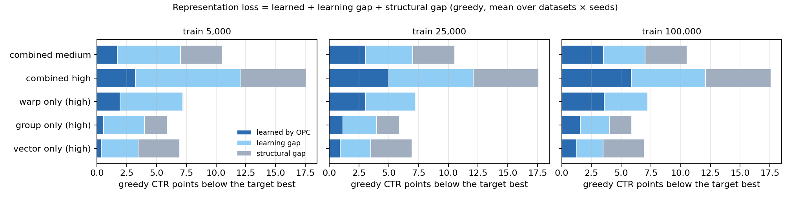

# Representation repair: follow-up on the development results (2026-09-27/28)

> **Historical: buggy logging simulator.**
> - **The bug.** The learned results here were produced by the logging simulator of commits 69fffab..c11b2b3
>   (2026-09-24 to 2026-10-04). In it, each logged action reused the random draw that picked its user. A user
>   therefore received a nearly fixed action, while the stored propensity was the logger's softmax probability.
> - **Scope.** The oracle validation (goal 1) and the structural gaps use no logs and are unaffected; the learned views and the learning gap are affected.
> - **Superseded by** [the revalidation on the fixed simulator](simulator_fix_opc_revalidation_20261004.md).
> - **This document** is kept unchanged as the record of what was run and concluded at the time.

This is a bounded follow-up to [representation_repair_dev_20260927.md](representation_repair_dev_20260927.md). It has
three goals:
- check the Stage 1 oracle bounds;
- break the Stage 1 and Stage 2 results down by dataset;
- make the structural-vs-learning gap explicit.

The only new runs are true-reward oracle fits. No learned-policy run was repeated, and the Stage 2 policies are the
ones reported before. Everything here is a development diagnostic (seeds 100/101). The tables are in
`artifacts/full_study/summaries_20260927/followup/`.

## 1. Are the Stage 1 oracle bounds close to the optimum of the same class?

### The Stage 1 oracle procedure (`training/oracle_repair.py`)

- **Class.** The learner's own policy on the frozen biased vectors, at the logger's temperature, with a
  `(I + D)x + b` correction on each side. It starts exactly at the logger (D = 0, b = 0), with 2 × (32² + 32)
  trainable parameters.
  - `linear` keeps the logit scale at 1. It can still sharpen, because D ≈ cI scales the vectors.
  - `linear+scale` also learns the scale. It contains `linear`.
  - The reported bound is the better of the two fits.
- **Objective.** The exact stochastic true value, the mean over users of Σₐ π(a|u) q(u,a). Users come from a fixed
  sample of 20,000 drawn from the user prior, 2,048 per step, with every item.
- **Optimizer.** Adam, cosine annealing to 0 over 3,000 steps, at learning rates {1e-3, 3e-3, 1e-2}, with a seed
  per (world seed, class, rate).
- **Selection.** Every candidate is scored exactly on all users, and the one with the best *stochastic* value is
  kept. The greedy bound is that candidate's greedy value.
- **The warning.** The "flattened" flag compares the last two tenths of the minibatch objective. The cosine
  schedule drives the rate to 0, so the objective flattens whether or not it converged. The scale-fixed class won
  at the top rate (1e-2) in 35 of 36 worlds. `linear+scale` peaked in the interior (3e-3) in 34 of 36, and two
  anime worlds sat at the lower edge. In 15 of the 30 biased worlds the greedy bound came from `linear`, including
  most vector and combined worlds.

### Validation (`training/oracle_validation.py`, prespecified)

The class, objective, user sample, batch and seeds are unchanged; this is true-reward only. It covers the 30 biased
worlds; with no bias the oracle is within 3e-5 of the ceiling.

- **Learning rate:**
  - `linear`: 1e-2, 3e-2, 1e-1, 3e-1 at 3,000 steps, extended further while the top rate wins.
  - `linear+scale`: its Stage 1 winner, plus one point past a Stage 1 grid edge that won (3e-4 where 1e-3 won).
- **Budget:** each class's best rate refit at 3× the steps, and at 9× when the value still moved by 0.02 CTR
  points or more.
- **Bound:** under the Stage 1 rule, pooled with the Stage 1 fit, so a bound can only rise. The best greedy value
  over all candidates is reported as a sensitivity.
- **Material change:** a bias type's mean greedy recoverability moves by ≥ 0.02, or a dataset cell by ≥ 0.03.

It ran 252 fits, plus 5 budget-tail refits (below).

### Results

- **Reproduction.** All 60 refits of the Stage 1 winners reproduced them exactly, to the last bit.
- **Learning rate.** Each class's best rate is now interior in every world:
  - `linear`: 3e-2 in 27 worlds and 1e-2 in 3. 1e-1 and 3e-1 were worse everywhere, so no further extension was
    needed.
  - `linear+scale`: 3e-3 in 28 worlds and 1e-3 in 2, where 3e-4 was worse.
- **Budget, `linear`.**
  - 3,000 → 9,000 steps added 0.05 points on average.
  - The 9× refit (27,000 steps) was triggered in 22 of 30 worlds. It changed the value by a median +0.003 points,
    but 7 worlds still rose, by 0.05–0.15 points.
  - A 27× refit (81,000 steps) of five of those settled the rest. Two kept rising by about 0.11 points: ml vector
    seed 101 (+0.013 recoverability) and ml combined high seed 101 (+0.006). One gained 0.03, and two fell (−0.03,
    −0.14). The value is close to its plateau, but not strictly flat everywhere.
- **Budget, `linear+scale`.** Longer schedules made it worse in every world where they ran (9k → 27k: median −0.35
  points): its learned scale runs away.
- **Bounds.**
  - Greedy recoverability rises by +0.005 to +0.010 on average per bias type, same selection rule. The largest
    change in any world is +0.025 (ml vector seed 101, with its 81k fit).
  - Not material by the prespecified rule, so the Stage 1 values stand.
  - Under the validated denominators, the Stage 2 fractions of the oracle repair would move by at most 0.006. The
    learned policies are the same.
- **Sensitivity.** Taking the best greedy value over all candidates instead of the Stage 1 rule changes the
  validated means by at most 0.0005.

| bias | Stage 1 | validated | mean change | largest world change | ml | kuairand | anime |
|---|---|---|---|---|---|---|---|
| warp | 0.994 | 0.999 | +0.005 | +0.013 | 0.994 → 0.998 | 0.994 → 0.999 | 0.993 → 1.000 |
| group | 0.680 | 0.690 | +0.010 | +0.019 | 0.775 → 0.788 | 0.701 → 0.710 | 0.564 → 0.571 |
| vector | 0.499 | 0.505 | +0.006 | +0.025 | 0.612 → 0.626 | 0.576 → 0.580 | 0.308 → 0.309 |
| combined medium | 0.669 | 0.676 | +0.008 | +0.018 | 0.737 → 0.752 | 0.713 → 0.714 | 0.556 → 0.562 |
| combined high | 0.689 | 0.698 | +0.009 | +0.015 | 0.721 → 0.734 | 0.752 → 0.756 | 0.595 → 0.605 |

**Conclusion.** The reported structural-recoverability values are stable:
- With the learning rate no longer at an edge and up to 9× the budget (27× in five worlds), they rise by
  0.005–0.010 on average.
- The warp > group > vector ordering, the per-dataset pattern (anime least recoverable) and every Stage 2
  conclusion are unchanged.
- They remain lower bounds on the class optimum. In a few worlds the scale-fixed fit still gains about 0.1 points
  per tripling of the budget, so the true optimum may be higher by a similar small amount.

## 2. Per-dataset views

All values are greedy (ranking) unless marked, in CTR points; each dataset cell is the mean of two seeds. The full
tables, with every metric at every size, are `stage1_by_dataset.csv` and `stage2_by_dataset.csv`.

**Stage 1 by dataset:** logger ranking loss / oracle repair gain / structural recoverability.

| bias | ml: loss / gain / recoverability | kuairand | anime |
|---|---|---|---|
| warp | 8.01 / 7.96 / 0.994 | 4.90 / 4.87 / 0.994 | 8.90 / 8.83 / 0.993 |
| group | 6.94 / 5.37 / 0.775 | 3.89 / 2.72 / 0.701 | 6.84 / 3.87 / 0.564 |
| vector | 8.29 / 5.08 / 0.612 | 5.37 / 3.11 / 0.576 | 7.16 / 2.21 / 0.308 |
| combined medium | 12.36 / 9.11 / 0.737 | 7.49 / 5.35 / 0.713 | 11.79 / 6.56 / 0.556 |
| combined high | 19.18 / 13.82 / 0.721 | 15.35 / 11.56 / 0.752 | 18.28 / 10.89 / 0.595 |

**Stage 2: fraction of the oracle ranking repair, OPC / DM-only.**

| bias | train | ml | kuairand | anime |
|---|---|---|---|---|
| warp | 5k | 0.27 / 0.12 | 0.30 / 0.03 | 0.24 / 0.10 |
| warp | 25k | 0.47 / 0.35 | 0.45 / 0.21 | 0.37 / 0.27 |
| warp | 100k | 0.53 / 0.41 | 0.52 / 0.28 | 0.45 / 0.32 |
| group | 5k | 0.13 / 0.04 | 0.14 / -0.00 | 0.14 / -0.28 |
| group | 25k | 0.28 / 0.21 | 0.26 / 0.02 | 0.30 / 0.18 |
| group | 100k | 0.35 / 0.27 | 0.36 / 0.19 | 0.47 / 0.34 |
| vector | 5k | 0.14 / -0.01 | 0.13 / 0.14 | -0.05 / -0.60 |
| vector | 25k | 0.30 / 0.25 | 0.33 / 0.19 | 0.08 / 0.02 |
| vector | 100k | 0.36 / 0.29 | 0.44 / 0.33 | 0.31 / 0.27 |
| combined medium | 5k | 0.22 / 0.16 | 0.34 / 0.27 | 0.19 / -0.03 |
| combined medium | 25k | 0.46 / 0.38 | 0.45 / 0.31 | 0.39 / 0.26 |
| combined medium | 100k | 0.48 / 0.41 | 0.54 / 0.35 | 0.50 / 0.39 |
| combined high | 5k | 0.24 / 0.19 | 0.37 / 0.52 | 0.18 / 0.25 |
| combined high | 25k | 0.35 / 0.32 | 0.53 / 0.47 | 0.37 / 0.38 |
| combined high | 100k | 0.41 / 0.39 | 0.57 / 0.52 | 0.48 / 0.45 |

**Stage 2: OPC − DM-only, true (stochastic) CTR points, with the two seeds' range.**

| bias | train | ml | kuairand | anime |
|---|---|---|---|---|
| warp | 5k | +1.08 (+0.00, +2.16) | +1.08 (-0.05, +2.20) | +1.13 (+0.98, +1.28) |
| warp | 25k | +0.90 (+0.33, +1.47) | +1.18 (+1.08, +1.29) | +0.77 (+0.77, +0.77) |
| warp | 100k | +0.95 (+0.68, +1.22) | +1.16 (+1.08, +1.25) | +1.14 (+0.75, +1.53) |
| group | 5k | +0.39 (+0.21, +0.58) | +0.32 (+0.22, +0.42) | +1.56 (+1.15, +1.97) |
| group | 25k | +0.37 (+0.23, +0.51) | +0.67 (+0.40, +0.95) | +0.51 (+0.23, +0.79) |
| group | 100k | +0.46 (+0.36, +0.55) | +0.47 (+0.34, +0.61) | +0.41 (+0.34, +0.49) |
| vector | 5k | +0.53 (+0.32, +0.73) | -0.05 (-0.31, +0.20) | +1.20 (+1.00, +1.41) |
| vector | 25k | +0.23 (+0.07, +0.39) | +0.41 (+0.35, +0.48) | +0.13 (+0.11, +0.14) |
| vector | 100k | +0.28 (+0.27, +0.29) | +0.37 (+0.31, +0.43) | +0.11 (+0.02, +0.19) |
| combined medium | 5k | +0.34 (-0.40, +1.08) | +0.34 (+0.22, +0.47) | +1.35 (+0.75, +1.95) |
| combined medium | 25k | +0.71 (+0.40, +1.02) | +0.71 (+0.65, +0.77) | +0.86 (+0.30, +1.42) |
| combined medium | 100k | +0.65 (+0.59, +0.72) | +1.04 (+1.03, +1.05) | +0.64 (+0.56, +0.71) |
| combined high | 5k | +0.60 (-0.90, +2.10) | -1.79 (-2.35, -1.23) | -0.92 (-1.30, -0.55) |
| combined high | 25k | +0.45 (-0.05, +0.95) | +0.72 (+0.36, +1.08) | -0.01 (-0.11, +0.08) |
| combined high | 100k | +0.40 (+0.23, +0.58) | +0.64 (+0.41, +0.87) | +0.35 (+0.15, +0.55) |

**Stage 2: OPC − no-propensity, true CTR points, with the two seeds' range.**

| bias | train | ml | kuairand | anime |
|---|---|---|---|---|
| warp | 5k | +1.80 (+1.39, +2.21) | +0.96 (+0.72, +1.21) | +1.54 (+1.26, +1.81) |
| warp | 25k | +3.01 (+2.29, +3.72) | +1.63 (+1.20, +2.06) | +2.49 (+2.41, +2.57) |
| warp | 100k | +3.58 (+3.37, +3.79) | +1.79 (+1.44, +2.15) | +3.04 (+2.82, +3.26) |
| group | 5k | +0.77 (+0.19, +1.34) | +0.03 (-0.09, +0.16) | +0.30 (+0.29, +0.31) |
| group | 25k | +1.63 (+1.47, +1.79) | +0.36 (+0.26, +0.45) | +1.07 (+0.94, +1.19) |
| group | 100k | +2.19 (+2.09, +2.30) | +0.68 (+0.53, +0.82) | +1.34 (+1.27, +1.41) |
| vector | 5k | +0.39 (+0.07, +0.70) | +0.02 (-0.21, +0.25) | -0.07 (-0.09, -0.05) |
| vector | 25k | +1.44 (+1.30, +1.57) | +0.69 (+0.47, +0.91) | +0.15 (+0.06, +0.24) |
| vector | 100k | +1.68 (+1.61, +1.75) | +1.00 (+0.80, +1.19) | +0.69 (+0.55, +0.84) |
| combined medium | 5k | +1.05 (+0.83, +1.27) | +1.04 (+0.29, +1.79) | +0.50 (+0.48, +0.53) |
| combined medium | 25k | +3.46 (+3.30, +3.63) | +1.61 (+1.36, +1.86) | +2.00 (+1.62, +2.38) |
| combined medium | 100k | +3.36 (+3.03, +3.69) | +2.07 (+1.87, +2.27) | +2.59 (+2.33, +2.85) |
| combined high | 5k | +1.97 (+1.55, +2.40) | +2.41 (+1.54, +3.29) | +1.15 (+0.96, +1.34) |
| combined high | 25k | +3.94 (+2.99, +4.88) | +4.43 (+4.30, +4.57) | +3.23 (+2.79, +3.67) |
| combined high | 100k | +4.90 (+3.89, +5.91) | +5.03 (+4.94, +5.12) | +4.27 (+4.25, +4.29) |

**Stage 2: true gain over the logger at 100k.** Stochastic OPC / DM-only / no-propensity / tempered logger, and
greedy OPC / DM-only / no-propensity; the tempered logger's greedy gain is 0 by construction.

| bias | dataset | stochastic: OPC / DM / no-prop / tempered | greedy: OPC / DM / no-prop |
|---|---|---|---|
| warp | ml | +8.59 / +7.64 / +5.02 / +4.37 | +4.24 / +3.29 / +0.66 |
| warp | kuairand | +7.40 / +6.24 / +5.61 / +4.85 | +2.55 / +1.39 / +0.74 |
| warp | anime | +8.13 / +6.99 / +5.09 / +4.21 | +3.95 / +2.80 / +0.89 |
| group | ml | +6.38 / +5.93 / +4.19 / +4.40 | +1.89 / +1.46 / -0.28 |
| group | kuairand | +6.28 / +5.81 / +5.61 / +5.33 | +0.98 / +0.52 / +0.30 |
| group | anime | +6.26 / +5.84 / +4.92 / +4.39 | +1.81 / +1.31 / +0.37 |
| vector | ml | +5.98 / +5.70 / +4.30 / +4.22 | +1.80 / +1.46 / +0.06 |
| vector | kuairand | +6.36 / +6.00 / +5.37 / +4.99 | +1.38 / +1.04 / +0.38 |
| vector | anime | +5.14 / +5.03 / +4.44 / +4.48 | +0.67 / +0.58 / -0.02 |
| combined medium | ml | +8.00 / +7.34 / +4.64 / +3.60 | +4.41 / +3.76 / +1.03 |
| combined medium | kuairand | +7.30 / +6.25 / +5.23 / +4.36 | +2.91 / +1.88 / +0.83 |
| combined medium | anime | +6.91 / +6.27 / +4.32 / +3.71 | +3.25 / +2.58 / +0.62 |
| combined high | ml | +7.86 / +7.46 / +2.96 / +2.06 | +5.72 / +5.32 / +0.81 |
| combined high | kuairand | +9.51 / +8.87 / +4.48 / +2.93 | +6.58 / +5.96 / +1.56 |
| combined high | anime | +7.64 / +7.29 / +3.37 / +2.45 | +5.22 / +4.86 / +0.93 |

**Common to all three datasets:**
- **Stage 1 ordering.** Warp is fully repairable (0.993–0.994), and group is more recoverable than vector. The
  order warp > group > vector holds in every dataset and seed.
- **Learning improves with data.** OPC's fraction of the oracle repair grows with the training size in every dataset.
- **Warp: OPC beats DM-only at every size on every dataset** (+0.77 to +1.18 points). Only two cells have one seed
  near 0: ml 5k (+0.00) and kuairand 5k (−0.05).
- **Group and vector: from 25k OPC leads DM-only on every dataset** (+0.11 to +0.67), with both seeds positive.
- **OPC beats no-propensity from 25k in every cell** (+0.15 to +5.03), with both seeds positive. The
  no-propensity arm recovers little ranking value anywhere.

**Quantitative differences:**
- **kuairand has the smallest losses.** Warp 4.9 against 8.0–8.9 points, group 3.9 against 6.8–6.9, vector 5.4
  against 7.2–8.3. So its absolute gains and its OPC − no-propensity margins are the smallest: warp +1.0 to +1.8,
  against +1.5 to +3.6 elsewhere.
- **anime is the least structurally recoverable** for group (0.56), vector (0.31) and the combined biases
  (0.56–0.60). ml is the most recoverable for group and vector.
- **OPC's fraction at 100k:**
  - similar across datasets for warp (0.45–0.53) and combined medium (0.48–0.54);
  - different for vector (0.31 on anime, 0.36–0.44 elsewhere) and combined high (0.41 on ml, 0.57 on kuairand).

**Anomalous cells** (two seeds each):
- **anime vector at 5k and 25k.** OPC's fraction is −0.05 and 0.08, DM-only's −0.60 and 0.02. OPC − no-propensity
  is −0.07 at 5k.
- **Combined high at 5k.** DM-only beats OPC on kuairand (−1.79; seeds −2.35 to −1.23) and on anime (−0.92; seeds
  −1.30 to −0.55). ml favours OPC (+0.60; seeds −0.90 to +2.10).
- **kuairand's DM-only is uneven.** It is strong on combined high (fraction 0.52 at 5k) but weak on warp (0.03)
  and group (−0.00) at 5k.
- **DM-only ranks worse than the logger at 5k** in anime group (−0.28), anime vector (−0.60), anime combined
  medium (−0.03) and ml vector (−0.01).

**What the aggregate owes to one dataset:**
- **Vector.** The aggregate vector recoverability (0.50) and its structural share (0.50) are pulled down by anime
  (0.31 and 0.69). ml and kuairand sit at 0.58–0.61 and about 0.4.
- **Combined high at 5k.** The aggregate OPC < DM-only there comes from kuairand and anime.
- **Replication.** The warp and group OPC − DM-only margins replicate on all three datasets. The vector margin is
  smallest on anime (+0.11 at 100k).

## 3. Structural gap versus learning gap

The decomposition uses greedy (ranking) values, so sharpening does not enter:

- **V_target_best** is the ceiling: each user's truly best item, the clean ranking's greedy value. It is identical
  across bias configurations within a dataset and seed, and equal to the no-bias logger's greedy value to 6e-10.
- **V_logger** is the logger's greedy value; **V_oracle_repair** is the Stage 1 repair bound; **V_OPC** is the
  selected OPC policy's greedy value.
- The decomposition is representation_loss = V_target_best − V_logger = structural_gap (V_target_best −
  V_oracle_repair) + learning_gap (V_oracle_repair − V_OPC) + learned_repair_gain (V_OPC − V_logger).

**No stochastic decomposition.** Its target would be ambiguous. Stage 1 measured the stochastic loss against the
clean logger at its own exploration level (23.97%), while the best achievable stochastic value is the ceiling
(29.94%). Stochastic oracle and OPC values also include sharpening.

| bias | train | V_target_best | V_logger | V_oracle_repair | V_OPC | representation loss | recoverable gain | learned gain | structural gap | learning gap | shares: structural / learning / learned |
|---|---|---|---|---|---|---|---|---|---|---|---|
| warp | 5k | 29.94 | 22.67 | 29.89 | 24.59 | 7.27 | 7.22 | 1.92 | 0.05 | 5.30 | 0.01 / 0.73 / 0.27 |
| warp | 25k | 29.94 | 22.67 | 29.89 | 25.71 | 7.27 | 7.22 | 3.04 | 0.05 | 4.18 | 0.01 / 0.57 / 0.42 |
| warp | 100k | 29.94 | 22.67 | 29.89 | 26.26 | 7.27 | 7.22 | 3.58 | 0.05 | 3.64 | 0.01 / 0.50 / 0.50 |
| group | 5k | 29.94 | 24.06 | 28.04 | 24.60 | 5.89 | 3.99 | 0.54 | 1.90 | 3.45 | 0.32 / 0.59 / 0.09 |
| group | 25k | 29.94 | 24.06 | 28.04 | 25.19 | 5.89 | 3.99 | 1.13 | 1.90 | 2.85 | 0.32 / 0.49 / 0.19 |
| group | 100k | 29.94 | 24.06 | 28.04 | 25.62 | 5.89 | 3.99 | 1.56 | 1.90 | 2.43 | 0.32 / 0.42 / 0.26 |
| vector | 5k | 29.94 | 23.00 | 26.47 | 23.34 | 6.94 | 3.46 | 0.34 | 3.48 | 3.13 | 0.50 / 0.45 / 0.05 |
| vector | 25k | 29.94 | 23.00 | 26.47 | 23.90 | 6.94 | 3.46 | 0.90 | 3.48 | 2.56 | 0.50 / 0.37 / 0.13 |
| vector | 100k | 29.94 | 23.00 | 26.47 | 24.28 | 6.94 | 3.46 | 1.28 | 3.48 | 2.18 | 0.50 / 0.31 / 0.19 |
| combined medium | 5k | 29.94 | 19.40 | 26.40 | 21.10 | 10.55 | 7.00 | 1.70 | 3.54 | 5.31 | 0.33 / 0.50 / 0.17 |
| combined medium | 25k | 29.94 | 19.40 | 26.40 | 22.46 | 10.55 | 7.00 | 3.06 | 3.54 | 3.94 | 0.33 / 0.38 / 0.29 |
| combined medium | 100k | 29.94 | 19.40 | 26.40 | 22.92 | 10.55 | 7.00 | 3.52 | 3.54 | 3.48 | 0.33 / 0.33 / 0.34 |
| combined high | 5k | 29.94 | 12.34 | 24.43 | 15.57 | 17.60 | 12.09 | 3.23 | 5.52 | 8.86 | 0.31 / 0.50 / 0.19 |
| combined high | 25k | 29.94 | 12.34 | 24.43 | 17.35 | 17.60 | 12.09 | 5.01 | 5.52 | 7.07 | 0.31 / 0.40 / 0.29 |
| combined high | 100k | 29.94 | 12.34 | 24.43 | 18.18 | 17.60 | 12.09 | 5.84 | 5.52 | 6.25 | 0.31 / 0.35 / 0.34 |

**Shares of the representation loss at 100k by dataset** (structural / learning / learned):

| bias | ml | kuairand | anime |
|---|---|---|---|
| warp | 0.01 / 0.47 / 0.53 | 0.01 / 0.48 / 0.52 | 0.01 / 0.55 / 0.45 |
| group | 0.23 / 0.50 / 0.27 | 0.30 / 0.45 / 0.25 | 0.44 / 0.30 / 0.26 |
| vector | 0.39 / 0.39 / 0.22 | 0.42 / 0.32 / 0.26 | 0.69 / 0.21 / 0.09 |
| combined medium | 0.26 / 0.38 / 0.36 | 0.29 / 0.32 / 0.39 | 0.44 / 0.28 / 0.28 |
| combined high | 0.28 / 0.42 / 0.30 | 0.25 / 0.32 / 0.43 | 0.40 / 0.31 / 0.29 |

validated-bound sensitivity at 100k (structural gap points, share): warp 0.01 (0.00); group 1.84 (0.31); vector 3.45 (0.50); combined medium 3.46 (0.32); combined high 5.37 (0.30)
min learning gap over conditions (points): warp 3.03@5k; warp 2.08@100k; group 1.95@5k; group 1.66@100k; vector 2.24@5k; vector 1.28@100k; combined medium 3.22@5k; combined medium 2.19@100k; combined high 6.67@5k; combined high 4.48@100k



The figure-ready rows are `gap_decomposition.csv` (and `_by_dataset`, `_rows`) in the follow-up folder.

**Reading:**
- **warp.** Almost nothing is structural (0.05 points, share 0.01): the linear class can express the whole repair.
  Everything left is a learning gap: 73% of the loss at 5k, 50% at 100k.
- **group.** About a third is structural: 0.32 overall (anime 0.44, kuairand 0.30, ml 0.23). The learning gap
  falls from 0.59 to 0.42 of the loss.
- **vector.** Half is structural: 0.50 overall (anime 0.69, kuairand 0.42, ml 0.39). It is the largest component
  at every size. The learning gap falls from 0.45 to 0.31.
- **Combined biases.** About a third is structural (0.31–0.33). The learning gap falls from 0.50 to about a
  third, and by 100k OPC recovers about a third.
- **Learning vs structure.** At 5k the learning gap is the largest part of the loss for every bias except vector.
  By 100k it roughly equals the learned part for warp and the combined biases.
- **OPC never exceeds the class bound.** The smallest learning gap in any condition is +1.28 points (vector,
  100k).
- **Sensitivity.** On the validated bounds the structural gaps shrink by at most 0.17 points (combined high 5.52
  → 5.35), and no share moves by more than 0.01 (`gap_decomposition_validated_bound.csv`).

## Before comparing with CausE and BLOB

- **Report the class bound with the method.**
  - Our OPC repairs frozen biased vectors with one linear map per side. Its structural gap is about 0 for warp,
    but a third to a half of the loss for group and vector.
  - Methods that learn their own embeddings, such as CausE (Bonner & Vasile 2018) and BLOB (Sakhi et al. 2020),
    have a different and richer class. Their gains over OPC on group and vector may come from class capacity rather
    than from the logged-data correction.
  - Separate the two: compare within the same class where possible, and quote our oracle bound as the reference.
- **Keep the logged budget fixed.** CausE uses a small uniformly logged sample next to the biased log; our worlds
  have one softmax logger. A uniform sample has to come out of the same row budget, and it changes the
  propensities. State what each method sees.
- **BLOB's organic signal has no counterpart in the simulator.** An organic stream (e.g. from the BPR
  interactions) would give BLOB information OPC does not use. Either say so or give it to both.
- **Selection and measure.**
  - Use one selection protocol for every method: DR with clip:10 on the same 20,000 validation rows, or oracle
    selection for all.
  - Report the greedy (ranking) value as primary: score-based methods need a temperature to become stochastic
    policies, and the tempered-logger arm shows how much sharpening alone is worth.
- **Keep the no-bias control and the small-data combined-high cells.** OPC pays 0.4–1.5 points when there is
  nothing to repair. DM-only leads under combined high at 5k on kuairand and anime, so reward-model-heavy baselines
  may look strong there.
- **Report per dataset.** anime is the least structurally recoverable (vector 0.31), and kuairand has the
  smallest losses and absolute effects.
- **Seeds.** Everything so far uses development seeds 100/101. The paper's comparison should use fresh
  confirmatory seeds.

## Reproduction

```bash
# Goal 1: oracle validation (the four processes ran in parallel; each folder is one --datasets/--seeds slice)
python -m training.oracle_validation --stage1 artifacts/full_study/run_oracle_repair_20260927 \
  --datasets <ml|kuairand|anime> --seeds <100 101|100|101> --emb-dir BPR/embeddings \
  --out artifacts/full_study/run_oracle_validation_20260927/<name>
# budget tail for the still-rising scale-fixed fits
python -m training.oracle_validation --stage1 artifacts/full_study/run_oracle_repair_20260927 \
  --datasets <d> --bias-configs <b> --seeds <s> --refit linear <lr> 81000 \
  --out artifacts/full_study/run_oracle_validation_20260927/tail_81k/<name>
# all follow-up tables and the figure
python -m training.analyze_recoverability followup artifacts/full_study/run_oracle_repair_20260927 \
  --candidates artifacts/full_study/run_oracle_validation_20260927 \
  --runs artifacts/full_study/run_stage2_ml artifacts/full_study/run_stage2_kuairand artifacts/full_study/run_stage2_anime \
  --out artifacts/full_study/summaries_20260927/followup
```
