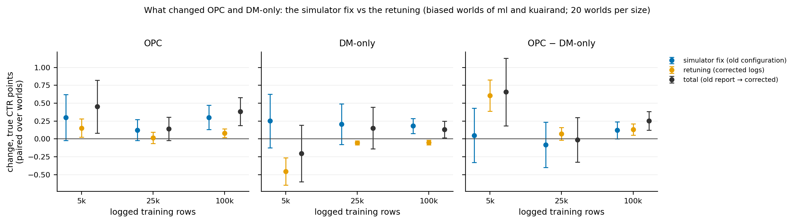
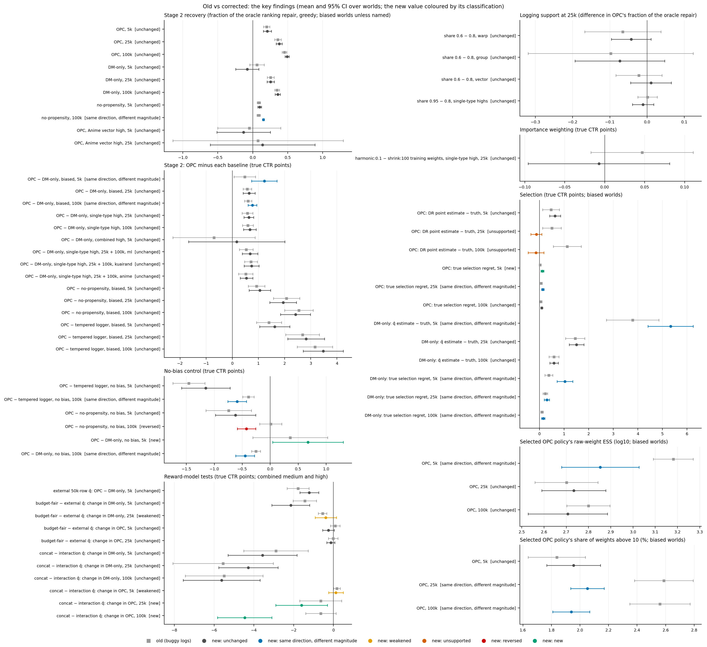
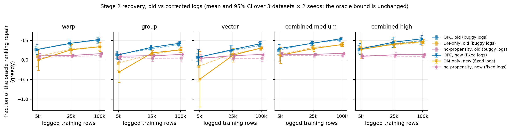
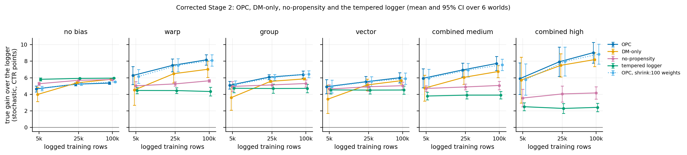
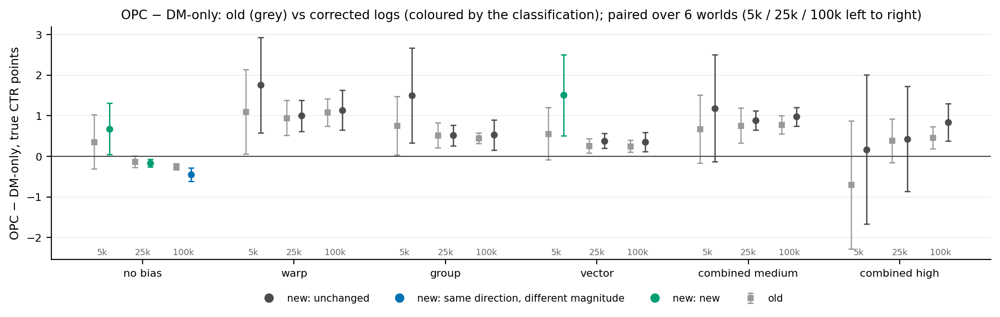
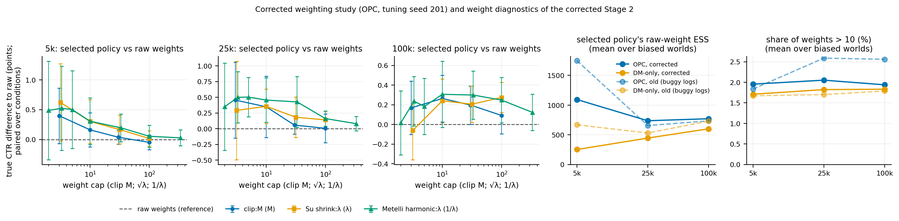
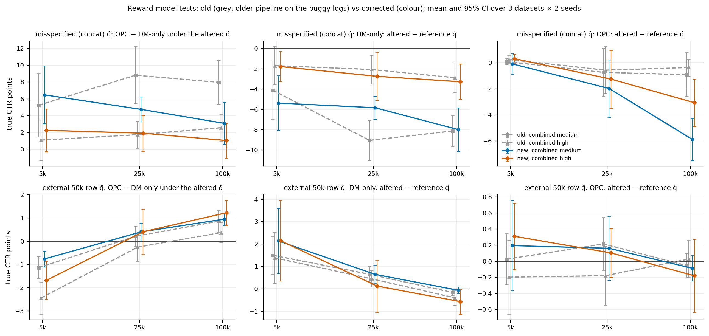
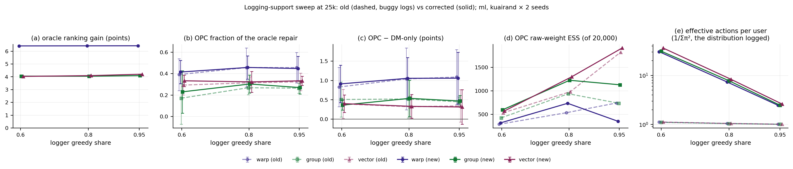

# Simulator logging fix and OPC revalidation (2026-10-04)

**Status: complete (development evidence, seeds 100/101 and tuning seeds 200/201).** Phases 0–5 are done.
- The final decision report below summarizes the outcome. The phases that follow it give the evidence.
- CausE is paused: no CausE experiment ran during this work. BLOB has not begun.

Artifacts are in `artifacts/full_study/opc_revalidation_20261004/`; its README lists what is there and how each part
is regenerated. Every new run records its source commit (`code_commit` in `run_meta.json` and `run_manifest.json`).

## Final decision report

### 1. Simulator

- **The bug.** The logger's generator was `default_rng(random_state % (2**31 − 1))`, the same PCG64 stream as the
  simulation's `default_rng(random_state)`, because every split seed is below 2³¹ − 1. Since 69fffab (2026-09-24) the
  logger draws one uniform per row (an inverse-CDF sampler), so row i's action reused the uniform that had drawn row
  i's user.
  - The logs came from P_eff(a|u) = |[C(u−1), C(u)) ∩ [F_u(a−1), F_u(a))| / prior(u): nearly one fixed action per
    user, carrying 93–99% of its probability.
  - The stored propensity was π0(a|u), 6–25 times smaller than the probability that generated the row (20–40 at
    logger share 0.6).
  - User and action indices correlated (+0.5 to +0.9).
  - Rewards were unaffected.
  - Range: 69fffab..c11b2b3, 59 commits; every study run since 2026-09-26.
- **The fix.** dbc401b on `CRM` (a cherry-pick of 5c011a9). The logger's generator is seeded with
  `derive_seed(random_state, "logging_policy_actions")`, and `create_simulation_data_from_policy` refuses a policy
  that shares the simulation's generator.
- **Permanent regression tests.** `tests/test_logging_propensity_calibration.py` (15) and
  `tests/test_logging_rng_independence.py` (4). On the old code 13 of the 15 fail, and 2 of the 4. On the fixed
  code all pass, with and without the GPU.
- **Proof that the logged propensities match the generating distribution.**
  - Per fixed user, the realized action frequencies over about 10,000 draws match the recorded π0 (chi-square; three
    temperatures, with and without a uniform mix).
  - The joint P_emp(u, a) matches prior(u)·π0(a|u).
  - E[π_e/pscore] = 1 and E[π_e/pscore · r] = V(π_e) for three targets.
  - Each fixed user's realized frequency of each logged action equals its stored pscore.
  - The minimal two-user case passes.
  - In the production logs, the users always given the same action fell from 91–99% to 1–10%, the per-user repeat
    rate equals Σπ0², and the user–action correlation is 0.
  - The logs reproduce exactly: the tempered logger has the same value on all 30 M5 worlds (Table R14).

### 2. New OPC defaults

| setting | revalidated default | before | evidence |
|---|---|---|---|
| objective | additive DR | same | 2.8: exact SNDR adds nothing over DR with harmonic weights |
| gradient | direct | same | 2.8: the log trick is never better |
| training weights | harmonic, λ = 0.1 (w / (0.9 + 0.1 w), at most 10) | same | 2.7: 16 weightings screened; harmonic 0.1–0.3 lead, 0.1 has the best worst size |
| selection | clip:10 weights, 95% DR lower bound | same | 2.6–2.7: within 0.03–0.11 points of the best trial |
| search space | lr 1e-4–2e-3 (log-uniform), 5–30 epochs, lr decay 0.8–1, batch schedule | lr ≤ 1e-3, ≤ 25 epochs | 2.3: the old optimum sat at the range's edge |
| sharpness | learnable logit scale; no post-hoc tempering | same | 2.5 |
| weight decay | none | same | 2.4 |
| sampler, trials | paired random sampler, 20 trials per size | same | — |
| design (not tuned) | budget-fair cross-fitted interaction q̂, 20,000 validation rows, logger share 0.8 | same | 0.5 |
| robustness alternatives | Su shrink:100 (interchangeable on the Stage 2 grid); **raw DR where q̂ may be misspecified** | shrink:100 only | R11; 3C |

Only the search space changed, plus a new robustness alternative. Tuning used seeds 200/201 only; every Phase 3
number is on seeds 100/101. The weighting is regime dependent: harmonic:0.1 is 0.77 points better than raw DR with a
well-specified q̂ at 100k and 3.64 worse with a badly misspecified one (3C). The code default is unchanged pending
review.

### 3. Revalidated scientific findings (development; seeds 100/101; mean [95% CI] over worlds)

- **Stage 2.**
  - OPC recovers 0.21 / 0.38 / 0.49 of the oracle's ranking repair at 5k / 25k / 100k (biased worlds), with a
    stochastic gain of 5.6 / 6.8 / 7.5 points over the logger.
  - The structural story is unchanged: warp 0.99, group 0.56–0.78, vector 0.31–0.61.
  - The learning gap still dominates warp. Vector is half structural.
- **OPC vs DM-only.**
  - Biased worlds: +1.22 [+0.73, +1.71] / +0.64 [+0.41, +0.87] / +0.77 [+0.60, +0.93].
  - Every single-type cell is above 0 at every size.
  - Combined high ties below 100k; there DM-only leads on ml at 25k (−1.03).
- **OPC vs no-propensity.**
  - +1.05 / +1.94 / +2.42 on the biased worlds; every biased cell is above 0 from 25k.
  - No-propensity improved at 100k: its fraction went from 0.08 to 0.15.
- **No-bias control.** Unneeded correction costs 0.6–1.2 points against the tempered logger. At 100k no-propensity
  beats OPC by 0.42 (a reversal).
- **Reward-model budget.** Unchanged: OPC is much less sensitive than DM-only to the reward model's data budget.
  - At 5k, cutting q̂'s data from a separate 50k-row slice to the policy's own rows costs DM-only 2.15 [1.20, 3.10]
    points and OPC 0.25 [−0.04, +0.54].
  - With the 50k-row q̂, DM-only beats OPC at 5k (−1.22 [−1.69, −0.74]).
- **Reward-model misspecification.** DM-only's failure survives: −3.6 / −4.3 / −5.6 points with the concat q̂,
  which overrates DM-only's pick by 11–17 points; its policies leave the logged support.
  - **New: OPC is not robust either from 25k** (−1.60 / −4.46 points), with harmonic:0.1 or shrink:100. Their cap at
    10 lets q̂'s errors steer training off the logged support, where the clipped selection estimate cannot see it.
  - With raw training weights OPC loses nothing at 100k (−0.05 [−0.39, +0.29]). The cost is 0.77 points when q̂ is
    well specified.
  - OPC still beats DM-only under the misspecified q̂: by +1.1 to +6.5 points, significantly under combined medium
    bias.
- **Support sweep.**
  - The corrected loggers spread over 31–36 / 7–8 / 2–3 effective actions per user at 0.6 / 0.8 / 0.95 (the buggy
    logs had about 1).
  - OPC's fraction at 0.6 / 0.8 / 0.95 is 0.42 / 0.46 / 0.45 (warp), 0.23 / 0.30 / 0.27 (group) and 0.33 / 0.32 /
    0.33 (vector).
  - OPC leads DM-only at every share.
- **Selection.**
  - OPC's DR estimate of its selected policy is unbiased within noise from 25k (−0.13, −0.14), and its regret is
    0.09–0.14 points.
  - DM-only's q̂ overrates its pick by 5.3 points at 5k, and its regret there is 1.04.

### 4. Old vs new

Of the 65 findings (Table R13, fig. 7): 43 unchanged, 13 changed in magnitude, 4 new, 2 weakened, 2 no longer
supported, 1 reversed.

The main changes and why:
- **OPC vs DM-only** grew at 5k (+0.75) and 100k (+0.16).
  - The 5k increase comes from the shared search space, not from the logs. 3F, on ml and kuairand: +0.61 of the
    +0.66, by lowering DM-only.
  - With DM-only in its own best range, OPC leads by +0.48 / +0.57 / +0.84, every interval above 0.
- **No-propensity improved at 100k** (+0.07 of the oracle repair). This is consistent with within-user action variety,
  which the bug removed.
- **No-bias control.** No-propensity now beats OPC at 100k: reversed.
- **OPC's optimistic selection estimate** is no longer supported. It disappears with the corrected logs in the old
  configuration (3F), so the buggy logs caused it.
- **"The most exploratory logger recovered least"** is weakened. The bug had taken that logger's exploration away.
- **harmonic:0.1 over shrink:100 in every cell** is no longer supported. They now differ by at most 0.17 points
  per cell.
- **OPC's robustness to a misspecified reward model** is no longer supported from 25k: a new negative. It comes from
  the capped training weights.
- **Unchanged:**
  - the structural story;
  - OPC's repair fractions;
  - OPC > DM-only for single-type biases from 25k, on every dataset;
  - OPC > no-propensity and OPC > tempered logger from 25k;
  - the flat 0.8 → 0.95 support;
  - the weighting defaults, for a well-specified q̂.

### 5. CausE implications (assessment only; nothing was run)

- **M5's OPC rows must be replaced.** They used a fixed logit scale and the old search range. On the same logs the
  revalidated configuration is +1.28 [+0.96, +1.59] points higher (+2.32 without bias), and DM-only is +0.58 higher.
  The replacement rows already exist: the corrected Stage 2 at 25k on the same worlds, with identical logs.
- **The CausE rows remain reusable.** The same fixed logs, splits and validation rows were used, and CausE's code and
  search are untouched.
- **The fair variants should change in five ways:**
  - use the revalidated OPC configuration;
  - give CausE an equivalent sharpening (a learned or validated temperature), or compare greedy values;
  - report the tempered logger;
  - match the trial budget, and check CausE's learning-rate range for an edge optimum;
  - state the corrected support.

### 6. Repository

- **Branch.** `CRM`, pushed: `CRM` = `origin/CRM` at the commit that adds this document, on top of c11b2b3.
- **Code.**
  - The simulator fix: dbc401b.
  - The revalidation tooling, through 34a37cb: provenance, the search space, exact SNDR, the coupling diagnostic,
    the summaries, report and tables, and the tests.
  - Every Phase 2–3 run used the pinned worktree at d791849, as recorded in `run_meta.json` (`code_commit`).
- **Results.** The summaries, the report and the run registry: 2a52bb9.
- **Tests.** 476 pass with the GPU; 453 pass and 8 are skipped with it hidden.
- **Paths.**
  - This document.
  - `artifacts/full_study/opc_revalidation_20261004/`: README, `phase0/`, `tuning/`, `summaries/`, and `report/` (fig1–fig8 and their CSVs, every table, `tables.md`).
  - `artifacts/full_study/run_registry.csv`.
- **Code Atlas.** https://claude.ai/artifact/21JZ2pQGMogqKakhRv1MVm, version 9 (code at 34a37cb). PDF snapshot:
  `docs/opc_code_atlas.pdf`.
- **State.**
  - The working tree is clean; the temporary worktrees are removed; no jobs or watchers are running.
  - The stash and the `cause-baseline` branch are untouched.
  - Run folders and console logs stay local, as before.

---

## Phase 0. The bug, the fix and the inventory

### 0.1 The bug

**Where.** `_simulate_from_embedding_policy` (training/trainer_trials.py) builds the logger as a `Policy` whose
generator is `default_rng(random_state % (2**31 − 1))` (since 433583f, 2026-05-05), and passes it to
`create_simulation_data_from_policy` (utils/simulation_utils.py), which draws everything else from
`default_rng(random_state)`. Every split seed of the study is below 2³¹ − 1 (`seed + 1009·train_size + 17·run +
7`, e.g. 25,225,124), so the two generators were the same PCG64 stream.

**When it became a bug.** 69fffab (2026-09-24 10:08 +0300, "Make logged-data sampling identical on CPU and GPU")
replaced the samplers by one inverse-CDF sampler that draws **one uniform per row**, `self.rng.random(n)`. The
simulation draws the users first, `rng.choice(n_users, size=n, p=user_prior)`, which also consumes one uniform per
row, in the same order. From 69fffab on, row i's action used exactly the uniform U_i that had drawn row i's user.
(The chunking at 100,000 rows does not break this: the policy draws its uniforms chunk by chunk, in the same
positions.) Before 69fffab:
- the CPU sampler (Gumbel-max) consumed |A| uniforms per row, so row i's own user uniform was reused only by row 0;
  the other overlaps tie the noise of the first ⌈n/|A|⌉ rows (at most a few dozen) to other rows' users;
- the GPU sampler, the default device, used a torch generator seeded by one draw from the policy's stream.

The coupling was therefore negligible before 69fffab.

**Range.**
- Buggy: every commit from 69fffab (2026-09-24) to c11b2b3 (CRM head before the fix, 2026-10-04): 59 commits. Every
  study run since 2026-09-26 used code in this range (verified with `git merge-base --is-ancestor` for each run's
  code commit in the run registry).
- Fixed: 5c011a9 (local branch `cause-baseline`, 2026-10-03 22:45), and the same change on `CRM` as dbc401b
  (cherry-picked, without any CausE code). The logger's generator is now seeded with
  `derive_seed(random_state, "logging_policy_actions")`. `create_simulation_data_from_policy` now refuses a
  policy whose generator is in the simulation's state.

**The coupling, exactly.** Let C be the normalized cumulative user prior in user-index order, and F_u the
cumulative π0(·|u) over the items in item-index order. One uniform U gave both the user and the action:

```text
user(U)   = u  such that  C(u−1) ≤ U < C(u)
action(U) = a  such that  F_u(a−1) ≤ U < F_u(a)
```

The logs were therefore drawn from the joint and conditional

```text
P(u, a)      = | [C(u−1), C(u)) ∩ [F_u(a−1), F_u(a)) |
P_eff(a | u) = P(u, a) / prior(u)
```

The prior gives each user a slice of [0, 1) of width prior(u), about 1/|U|. A user's action is the item whose
CDF interval covers that slice, so it is nearly a fixed function of the user. Because the slice sits at
position ≈ C(u), users with small indices receive items early in the item order, and the user and action indices
correlate.

**Which propensity was wrong.**
- **Stored:** the pscore, π0(a|u) (the logger's softmax, or its uniform mixture), for the logged pair. That number
  is the policy's probability, and the older tests checked it.
- **Actual:** the row was generated with probability P_eff(a|u), not π0(a|u).
- **Consequences:**
  - Every importance weight w = π(a|u)/pscore had the wrong denominator.
  - Within a user the logs contained essentially no action variation.
  - Across users, the action was a deterministic function of the user's position in the index order.

**Rewards were unaffected.** They were drawn after all users, from the simulation stream (positions n to 2n−1),
which the policy never reached, so r ~ Bernoulli(q(u, a)) given the logged pair.

**What looked right, and why the bug was missed.**
- The pscore of each logged pair was the logger's probability.
- The mean logged click rate matched V(π0).
- The CPU and GPU samplers agreed draw for draw, the property 69fffab was written to guarantee.

The existing tests checked only these marginal properties.

### 0.2 What the logs actually were

`training/logging_coupling_diagnostic.py` computes P_eff exactly over every user of a world and draws the old and
the fixed logs of the 25k split (95,000 rows: 50,000 regression + 25,000 training + 20,000 validation). Its
reconstruction of the old sampler reproduces the code at c11b2b3 bit for bit (users, actions, pscores and rewards
of ml/none and kuairand/high, 95,000 rows each). Full table:
`artifacts/full_study/opc_revalidation_20261004/phase0/coupling_exact_lgs0.8.csv`.

Seed 100, logger share 0.8, the six Stage 2 bias settings. Ranges over the six settings per dataset:

| quantity (prior-weighted over users) | ml | kuairand | anime |
|---|---|---|---|
| actions with P_eff > 0, per user | 2.00–2.29 | 1.50–1.63 | 1.29–1.37 |
| largest P_eff(a\|u) | 0.945–0.975 | 0.965–0.974 | 0.975–0.992 |
| total variation between P_eff(·\|u) and π0(·\|u) | 0.88–0.92 | 0.83–0.88 | 0.91–0.96 |
| mean stored pscore of a generated row | 0.08–0.12 | 0.12–0.17 | 0.04–0.09 |
| mean true generating probability of a generated row | 0.93–0.97 | 0.95–0.97 | 0.97–0.99 |
| V under P_eff − V(π0) (points) | −0.14 to +0.13 | −0.09 to +0.03 | −0.03 to +0.04 |
| E_gen[w] for the logger ×2 / ×0.5 / uniform (1 if correct) | 0.97–1.01 / 0.95–1.04 / 0.81–1.11 | 0.98–1.01 / 0.98–1.02 / 0.92–1.04 | 1.00–1.02 / 0.99–1.02 / 0.98–1.15 |
| IPS limit − truth, logger ×2 (points) | −0.38 to +0.23 | −0.28 to +0.05 | −0.13 to +0.27 |
| IPS limit − truth, uniform (points) | −0.41 to +0.19 | −0.19 to +0.13 | −0.05 to +0.30 |
| total variation of the action marginal | 0.20–0.28 | 0.17–0.20 | 0.11–0.16 |
| users (≥ 2 rows) who always got the same action: old / fixed | 0.91–0.95 / 0.01 | 0.94–0.96 / 0.06–0.10 | 0.96–0.99 / 0.02–0.05 |
| corr(user index, action index): old / fixed | +0.72 to +0.84 / −0.04 to 0.00 | +0.82 to +0.89 / −0.00 | +0.51 to +0.72 / −0.03 to −0.02 |
| distinct logged actions (95,000 rows): old / fixed | 1,275–2,223 / 2,260–3,395 | 4,544–5,202 / 6,600–6,959 | 3,425–6,823 / 4,047–8,279 |

**By logger sharpness (Stage 3 worlds).** Means over ml and kuairand × warp / group / vector high, seed 100
(`coupling_exact_lgs{0.6,0.8,0.95}.csv`):

| logger share | largest P_eff(a\|u) | TV(P_eff, π0) | mean stored pscore | mean true generating probability | users always given the same action (old / fixed) |
|---|---|---|---|---|---|
| 0.6 | 0.91–0.94 | 0.95–0.98 | 0.02–0.05 | 0.88–0.92 | 0.85–0.89 / 0.00–0.02 |
| 0.8 | 0.97 | 0.85–0.89 | 0.11–0.16 | 0.96 | 0.94–0.95 / 0.01–0.08 |
| 0.95 | 0.99 | 0.59–0.62 | 0.39–0.41 | 0.99 | 0.99 / 0.10–0.27 |

The coupling removed most of the exploration the logger was supposed to perform. It did so the more the more
exploratory the logger: the 0.6 logger's stored propensities understated the generating probability 20–40 fold,
the 0.95 logger's about 2.5 fold. The old Stage 3 finding that the most exploratory logger recovered least is
therefore exactly the comparison the bug distorted most (Phase 3D).

**Reading.**
- The old logs were drawn from a nearly deterministic per-user logger: one action per user, carrying 93–99% of
  that user's probability.
- The stored pscores understated the generating probability 6–25 fold.
- Aggregates were nearly preserved: the logger's own value to within 0.14 points.
- The "IPS limit" is the expectation of the importance-weighted estimate under the generated distribution, with
  the stored pscores. For the three targets checked (the logger sharpened ×2, flattened ×0.5, uniform), it lies
  within about ±0.4 points of the truth, with mean weights 0.81–1.15.
- These population-level checks bound only the infinite-data bias of a few fixed estimates. They say nothing about
  learning. The learned policies, their selection and the variance of the estimates all saw logs without
  within-user randomization, so no learned result can be assumed to carry over.

### 0.3 What is preserved

- **Old run folders.** Every `artifacts/full_study/run_*` folder is untouched (local, excluded from git), as are the
  old summaries (`summaries_20260927/`, `analysis_20260927/`) and the old report figures (`report_20260928/`).
- **Old documents.** These stay as historical records:
  - `representation_repair_dev_20260927.md`, `representation_repair_followup_20260927.md`;
  - `representation_repair_experimental_report_20260928.md`;
  - `decision_record_opc_objective_weighting.md`;
  - `training_losses.md` §9;
  - `roee_handoff_20260928.md`.

  Each gets a banner naming the buggy simulator (Phase 4), with no other change.
- **CausE.** Everything is untouched:
  - the branch `cause-baseline` (d31a5dd, with the CausE code and its own copy of the fix, 5c011a9);
  - the M5 runs (`run_cause_dev_25k_opc_20261004`, `run_cause_dev_25k_cause_20261004`);
  - the pushed CausE documents and results (`docs/cause_baseline.md`, `docs/cause_dev_report_20261004.md`,
    `artifacts/cause_repro/`, `artifacts/full_study/cause_dev_25k_20261004/`).

  No CausE code is on `CRM`.
- **The stash** (`stash@{0}`, "issue1: reward features") is untouched.

### 0.4 Inventory

Classes:
- **U**, unaffected;
- **R**, affected and must be rerun;
- **S**, affected but supporting or diagnostic only;
- **M**, a mathematical result unaffected, although its empirical experiment is affected.

A run is affected if it trained, tuned, selected or estimated on logged rows produced by
`_simulate_from_embedding_policy` with code in the buggy range. "Plausible-looking" was not a criterion: every
run's code commit was checked for 69fffab.

| experiment | runs (run registry) | what used the logs | class | action |
|---|---|---|---|---|
| Stage 1 oracle repair bound | `run_oracle_repair_20260927`; `run_oracle_repair_stage3_lgs_0_6`, `_0_95` | nothing: Adam on the exact true value from the logger's vectors; the logger's temperature from `sharpen_logger` (exact over the catalog); world calibration from its own derived streams (`derive_seed(seed, "world", …)`), users and items drawn in sequence from one generator | U | reused unchanged |
| Oracle validation | `run_oracle_validation_20260927` | nothing (true-reward oracle) | U | reused unchanged |
| Exact values | every run's V(π), greedy values, V_target_best, logger value and ranking loss | none (`calc_reward` is exact; `policy_reward_mode` = exact in every run) | U | the denominators of the fractions and the structural gap stand |
| Stage 2 learned recovery: OPC, DM-only, no-propensity, tempered logger | `run_stage2_ml`, `_kuairand`, `_anime` | training rows, q̂ fit (budget-fair, cross-fitted by user), the validation rows used for selection | R | Phase 3A, all arms, same worlds and dev seeds |
| Stage 2 fractions, OPC − baselines, gap decomposition | `summaries_20260927/stage2_*`, `followup/` | derived from Stage 2 | R (the structural gap U) | recomputed in 3A with the unchanged oracle |
| Su robustness slice | `run_stage2_su_shrink_100` | as Stage 2 | R | the weighting study (2C) and the robustness arm (3A) |
| Stage 3 logging support | `run_stage3_lgs_0_6`, `_0_8`, `_0_95` | as Stage 2 | R (oracle bounds U) | Phase 3D |
| Objective comparison: DR vs legacy and global SNDR | `run_gradcmp_dr_shrink_100_log_trick`, `run_replay_sndr_batch_shrink_100`, `run_replay_sndr_global_shrink_100`; TPE `run_retune_*` | as Stage 2 | R for the DR family; S for the SNDR arms | Phase 2A |
| Legacy and global SNDR characterization | (analysis) | none: the batch-size dependence of legacy SNDR and the stop-gradient, epoch-stale normalizer of global SNDR are properties of the objectives | M; their empirical deficit vs DR is S | stay reproduction-only |
| DR as the working objective | f5cade9, from the runs above | as above | R | Phase 2A |
| Direct gradient vs log trick | `run_gradcmp_*` | the empirical comparison | M: with raw weights the two gradients are identical; with a transform g the log trick ascends DM + H(w)(r − q̂), H = ∫ g(t)/t dt, not the named estimate. The empirical "direct ≥ log trick" is S | direct kept; a small confirmation (2B) |
| Training weights raw / clip / Su shrink / Metelli harmonic | `run_tune_weights_*` (2026-09-26, spread logger), `run_retune_dr_train_*`, `run_gradcmp_*`, `run_final_dr_harmonic_*`, `run_final_check_*` | as Stage 2 | R | Phase 2C |
| Selection weights clip:10 | `run_tune_weights_*` (`weight_tuning_picks.csv`), d7a434c | the logged selection scores against the true values of the trials | R | Phase 2C/2D (post hoc from the logged per-trial scores) |
| Reward-model budget (external 50k vs budget-fair q̂) | `run_logger_explore`, `run_logger_explore_budget` | as Stage 2; also on the older pipeline (legacy SNDR, log trick, shrink:100, TPE, before the short-batch fix) | R | Phase 3B on the current pipeline |
| Budget-fair q̂, 5-fold cross-fitting, validation 20,000 | 66fd303, from the runs above | the evidence (the DR standard error at 5k vs 20k validation rows) | S: a budget and fairness design choice; the standard error argument is generic | kept as a design choice, not re-tuned |
| Reward-model misspecification (interaction vs concat q̂) | `run_qhat_concat` (also the older pipeline) | as Stage 2 | R | Phase 3C |
| Interaction q̂ features | b953d89 | the fit-quality evidence (RMSE, rank correlation against the truth) was measured on affected logs | M for the structural argument (the true score is a dot product; concat cannot rank items per user); the fit numbers are S | kept; 3C reruns the comparison |
| No-propensity arm | Stage 2 and 3 | its training rows | R | 3A, 3D |
| DM-only arm | Stage 2 and 3 | q̂'s training rows | R | 3A, 3D |
| Tempered logger | Stage 2 and 3 | its scale is chosen by the DR score on validation rows | R | 3A, 3D |
| Selection-estimation diagnostics (estimate error, optimism, regret, Spearman) | Stage 2 and 3, the weighting study | validation rows | R | recomputed from the reruns |
| ESS and heavy-weight diagnostics | Stage 2 and 3, the weighting study | validation rows | R | recomputed from the reruns |
| Logger greedy share 0.8 | e7115f5 (Test 2 = `run_logger_explore_budget`); `representation_bias.md` | Test 1 (the room the logs can evaluate, from a policy trained on the truth under an ESS constraint) is exact; Test 2 (learning) is affected | S: a world-design choice; it should not be chosen by a method's performance | kept at 0.8 so that old and new runs pair; Stage 3 reports the dependence |
| Post-hoc tempering (off) | 63a3cc1 | its motivating observation (learned scale ~7 vs ~60) came from affected logs | S | reviewed in Phase 2D |
| Learnable logit scale (on in Stage 2) | 2a29056 | design; no tuning on logs | S | reviewed in Phase 2D |
| Linear policy transform | b8450c9 | design: starts exactly at the logger, can invert the warp | U (not chosen from logs) | kept |
| Policy search ranges: lr 1e-4–1e-3, epochs 5–25, lr decay 0.8–1, batch schedule | 6a7a39c (2026-05-27), f684df3 (2026-09-20) | set before the bug, on older protocols, never validated on the current pipeline | U as to the bug. In old Stage 2, 92% of selected OPC trials at 5k and 72% at 25k had lr ≥ 6e-4, against 20–25% of the trials: the optimum sat at the upper edge | Phase 2D: widened and re-tuned |
| Selection rule (DR lower bound) | b865449 (2026-07-19) | set before the bug; never tuned on the current pipeline | U as to the bug | reviewed post hoc in Phase 2D |
| Baseline before weight tuning | `run_baseline_step4` | as Stage 2 | S (superseded) | none |
| KL check | `run_tune_kl_clip_100` | as Stage 2 | S (diagnostic) | none |
| Reproducibility checks | `run_final_check_*` | as Stage 2 | S; their conclusion, bit-identical reruns, is a property of the code (U) | none |
| Early runs | `run_20260503_192442`, `run_demo_ml` | before 69fffab | U (older protocol; not used) | none |
| H1 study | design in `h1_experiment.md` | no H1 runs in this repository since 2026-09-24 (any made elsewhere since then are affected) | — | none |
| CausE port validation (ML-10M reproduction against TensorFlow) | `artifacts/cause_repro/` | not the simulator | U | none |
| CausE M5 bounded comparison | `run_cause_dev_25k_opc_20261004`, `run_cause_dev_25k_cause_20261004` | logs generated **with** the fix (5c011a9) | the logs are U. The OPC rows used the defaults chosen on buggy logs (dr, direct, harmonic:0.1, selection clip:10, the old search ranges); the CausE rows used CausE's own search | Phase 5 (assessment only) |

### 0.5 Defaults that rest on affected evidence

| default | set in | evidence | status |
|---|---|---|---|
| OPC objective `dr`, direct gradient | f5cade9 | affected runs; the gradient argument is analytic | 2A / 2B |
| training weights `harmonic:0.1` | f5cade9 | `run_final_dr_harmonic_*` (affected); λ was best at the edge of {0.05, 0.1, 0.2} | 2C |
| selection weights `clip:10` | d7a434c | `run_tune_weights_*` (affected, spread logger) | 2C / 2D |
| logger share 0.8 | e7115f5 | partly affected | kept (world design) |
| budget-fair cross-fitted q̂, validation 20,000 | 66fd303 | partly affected; design | kept (design) |
| interaction q̂ features | b953d89 | structural argument plus affected fit numbers | kept; 3C |
| post-tempering off; learnable logit scale on | 63a3cc1, 2a29056 | affected / design | 2D |
| search ranges, selection rule | before the bug | never validated on the current pipeline; lr at the edge | 2D |

---

## Phase 1. Regression tests

`tests/test_logging_propensity_calibration.py` (15 tests) and `tests/test_logging_rng_independence.py` (4 tests,
with the fix). They test the production path `_simulate_from_embedding_policy`.

| # | test | what it checks |
|---|---|---|
| 1 | `test_each_fixed_user_gets_actions_with_the_recorded_probabilities` (6 cases) | four fixed users, ~10,000 draws each, at temperatures 0.3 / 1 / 3, with and without a 0.3 uniform mixture: chi-square of P_emp(a\|u) against the recorded π0(a\|u); the most frequent action's frequency equals its pscore |
| 2 | `test_actions_are_independent_of_the_user_when_the_logger_is_the_same_for_all` | identical user vectors, so π0(·\|u) is one distribution: users × actions contingency test of independence; rank correlation |
| 2 | `test_users_follow_the_prior_and_rewards_follow_q_given_the_logged_pair` | users against the prior; the click rate in every logged (u, a) cell against q(u, a); residuals uncorrelated with users and actions |
| 3 | `test_the_joint_of_users_and_actions_is_prior_times_pscore` | P_emp(u, a) against prior(u)·π0(a\|u) over all cells; E[π_e/pscore] = 1 and E[π_e/pscore · r] = V(π_e) for a sharper, a flatter and the uniform target |
| 4 | `test_stored_pscore_is_the_generating_policys_probability` (2 cases) | the stored pscore equals the logger's probability (formula, rtol 1e-12) and each fixed user's realized frequency of each logged action |
| 4 | `test_uniform_rows_store_exactly_one_over_the_catalog` | uniform loggers (mixture weight 1; constant logits): pscore exactly 1/\|A\|; actions uniform and independent of the user |
| 4 | `test_softmax_rows_store_the_exact_softmax_in_float64` | row by row, the float64 softmax |
| 5 | `test_a_sharper_logger_is_more_concentrated_in_the_population_and_in_the_logs` | logger shares 0.6 / 0.8 / 0.95: exact entropy falls, collision probability and value rise, the uniform target's ESS falls; in the logs the per-user repeat rate equals Σπ0², the mean reward equals V(π0), the logged action entropy falls |
| 6 | `test_minimal_case_two_users_two_actions` | the smallest failing case, documented in the module docstring: two users with equal prior and π0 = (½, ½) for both. With the coupled streams user 0 always got action 0 and user 1 always action 1 (pscore 0.5 recorded) |

**On the old code** (c11b2b3, in a temporary worktree), 13 of the 15 fail. Two pass, because they check what the
old code did correctly:
- the user and reward draws;
- the float64 softmax value of the stored pscore.

Of the four tests in `test_logging_rng_independence.py`, two fail on the old code (the repeat rate and the
shared-seed guard). The other two pass there: the pscore formula and per-seed determinism. On the fixed code all
pass, with and without the GPU.

---

## Phase 2. Re-tuning OPC on corrected logs

### 2.0 Design (written before the tuning runs)

**Seeds and stages.**
- Tuning uses new development seeds, **200 and 201**, never used before.
- Seeds 100/101 are reserved for the Phase 3 reruns, which pair trial by trial with the old runs. The configuration
  chosen here is therefore never evaluated on the worlds it was tuned on.
- Every run is a development run (`--stage development`, run tags `reval_*`). Confirmatory runs on fresh seeds
  remain for the paper.

**Fixed across the tuning.** These are design choices, not tuned:
- the budget-fair q̂ (5-fold cross-fitted, interaction features), 20,000 validation rows, logger share 0.8;
- the linear repair class and the paired random sampler;
- 20 trials per size (40 in the range study).

**Factors, in order.** Each step uses the previous step's choice.

| step | question | runs | analysis |
|---|---|---|---|
| 2D-R | search space: learning rate and step budget (lr, epochs, batch, lr decay), weight decay | lr 1e-4–1e-1 and epochs 5–30, 30 trials. Arms: OPC (harmonic:0.1), DM-only, no-propensity, paired; OPC (raw) and OPC with AdamW decay as paired OPC-only runs. A first design with epochs 5–60 and 40 trials was stopped after 18 minutes: about 6 GPU-hours for its first run alone. The lean design spans the same lr × steps range through the learning rate | true gain against the optimization budget (lr × steps); the 20-trial protocol simulated on candidate sub-ranges by resampling the logged trials |
| 2C | training weights | raw; clip M ∈ {3, 10, 30, 100}; Su shrink λ ∈ {10, 100, 1000, 10⁴}; Metelli harmonic λ ∈ {0.003, 0.01, 0.03, 0.1, 0.2, 0.3, 0.5}; screened, then the leaders on the full tuning grid | selected and per-trial true value (paired), ESS, weight tails, estimate error, sensitivity by dataset, bias and size, grid edges |
| 2A | objective family | additive DR; exact SNDR (`--sn-scope exact`, the full-data ratio's gradient); raw DR (reference) | as 2C |
| 2B | gradient (confirmation only) | direct vs log trick at shrink:100 | per-trial paired |
| 2D-S | sharpness | learnable logit scale (current) vs fixed vs post-hoc tempering | as 2C |
| 2D-Sel | selection | the selection weights (13 transforms logged per trial) and the lower bound's penalty, post hoc on the logged scores | selected true value, regret, optimism |

**The harmonic λ grid**, from theory, earlier results and the corrected weights:
- Metelli et al.'s rate-optimal λ*₂ = √(2 log(1/δ) / (3 I₂ n)) gives λ ≈ 0.001–0.003 at these n, taking the 2-Rényi
  divergence I₂ ≈ n/ESS ≈ 10–70 from the old diagnostics.
- The old (buggy) optimum sat at the edge of {0.05, 0.1, 0.2}.
- The grid therefore spans 0.003 to 0.5.

**The other λ grids.**
- Su's shrinkage peaks at w = √λ, so λ ∈ {10, …, 10⁴} spans thresholds of about 3–100.
- The clip values bracket the same range.

**Decision rule.**
- Choose the configuration with the highest mean selected true gain over the tuning grid. Every condition × size
  counts equally.
- Read the per-trial paired differences alongside.
- Among options within each other's intervals, prefer the simpler or more robust one (raw over transformed weights,
  wider over narrower support).
- If an optimum sits on a grid edge, extend the grid before choosing.
- No per-condition tuning. Dependence on dataset, mismatch type and size is reported, not fitted.
- The global default is accompanied by robustness alternatives.

### 2.1 Probe (seed 200, combined high bias, current defaults)

One condition per dataset at the current defaults (`run_reval_probe_s200`), mainly to time the grid.
Preliminary results:
- On ml and kuairand, OPC's per-trial true gain rises monotonically with the optimization budget lr × steps:
  Spearman 0.96–0.98 at every size.
- The best trials sit at the largest budgets the old range allows (lr ≤ 1e-3, 5–25 epochs).
- The policies are under-trained in the old search space, so step 2D-R comes first.

### 2.2 Compute, memory and scheduling

**Hardware.** One RTX 6000 Ada (48 GB) under WSL2, shared by every run of the revalidation.

**Estimates before launching.**
- **Time.** The runner prints a wall-time estimate per size before training. For example, an anime condition
  needs about 14 minutes at 5k and 51 minutes each at 25k and 100k with 20 trials.
- **Memory.** The worker planner (`training/memory_budget.py`) sizes the workers per device. Its estimate per
  worker is the training step at the largest batch, plus the dense q̂ copies, plus a margin. It allows
  floor(0.75 × free memory / estimate) workers per device. With 46 GiB free:
  - ml: 2.4 GiB per worker (14 would fit; capped at 3);
  - kuairand: 5.2 GiB (6 would fit; capped at 3);
  - anime: 12.3 GiB (2 fit).
- **The first search-space design** (lr up to 1e-1, 5–60 epochs, 40 trials, 3 datasets × 3 biases) was estimated at
  about 6 GPU-hours for its first run alone. It was stopped after 18 minutes and replaced by the lean design of 2.3.

**Concurrent runs.**
- To use the card, two or three run chains ran side by side. The planner sizes one run and does not see the
  others.
- Twice on 4 Oct (stopped at 15:33 and 16:18) the combined workers oversubscribed the card. The WSL driver then spills into
  shared system memory without an error. The signature was about 47 GB used, about 135 W of power instead of
  250–290 W, and rising shared memory.
- Both times the affected run was stopped (`run_reval_qhat_concat_base`, `run_reval_sndr_exact_harm0.1_s201`) and
  resumed with `--skip-completed`. The results are unaffected: runs are deterministic, the resumed trials are
  identical but for their wall time, and the analysis loaders drop the duplicates (1ac207b).
- From then on, the chains were arranged to keep at most 3 anime workers in total, and a monitor watched for the
  spill signature.

**Totals.** The revalidation ran 46 runs with 448 conditions in all, tuning included, from 08:05 to 22:14 on 4 Oct.


### 2.3 2D-R: the search space (`run_reval_range2_*`, seed 200)

**Response of the true gain to the optimization budget.**
- Budget is move = lr × steps per epoch × Σ_e decay^e, the total Adam step length; analysis in
  `training/analyze_revalidation.py`.
- ml and kuairand × warp / vector / combined high: every arm peaks at move ≈ 0.03–1 (log10 move between −1.5 and 0)
  at every size. Beyond move ≈ 1 the gain collapses: OPC falls from about 8.5 to 1–2 points at 100k, and below 0 at
  5k–25k.
- The mechanism is the learnable logit scale. Median s is 1–3 at small budgets and 7–21 at the peak, then 10²–10⁶
  beyond it. The policy turns deterministic, the raw-weight ESS falls from ~10⁴ to tens, and the largest weight
  diverges.

| OPC trials by log10(move) | 5k gain | 25k gain | 100k gain | median ESS (25k) | median logit scale (25k) |
|---|---|---|---|---|---|
| ≤ −2 | 2.6 | 3.3 | 3.9 | 11,700 | 1.2 |
| (−1.5, −1] | 6.2 | 7.3 | 8.1 | 1,420 | 3.3 |
| (−1, −0.5] | 6.5 | 7.8 | 8.7 | 830 | 9.1 |
| (−0.5, 0] | 4.9 | 7.9 | 8.6 | 450 | 21 |
| (0, 0.5] | 2.0 | 4.9 | 6.7 | 28 | 102 |
| (0.5, 1] | −1.5 | 2.2 | 2.7 | 17 | 559 |

**The 20-trial protocol on sub-ranges.**
- Method: simulated by resampling the logged trials inside each candidate range, each arm selecting by its own
  score, 300 resamples.
- **OPC** is best with lr up to 3e-3: +0.39 / +0.16 / +0.10 points at 5k / 25k / 100k over the old range. Its
  selection regret stays at 0.01–0.17 points in every range.
- **DM-only** is best in the old range. With lr up to 3e-3 it loses 0.89 / 0.20 / 0.17 points, and its regret rises
  from 0.72 to 1.76 at 5k. DM selects by its own reward model, which rates policies that exploit q̂'s errors highly,
  and a wider range offers more of them.
- **No-propensity** is indifferent across the ranges.

**Choice: one search space for every trained arm.**
- Criterion: minimize the largest loss of any arm (at any size) against that arm's own best candidate, over 40
  candidates (lr lower bound 1–3e-4, upper bound 1–5e-3, epochs 5–25 / 5–30).
- The best family is lr from 1–3e-4 to 1.5–2e-3 with epochs 5–30, whose worst arm loss is 0.19 points (0.38 for the
  old range).
- Chosen: **lr 1e-4–2e-3 (log-uniform), epochs 5–30**. The lr decay (0.8–1) and the batch schedule are unchanged.
- Against the old range: OPC +0.2 at 5k–25k and ±0 at 100k; DM −0.2 at 5k and −0.15 at 100k; no-propensity
  unchanged.
- The mean OPC − DM-only shifts by about +0.2 points because of the range alone, which Phase 4 reports. On the
  Stage 2 worlds, 3F measures +0.61 / +0.07 / +0.13 points at 5k / 25k / 100k, mostly by lowering DM-only at 5k (−0.46).
  It also gives OPC − DM-only with each arm in its own range.

**Checks.**
- **Anime** (combined high, one condition): the same peak. OPC keeps its value beyond the peak better than on ml and
  kuairand, and would gain from a higher range (+0.8 / +0.4 points at 5k / 25k with lr up to 1e-2 or 3e-3). DM is
  again best in the old and the chosen range.
- **Raw weights** (OPC, `run_reval_range2_raw_s200`, paired trial by trial with harmonic:0.1). Raw training weights
  are worse almost everywhere near and beyond the peak. Within the chosen lr range raw beats harmonic in 0–9 of 28–32
  paired trials per cell, and the selected policy on ml is 0.4 / 0.9 / 0.9 points lower at 5k / 25k / 100k. The
  chosen range suits raw weights as well (their best candidate is within 0.4 points).
- **Sensitivity reported, not used for selection.** OPC's own best range is higher (lr up to 3e-3 on ml and
  kuairand, up to 1e-2 on anime).

### 2.4 Weight decay (`run_reval_range2_wd_s200`; OPC harmonic:0.1, AdamW decay log-uniform 1e-2–3, paired per trial)

- **Per trial** (ml and kuairand): decay rescues trials beyond the peak (+1.2 to +6.6 points at log10 move > 0, where
  it stops the logit scale's runaway). Near and below the peak it changes nothing (±0.1).
- **Under the protocol** (chosen range, 20 trials), the selection already avoids the collapsed trials:

  | selected gain, 5k / 25k / 100k | with decay | without |
  |---|---|---|
  | ml | 6.19 / 7.73 / 8.54 | 6.19 / 7.83 / 8.58 |
  | kuairand | 6.85 / 8.26 / 8.82 | 6.85 / 8.50 / 8.83 |
- **Decision:** no weight decay (Adam, as before). Weight decay remains a tested, available alternative
  (`--weight-decay-range`).

### 2.5 Sharpness: the learnable logit scale (`run_reval_range2_noscale_s200`, paired per trial)

With the logit scale fixed at 1 (the policy can still sharpen through D), in the chosen range:

| selected true gain (points), 5k / 25k / 100k | ml, scale learned | ml, scale fixed | kuairand, scale learned | kuairand, scale fixed |
|---|---|---|---|---|
| OPC | 6.19 / 7.83 / 8.58 | 4.91 / 7.01 / 8.04 | 6.85 / 8.50 / 8.83 | 5.84 / 8.07 / 8.65 |
| DM-only | 4.66 / 7.28 / 7.89 | 4.89 / 6.98 / 7.62 | 6.49 / 7.85 / 8.15 | 6.57 / 8.06 / 8.37 |
| no-propensity | 4.04 / 4.80 / 5.20 | 3.40 / 4.60 / 4.88 | 4.90 / 5.30 / 5.30 | 4.63 / 5.30 / 5.47 |

The shared setting favours OPC most. DM-only would prefer the fixed scale on kuairand (by 0.1–0.2 points) and at ml
5k, which the report keeps in view as a sensitivity of OPC − DM.

- **Per trial:** the fixed scale is worse below and at the peak (−0.2 to −1.7 points) and better only beyond it,
  where it avoids the runaway.
- **Decision:** keep the learnable logit scale (the Stage 2 setting). The runaway is contained by the chosen range.
  The logit-scale speed (30, set on buggy logs in 2a29056) is unchanged.

**Post-hoc tempering on top of the learned scale** (`run_reval_posttemper_harm0.1_s201`; seed 201, paired with
harmonic:0.1). The trained policy's logits are rescaled by the factor (0.25–16) with the best DR lower bound.
- **Per trial:** most trials improve, by +1.17 / +0.13 / +0.19 points (99% / 65% / 76% of trials at 5k / 25k /
  100k), mostly by sharpening under-trained 5k policies (median factor 8 at 5k).
- **Selected policy:** +0.09 [−0.01, +0.18] / +0.04 [−0.03, +0.12] / −0.07 [−0.25, +0.10]. The selection already
  finds well-sharpened trials.
- **Decision:** no post-hoc tempering. It is simpler, and the selected value does not change.

### 2.6 Selection (post hoc on the logged scores; preliminary)

- **Data:** every trial logs its DR point estimate and 95% lower bound under 19 selection transforms. The OPC trials
  of `run_reval_range2_*` inside the chosen range (7 conditions) are re-selected under each transform and lower-bound
  multiplier z.
- **Tight transforms:** all of them pick within 0.02–0.2 points of the best trial at every size: clip 1–30, Su shrink
  10–1,000, harmonic 0.03–0.3, and even the reward-model score. The current rule (clip:10, 95% lower bound) gives
  6.23 / 8.05 / 8.64 against the best trial's 6.25 / 8.14 / 8.75 at 5k / 25k / 100k.
- **Raw or loose weights** (none, clip ≥ 300, shrink:100000) lose up to 1.3 points, the more so the larger z.
- **The penalty z** (0 to 3) barely matters for tight transforms.
- **Preliminary decision:** keep clip:10 with the 95% lower bound. Re-checked on the 2C runs (other training
  weights).

### 2.7 2C: training weights (`run_reval_w_*_s201`; table `tuning/weights_screen_s201.csv`)

**Setup.** OPC with dr and the direct gradient, in the chosen space, with the learnable scale and clip:10 selection.
Tuning seed 201; ml and kuairand × warp / vector / combined high × 5k / 25k / 100k. 16 weightings, all paired trial
by trial.

**Selected policy minus raw DR** (paired over the 6 conditions, true CTR points):

| weights | 5k | 25k | 100k | mean | per trial, mean over sizes |
|---|---|---|---|---|---|
| clip:3 | +0.40 | +0.46 | +0.17 | +0.34 | +0.25 |
| clip:10 | +0.16 | +0.35 | +0.26 | +0.26 | +0.15 |
| clip:30 | +0.04 | +0.06 | +0.20 | +0.10 | +0.08 |
| clip:100 | −0.05 | +0.01 | +0.09 | +0.02 | +0.04 |
| shrink:10 | +0.62 | +0.29 | −0.06 | +0.28 | +0.37 |
| shrink:100 | +0.30 | +0.36 | +0.24 | +0.30 | +0.26 |
| shrink:1000 | +0.17 | +0.18 | +0.21 | +0.18 | +0.16 |
| shrink:10⁴ | +0.02 | +0.14 | +0.27 | +0.14 | +0.09 |
| harmonic:0.003 | +0.03 | +0.08 | +0.12 | +0.08 | +0.06 |
| harmonic:0.01 | +0.05 | +0.16 | +0.25 | +0.15 | +0.14 |
| harmonic:0.03 | +0.20 | +0.43 | +0.30 | +0.31 | +0.23 |
| **harmonic:0.1** | **+0.31** | **+0.46** | **+0.31** | **+0.36** | **+0.34** |
| harmonic:0.2 | +0.50 | +0.50 | +0.18 | +0.40 | +0.42 |
| harmonic:0.3 | +0.52 | +0.50 | +0.24 | +0.42 | +0.46 |
| harmonic:0.5 | +0.49 | +0.35 | +0.02 | +0.29 | +0.48 |

**Findings.**
- **Every regularized weighting beats raw DR.** The best are about +0.3 to +0.5 points per cell. On the buggy logs
  (a different grid: medium and high bias), harmonic:0.1 − raw was +0.07 to +0.74 per trial across its 6 cells, so the
  size of the gain is similar; it is not clearly larger.
- **The best amount of regularization falls with n**, as theory predicts (λ* ∝ 1/√n), in every family:
  - at 5k, the tightest transforms win (shrink:10 +0.62, harmonic 0.2–0.3 about +0.5);
  - at 100k, moderate caps win (clip:10, shrink:100–10⁴, harmonic 0.03–0.1: +0.24 to +0.31), and the tightest lose
    (shrink:10 −0.06, harmonic:0.5 +0.02).
- **Metelli's rate-optimal λ is far too small for learning.** It is λ*₂ ≈ 0.001–0.003 here (the 2-Rényi divergence
  from the selected policies' ESS), and harmonic:0.003 is barely better than raw (+0.08).
- **The harmonic optimum is interior:** the mean peaks at λ = 0.2–0.3, and λ = 0.5 falls back.
- **Diagnostics.** The selected policies keep 1.7–2.1% of weights above 10 under every weighting. Regularized
  weights hold the learned logit scale down: about 4–19, against 20–35 for raw and the loose transforms. The median
  raw-weight ESS is 290–1,390 of 20,000, and the regret stays at 0.0–0.3 points.
- **By dataset:** the same ordering holds on ml and kuairand. On ml at 100k, harmonic:0.1 is the best of all
  (7.35 vs 6.87 raw).

**Pairwise checks** (selected, 5k / 25k / 100k):
- harmonic:0.3 − harmonic:0.1: +0.22 [−0.12, +0.55] / +0.04 [−0.19, +0.27] / −0.07 [−0.22, +0.08];
- harmonic:0.2 − harmonic:0.1: +0.19 [−0.08, +0.47] / +0.05 [−0.01, +0.10] / −0.12 [−0.19, −0.05];
- harmonic:0.1 − shrink:100: +0.00 / +0.10 / +0.07 (every interval includes 0).

**Decision (the pre-registered rule).**
- harmonic 0.1, 0.2 and 0.3 have the highest means (+0.36 to +0.42), within each other's intervals.
- Among them, harmonic:0.1 is the most robust across sizes: its worst size is +0.31, against +0.18 and +0.24, and it
  is significantly ahead of 0.2 at 100k.
- **The default stays dr, direct gradient, harmonic:0.1**, now with the corrected search space and the learnable
  scale.
- **Robustness alternative:** Su shrink:100, a different family within noise of the default, run on the whole
  Stage 2 grid.
- λ-sensitivity is reported from this screen. A size-dependent λ ∝ 1/√n would gain about +0.08 here; it is not
  adopted (it would be fit on this screen).

**Selection rule** (post hoc on the harmonic:0.1, harmonic:0.3 and shrink:100 runs):
- clip:10 with the 95% lower bound picks within 0.03–0.11 points of the best trial at every size. No other tight
  transform or z improves on it by more than 0.04.
- Raw-weight selection loses up to 0.8 points with the bound.
- **Kept: clip:10, 95% lower bound.**

### 2.8 2A: objective family, and 2B: gradient (paired with the screen's runs, seed 201)

| comparison (selected; per trial), 5k / 25k / 100k | selected difference [95% CI] | per-trial difference | trials better |
|---|---|---|---|
| exact SNDR − DR, raw weights | +0.07 [−0.28, +0.41] / +0.21 [−0.07, +0.48] / +0.05 [−0.28, +0.38] | +0.05 / +0.08 / +0.07 | 62 / 78 / 66% |
| exact SNDR − DR, harmonic:0.1 | −0.01 [−0.24, +0.22] / +0.09 [−0.27, +0.45] / +0.01 [−0.36, +0.38] | +0.03 / −0.03 / +0.07 | 63 / 61 / 80% |
| log trick − direct, shrink:100 | −0.11 [−0.23, +0.02] / −0.10 [−0.29, +0.08] / −0.02 [−0.18, +0.15] | −0.06 / −0.11 / +0.05 | 29 / 31 / 71% |

- **Objective (2A).**
  - The legitimate self-normalized objective (`--sn-scope exact`, the gradient of the full-data SNDR ratio) does not
    trail DR. The legacy and global surrogates did, by 0.02–0.32 per trial on the buggy logs.
  - With raw weights it is slightly ahead per trial. On top of the harmonic transform it adds nothing.
  - **Decision: additive DR stays the objective** (simpler, per-row additive, no full-data pass per epoch). Exact SNDR
    remains an available, tested option.
  - Legacy and global SNDR stay reproduction-only.
- **Gradient (2B).** At shrink:100, where the two forms optimize different objectives (section 3.4 of
  `training_losses.md`), the log trick is never better than the direct gradient. **Direct gradient kept.**

### 2.9 Phase 2 decisions at a glance

| choice | before (set on the buggy logs, or earlier) | after re-tuning on corrected logs | evidence |
|---|---|---|---|
| objective | DR (additive) | DR, unchanged | 2.8: exact SNDR adds nothing over DR with harmonic weights |
| gradient | direct | direct, unchanged | 2.8: the log trick is never better |
| training weights | harmonic:0.1 | harmonic:0.1, unchanged, for a well-specified q̂. Robustness alternatives: shrink:100 (interchangeable on the Stage 2 grid) and **raw DR wherever q̂ may be misspecified** (3C: at 100k raw DR loses nothing to a misspecified q̂, while harmonic:0.1 and shrink:100 lose 4.5 points) | 2.7, 3A, 3C |
| selection | clip:10 weights, 95% DR lower bound | unchanged | 2.6, 2.7 |
| search space | lr 1e-4–1e-3, 5–25 epochs | **lr 1e-4–2e-3, 5–30 epochs** | 2.3 |
| weight decay | none | none | 2.4 |
| sharpness | learnable logit scale, no post-hoc tempering | unchanged | 2.5 |
| lr decay 0.8–1, batch schedule | — | unchanged | 2.3 |
| q̂ (budget-fair, cross-fitted, interaction), 20,000 validation rows, logger share 0.8 | design | unchanged (design choices, not tuned) | 0.5 |

---

## Phase 3. Reruns on the corrected logs

### 3.0 Plan (fixed before the reruns)

All reruns use the worlds and seeds of the old runs (100/101), so every result pairs with its old value world by
world. They use the configuration chosen in Phase 2, the same search space for every trained arm, the paired
random sampler and 20 trials per size.

| rerun | worlds | arms | old counterpart |
|---|---|---|---|
| 3A Stage 2 | ml, kuairand, anime × none / warp high / group high / vector high / combined medium / combined high × 5k / 25k / 100k | new OPC default, DM-only, no-propensity, tempered logger; the OPC robustness alternative(s) as separate paired runs | `run_stage2_*` |
| 3B reward-model budget | the three datasets × combined medium / high × three sizes; q̂ fit on 50,000 extra rows (`--reward-data external`) | OPC, DM-only, tempered logger (no-propensity does not use q̂) | `run_logger_explore(_budget)` (older pipeline) |
| 3C misspecified q̂ | as 3B, with concat features | OPC, DM-only, tempered logger | `run_qhat_concat` (older pipeline) |
| 3D logging support | ml, kuairand × warp / group / vector high × 25k, logger shares 0.6 and 0.95 (0.8 is 3A) | the four arms | `run_stage3_lgs_*` |

The structural quantities (oracle bounds, structural gaps) are reused unchanged. Only the learned side is
recomputed.

The baseline arms (no-propensity, DM-only, tempered logger) do not depend on OPC's training weights. Under the paired
random sampler every trained arm draws its configurations and seeds from the seed label "opc", whether it runs alone
or next to OPC. They are therefore run first (`run_reval_stage2_base_*`), and OPC follows in OPC-only runs once its
weights are chosen. The trials stay paired across these runs.


### 3.1 Runs and provenance

Every Phase 3 run used the pinned worktree at **d791849**: `CRM` with the fix (dbc401b) and the Phase 1–2 tooling, and
no CausE code. Each `run_meta.json` records `code_commit` {d791849, clean} and the search space. The runs are
development runs on seeds 100/101 with the paired random sampler, 20 trials per size and the flags of the README's
"Revalidated study configuration". The run registry (`artifacts/full_study/run_registry.csv`) lists each run with
its purpose and pairing. The run folders and console logs stay local, as for every earlier run; the committed
summaries are under `opc_revalidation_20261004/summaries/`.

| run | worlds | arms | conditions | wall time | workers | exit |
|---|---|---|---|---|---|---|
| `run_reval_stage2_base_mlkr` | ml, kuairand × 6 biases × 2 seeds × 3 sizes | DM-only, no-propensity, tempered logger | 24 | 10:38–12:54 (2.3 h) | 2 | 0 |
| `run_reval_stage2_base_anime` | anime × 6 biases × 2 seeds × 3 sizes | DM-only, no-propensity, tempered logger | 12 (resumed) | 12:55–16:15, 16:15–17:02 (4.1 h) | 1, 2 | 0 |
| `run_reval_stage2_opc_mlkr` | ml, kuairand × 6 biases × 2 seeds × 3 sizes | OPC | 24 | 14:37–16:27 (1.8 h) | 3 | 0 |
| `run_reval_stage2_opc_anime` | anime × 6 biases × 2 seeds × 3 sizes | OPC | 12 | 17:02–18:31 (1.5 h) | 2 | 0 |
| `run_reval_stage2_opc_shrink100_mlkr` | as Stage 2, ml and kuairand | OPC with shrink:100 (robustness) | 24 | 16:52–18:13 (1.3 h) | 3 | 0 |
| `run_reval_stage2_opc_shrink100_anime` | as Stage 2, anime | OPC with shrink:100 (robustness) | 12 | 19:56–21:35 (1.7 h) | 1 | 0 |
| `run_reval_stage3_base_lgs_0_6` | ml, kuairand × warp / group / vector high × 2 seeds, 25k, share 0.6 | DM-only, no-propensity, tempered logger | 12 | 12:55–13:24 (0.5 h) | 2 | 0 |
| `run_reval_stage3_opc_lgs_0_6` | as above | OPC | 12 | 16:27–16:40 (0.2 h) | 3 | 0 |
| `run_reval_stage3_base_lgs_0_95` | as above, share 0.95 | DM-only, no-propensity, tempered logger | 12 | 13:24–13:53 (0.5 h) | 2 | 0 |
| `run_reval_stage3_opc_lgs_0_95` | as above | OPC | 12 | 16:40–16:52 (0.2 h) | 3 | 0 |
| `run_reval_budget_external_base` | 3 datasets × combined medium / high × 2 seeds × 3 sizes, external 50k-row q̂ | DM-only, tempered logger | 12 | 13:54–14:59 (1.1 h) | 2 | 0 |
| `run_reval_budget_external_opc` | as above | OPC | 12 | 18:31–19:26 (0.9 h) | 2 | 0 |
| `run_reval_qhat_concat_base` | 3 datasets × combined medium / high × 2 seeds × 3 sizes, concat q̂ | DM-only, tempered logger | 12 (resumed) | 14:59–15:32, 19:26–20:01 (1.1 h) | 2 | 0 |
| `run_reval_qhat_concat_opc` | as above | OPC | 12 | 20:02–20:41 (0.7 h) | 2 | 0 |
| `run_reval_stage2_oldspace_opc_mlkr` | as Stage 2, ml and kuairand; the old search space | OPC (decomposition) | 24 | 18:13–19:10 (0.9 h) | 3 | 0 |
| `run_reval_stage2_oldspace_dm_mlkr` | as above | DM-only (decomposition) | 24 | 19:10–19:55 (0.8 h) | 3 | 0 |
| `run_reval_qhat_concat_opc_raw_100k` | as the concat runs, 100k only | OPC, raw training weights (3C check) | 12 | 20:44–21:11 (0.4 h) | 2 | 0 |
| `run_reval_qhat_concat_opc_oldspace_100k` | as above | OPC, old search space (3C check) | 12 | 21:11–21:35 (0.4 h) | 2 | 0 |
| `run_reval_qhat_concat_opc_shrink100_100k` | as above | OPC, shrink:100 training weights (3C check) | 12 | 21:55–22:14 (0.3 h) | 2 | 0 |
| `run_reval_interaction_opc_raw_100k` | as above, interaction q̂ | OPC, raw training weights (3C check) | 12 | 21:35–21:54 (0.3 h) | 2 | 0 |

All result tables below are generated by `training/revalidation_tables.py` from the committed summaries
(`report/tables.md`); the figures and their plotted values are in `report/`.

### 3A Stage 2: learned representation repair

The corrected Stage 2 covers all 36 worlds: ml, kuairand and anime, × no bias, warp / group / vector high and combined
medium / high, × seeds 100/101. Each world has 5k, 25k and 100k rows and four arms, plus the robustness arm. The
oracle bound (Stage 1) is reused unchanged.

**Table R1.** Corrected Stage 2: learned repair (mean over 3 datasets × 2 seeds; gains in true CTR points)

| bias | train | greedy gain: OPC / DM / no-prop | stochastic gain: OPC / DM / no-prop / tempered | fraction of oracle repair: OPC / DM / no-prop |
|---|---|---|---|---|
| no bias | 5k | -1.00 / -1.90 / -0.47 | +4.66 / +3.99 / +5.28 / +5.81 | — / — / — |
| no bias | 25k | -0.61 / -0.58 / -0.26 | +5.22 / +5.39 / +5.69 / +5.92 | — / — / — |
| no bias | 100k | -0.60 / -0.15 / -0.13 | +5.36 / +5.81 / +5.78 / +5.95 | — / — / — |
| warp | 5k | +1.92 / +0.08 / +0.68 | +6.28 / +4.52 / +5.03 / +4.46 | 0.27 / 0.00 / 0.11 |
| warp | 25k | +3.03 / +2.00 / +0.84 | +7.49 / +6.49 / +5.26 / +4.45 | 0.42 / 0.26 / 0.12 |
| warp | 100k | +3.72 / +2.54 / +1.18 | +8.16 / +7.02 / +5.63 / +4.34 | 0.52 / 0.34 / 0.16 |
| group | 5k | +0.55 / -1.15 / +0.38 | +5.10 / +3.60 / +4.95 / +4.73 | 0.13 / -0.31 / 0.10 |
| group | 25k | +1.32 / +0.77 / +0.42 | +6.08 / +5.56 / +5.14 / +4.70 | 0.32 / 0.18 / 0.11 |
| group | 100k | +1.71 / +1.07 / +0.55 | +6.39 / +5.86 / +5.30 / +4.72 | 0.43 / 0.26 / 0.14 |
| vector | 5k | +0.37 / -1.12 / +0.17 | +4.92 / +3.42 / +4.64 / +4.53 | 0.07 / -0.49 / 0.04 |
| vector | 25k | +0.96 / +0.57 / +0.41 | +5.52 / +5.14 / +4.92 / +4.51 | 0.26 / 0.13 / 0.12 |
| vector | 100k | +1.46 / +1.08 / +0.50 | +6.00 / +5.65 / +5.04 / +4.52 | 0.42 / 0.31 / 0.14 |
| combined medium | 5k | +2.15 / +0.89 / +1.01 | +5.94 / +4.75 / +4.71 / +3.80 | 0.29 / 0.12 / 0.15 |
| combined medium | 25k | +3.03 / +2.14 / +1.01 | +6.94 / +6.05 / +4.89 / +3.90 | 0.43 / 0.29 / 0.15 |
| combined medium | 100k | +3.84 / +2.85 / +1.19 | +7.72 / +6.75 / +5.07 / +3.90 | 0.54 / 0.40 / 0.17 |
| combined high | 5k | +3.41 / +3.24 / +1.16 | +5.89 / +5.73 / +3.55 / +2.50 | 0.28 / 0.27 / 0.10 |
| combined high | 25k | +5.42 / +4.99 / +1.61 | +7.93 / +7.50 / +4.05 / +2.30 | 0.45 / 0.41 / 0.14 |
| combined high | 100k | +6.53 / +5.68 / +1.68 | +9.03 / +8.19 / +4.17 / +2.43 | 0.54 / 0.47 / 0.14 |

**Table R2.** Corrected Stage 2: OPC minus each baseline and minus the robustness arm (stochastic true CTR points, mean [95% CI] over the paired worlds)

| bias | train | OPC − DM-only | OPC − no-propensity | OPC − tempered logger | OPC − OPC with shrink:100 |
|---|---|---|---|---|---|
| no bias | 5k | +0.67 [+0.04, +1.31] | -0.62 [-0.98, -0.26] | -1.15 [-1.59, -0.72] | -0.05 [-0.19, +0.09] |
| no bias | 25k | -0.16 [-0.26, -0.07] | -0.47 [-0.64, -0.30] | -0.70 [-0.91, -0.49] | -0.05 [-0.15, +0.05] |
| no bias | 100k | -0.45 [-0.62, -0.28] | -0.42 [-0.59, -0.26] | -0.59 [-0.76, -0.43] | -0.14 [-0.27, -0.01] |
| warp | 5k | +1.76 [+0.58, +2.93] | +1.25 [+0.33, +2.18] | +1.81 [+0.68, +2.95] | +0.12 [-0.16, +0.39] |
| warp | 25k | +1.00 [+0.61, +1.39] | +2.23 [+1.39, +3.08] | +3.04 [+2.06, +4.02] | -0.02 [-0.22, +0.17] |
| warp | 100k | +1.14 [+0.64, +1.63] | +2.53 [+1.93, +3.13] | +3.82 [+2.87, +4.78] | +0.06 [-0.00, +0.12] |
| group | 5k | +1.50 [+0.34, +2.67] | +0.15 [-0.29, +0.59] | +0.37 [-0.18, +0.92] | -0.08 [-0.22, +0.06] |
| group | 25k | +0.52 [+0.26, +0.77] | +0.94 [+0.39, +1.49] | +1.38 [+0.71, +2.05] | +0.02 [-0.05, +0.09] |
| group | 100k | +0.53 [+0.15, +0.90] | +1.08 [+0.55, +1.62] | +1.67 [+1.04, +2.30] | -0.05 [-0.17, +0.07] |
| vector | 5k | +1.51 [+0.51, +2.51] | +0.29 [-0.24, +0.81] | +0.39 [-0.34, +1.12] | -0.03 [-0.13, +0.08] |
| vector | 25k | +0.38 [+0.20, +0.57] | +0.60 [+0.22, +0.99] | +1.01 [+0.49, +1.53] | -0.04 [-0.16, +0.08] |
| vector | 100k | +0.35 [+0.12, +0.59] | +0.96 [+0.57, +1.35] | +1.48 [+0.77, +2.19] | +0.11 [-0.02, +0.23] |
| combined medium | 5k | +1.19 [-0.13, +2.51] | +1.23 [+0.13, +2.33] | +2.14 [+0.82, +3.47] | -0.03 [-0.26, +0.21] |
| combined medium | 25k | +0.89 [+0.65, +1.13] | +2.05 [+1.23, +2.87] | +3.04 [+1.97, +4.11] | +0.01 [-0.15, +0.17] |
| combined medium | 100k | +0.97 [+0.75, +1.20] | +2.65 [+1.79, +3.51] | +3.82 [+2.69, +4.95] | +0.15 [-0.06, +0.36] |
| combined high | 5k | +0.17 [-1.67, +2.01] | +2.34 [+1.29, +3.40] | +3.39 [+1.72, +5.06] | +0.10 [-0.12, +0.32] |
| combined high | 25k | +0.43 [-0.87, +1.73] | +3.88 [+2.74, +5.03] | +5.63 [+4.19, +7.08] | -0.05 [-0.39, +0.30] |
| combined high | 100k | +0.84 [+0.38, +1.30] | +4.86 [+4.22, +5.51] | +6.60 [+5.59, +7.62] | +0.17 [-0.01, +0.36] |

**OPC.**
- It recovers 0.21 / 0.38 / 0.49 of the oracle's ranking repair at 5k / 25k / 100k (biased worlds pooled; Table R3
  in Phase 4).
  Its stochastic gain over the logger is 5.63 / 6.79 / 7.46 points.
- At 100k the fractions are warp 0.52, group 0.43, vector 0.42 and combined 0.54.

**OPC vs DM-only.**
- **Single-type biases:** OPC leads at every size, and every interval is above 0:
  - warp +1.76 / +1.00 / +1.14;
  - group +1.50 / +0.52 / +0.53;
  - vector +1.51 / +0.38 / +0.35.
- **Combined medium:** +0.89 and +0.97 from 25k; at 5k, +1.19 [−0.13, +2.51].
- **Combined high:** ties at 5k and 25k (+0.17 [−1.67, +2.01], +0.43 [−0.87, +1.73]); +0.84 [+0.38, +1.30] at 100k.

**OPC vs no-propensity.**
- From 25k: +0.60 to +4.86 in every biased setting, every interval above 0.
- At 5k: warp, combined medium and combined high are above 0; group (+0.15) and vector (+0.29) include 0.

**OPC vs the tempered logger.**
- From 25k: +1.01 to +6.60, every interval above 0.
- At 5k: group and vector include 0.

**No bias.**
- OPC trails the tempered logger by 1.15 / 0.70 / 0.59 points and no-propensity by 0.62 / 0.47 / 0.42.
- It trails DM-only by 0.16 at 25k and 0.45 at 100k, and leads it at 5k (+0.67 [+0.04, +1.31]).

**Per dataset** (mean of 2 seeds; fraction OPC / DM-only; OPC − DM-only / OPC − no-propensity):

**Table R7.** Corrected Stage 2 per dataset (mean of 2 seeds): fraction OPC / DM-only; OPC − DM-only / OPC − no-propensity (stochastic points)

| bias | train | MovieLens | KuaiRand | Anime |
|---|---|---|---|---|
| warp | 5k | 0.38 / 0.23; +0.95 / +2.09 | 0.23 / -0.07; +1.45 / +0.63 | 0.18 / -0.15; +2.87 / +1.03 |
| warp | 25k | 0.49 / 0.37; +0.88 / +3.01 | 0.43 / 0.16; +1.23 / +1.44 | 0.36 / 0.26; +0.89 / +2.25 |
| warp | 100k | 0.56 / 0.43; +1.00 / +3.10 | 0.55 / 0.25; +1.42 / +1.85 | 0.46 / 0.34; +0.99 / +2.63 |
| group | 5k | 0.22 / -0.16; +1.71 / +0.59 | 0.14 / -0.31; +0.92 / -0.24 | 0.02 / -0.45; +1.87 / +0.09 |
| group | 25k | 0.35 / 0.20; +0.71 / +1.45 | 0.26 / 0.12; +0.37 / +0.35 | 0.36 / 0.23; +0.47 / +1.02 |
| group | 100k | 0.42 / 0.27; +0.71 / +1.58 | 0.42 / 0.19; +0.55 / +0.61 | 0.44 / 0.32; +0.32 / +1.06 |
| vector | 5k | 0.14 / -0.05; +0.97 / +0.59 | 0.20 / -0.08; +0.87 / +0.39 | -0.13 / -1.33; +2.68 / -0.12 |
| vector | 25k | 0.29 / 0.24; +0.24 / +0.98 | 0.36 / 0.21; +0.42 / +0.57 | 0.14 / -0.07; +0.48 / +0.25 |
| vector | 100k | 0.42 / 0.31; +0.53 / +1.41 | 0.47 / 0.31; +0.43 / +0.87 | 0.36 / 0.31; +0.10 / +0.61 |
| combined medium | 5k | 0.39 / 0.16; +2.07 / +2.48 | 0.30 / 0.25; +0.19 / +0.91 | 0.19 / -0.04; +1.30 / +0.30 |
| combined medium | 25k | 0.47 / 0.36; +0.95 / +2.96 | 0.43 / 0.25; +0.98 / +1.52 | 0.39 / 0.27; +0.74 / +1.67 |
| combined medium | 100k | 0.57 / 0.44; +1.12 / +3.58 | 0.54 / 0.34; +1.06 / +1.82 | 0.52 / 0.41; +0.75 / +2.57 |
| combined high | 5k | 0.22 / 0.18; +0.47 / +1.99 | 0.46 / 0.47; -0.18 / +3.47 | 0.18 / 0.16; +0.21 / +1.57 |
| combined high | 25k | 0.37 / 0.44; -1.03 / +3.72 | 0.60 / 0.47; +1.49 / +4.79 | 0.39 / 0.32; +0.83 / +3.13 |
| combined high | 100k | 0.50 / 0.44; +0.81 / +5.05 | 0.64 / 0.52; +1.31 / +5.32 | 0.49 / 0.46; +0.39 / +4.22 |

- **Single-type biases, 25k and 100k:** OPC leads DM-only on each dataset. The smallest leads are anime vector at
  100k (+0.10) and ml vector at 25k (+0.24).
- **Combined high is where DM-only is competitive:**
  - ml at 25k: DM-only leads by 1.03 points (seeds −1.63 and −0.43). DM-only improved there by about 1.8 points over
    the buggy logs, while OPC improved by 0.1–0.5.
  - kuairand at 5k: DM-only leads by 0.18.
  - The buggy logs instead showed DM-only leading at 5k on kuairand (−1.79) and anime (−0.92).
- **Anime at 5k is still the hardest case.**
  - OPC's fraction for vector is −0.13 (buggy logs: −0.05).
  - DM-only ranks below the logger for warp, group, vector and combined medium (−0.04 to −1.33).

**Structural gap, learning gap and learned repair** (greedy; the structural gap is Stage 1's and unchanged):

**Table R6.** Structural gap, learning gap and learned repair (greedy, CTR points; mean over 3 datasets × 2 seeds)

| bias | train | representation loss | structural gap (unchanged) | learning gap: old → corrected | learned repair: old → corrected | shares structural / learning / learned: old → corrected |
|---|---|---|---|---|---|---|
| warp | 5k | 7.27 | 0.05 | 5.30 → 5.30 | 1.92 → 1.92 | 0.01 / 0.73 / 0.27 → 0.01 / 0.73 / 0.26 |
| warp | 100k | 7.27 | 0.05 | 3.64 → 3.50 | 3.58 → 3.72 | 0.01 / 0.50 / 0.50 → 0.01 / 0.47 / 0.52 |
| group | 5k | 5.89 | 1.90 | 3.45 → 3.43 | 0.54 → 0.55 | 0.32 / 0.59 / 0.09 → 0.32 / 0.59 / 0.09 |
| group | 100k | 5.89 | 1.90 | 2.43 → 2.28 | 1.56 → 1.71 | 0.32 / 0.42 / 0.26 → 0.32 / 0.39 / 0.29 |
| vector | 5k | 6.94 | 3.48 | 3.13 → 3.09 | 0.34 → 0.37 | 0.50 / 0.45 / 0.05 → 0.50 / 0.44 / 0.06 |
| vector | 100k | 6.94 | 3.48 | 2.18 → 2.01 | 1.28 → 1.46 | 0.50 / 0.31 / 0.19 → 0.50 / 0.29 / 0.21 |
| combined medium | 5k | 10.55 | 3.54 | 5.31 → 4.85 | 1.70 → 2.15 | 0.33 / 0.50 / 0.17 → 0.33 / 0.47 / 0.20 |
| combined medium | 100k | 10.55 | 3.54 | 3.48 → 3.17 | 3.52 → 3.84 | 0.33 / 0.33 / 0.34 → 0.33 / 0.30 / 0.37 |
| combined high | 5k | 17.60 | 5.52 | 8.86 → 8.68 | 3.23 → 3.41 | 0.31 / 0.50 / 0.19 → 0.31 / 0.49 / 0.20 |
| combined high | 100k | 17.60 | 5.52 | 6.25 → 5.56 | 5.84 → 6.53 | 0.31 / 0.35 / 0.34 → 0.31 / 0.31 / 0.38 |

- OPC's learned repair at 100k grew by 0.1–0.7 points, and the learning gap shrank by the same amount.
- The decomposition's shape is unchanged:
  - warp is almost entirely expressible, and half of it is still unlearned at 100k (learning share 0.47);
  - vector's loss is half structural (0.50);
  - group and the combined biases are about a third structural.
- The fraction of the total representation loss that OPC repairs at 100k is warp 0.52, group 0.29, vector 0.21 and
  combined 0.37–0.38.
- **OPC still never exceeds the class bound.** The smallest learning gap in any world is +1.25 points (before:
  +1.28).
- **On the validated bounds** (the oracle validation's best fits; `followup/gap_decomposition_validated_bound.csv`),
  the structural gaps shrink by at most 0.16 points, and no share moves by more than 0.01, as before.

**Selection and weights** (biased worlds; old → corrected):

**Table R8.** Selected policies' weights and selection, biased worlds: old → corrected

| arm | train | raw-weight ESS (mean) | weights > 10 (%) | selection estimate − truth (points) | true selection regret (points) | q̂ estimate − truth, corrected (points) |
|---|---|---|---|---|---|---|
| OPC | 5k | 1748 → 1094 | 1.84 → 1.96 | +0.47 → +0.63 | 0.02 → 0.12 | +1.10 |
| OPC | 25k | 656 → 737 | 2.59 → 2.05 | +0.50 → -0.13 | 0.07 → 0.14 | -0.51 |
| OPC | 100k | 735 → 771 | 2.56 → 1.94 | +1.13 → -0.14 | 0.06 → 0.09 | -1.09 |
| DM-only | 5k | 669 → 253 | 1.67 → 1.71 | +3.79 → +5.34 | 0.38 → 1.04 | +5.34 |
| DM-only | 25k | 530 → 445 | 1.70 → 1.82 | +1.45 → +1.51 | 0.23 → 0.30 | +1.51 |
| DM-only | 100k | 731 → 601 | 1.79 → 1.83 | +0.59 → +0.59 | 0.10 → 0.15 | +0.59 |

- **OPC's selected policies.** The raw-weight ESS averages 1,094 / 737 / 771 of 20,000 validation rows, and 1.9–2.1%
  of weights exceed 10.
- **OPC's selection.** The DR point estimate of the selected policy is no longer optimistic from 25k: +0.50 / +1.13
  points before, −0.13 / −0.14 now, intervals including 0; 3F attributes this to the logs. The true selection regret
  stays small: 0.09–0.14 points, against 0.02–0.07 before (the increase comes from the wider range; 3F).
- **DM-only.** q̂ overrates DM-only's selected policy by 5.3 / 1.5 / 0.6 points (before: 3.8 / 1.5 / 0.6). Its
  regret at 5k is 1.04 points (before: 0.38). Both increases come from the wider search space, not from the logs
  (3F).
- **q̂ on OPC's policies.** It rates OPC's selected policies 0.5–1.1 points below their true value from 25k: OPC's
  gains include value that the reward model does not represent.

**The robustness alternative** (Su shrink:100 training weights; `run_reval_stage2_opc_shrink100_{mlkr,anime}`, all
36 worlds, paired trial by trial with the default):

**Table R11.** Robustness arm: OPC with harmonic:0.1 (default) minus OPC with shrink:100 training weights (paired trial by trial)

| bias | train | worlds | V: harmonic:0.1 − shrink:100 (points) | fraction (greedy) |
|---|---|---|---|---|
| no bias | 5k | 6 | -0.05 [-0.19, +0.09] | — |
| no bias | 25k | 6 | -0.05 [-0.15, +0.05] | — |
| no bias | 100k | 6 | -0.14 [-0.27, -0.01] | — |
| warp | 5k | 6 | +0.12 [-0.16, +0.39] | -0.008 [-0.052, +0.036] |
| warp | 25k | 6 | -0.02 [-0.22, +0.17] | -0.004 [-0.029, +0.020] |
| warp | 100k | 6 | +0.06 [-0.00, +0.12] | +0.003 [-0.002, +0.007] |
| group | 5k | 6 | -0.08 [-0.22, +0.06] | -0.020 [-0.063, +0.022] |
| group | 25k | 6 | +0.02 [-0.05, +0.09] | +0.009 [-0.022, +0.040] |
| group | 100k | 6 | -0.05 [-0.17, +0.07] | +0.002 [-0.009, +0.012] |
| vector | 5k | 6 | -0.03 [-0.13, +0.08] | -0.028 [-0.068, +0.011] |
| vector | 25k | 6 | -0.04 [-0.16, +0.08] | -0.015 [-0.060, +0.029] |
| vector | 100k | 6 | +0.11 [-0.02, +0.23] | +0.033 [-0.022, +0.088] |
| combined medium | 5k | 6 | -0.03 [-0.26, +0.21] | -0.009 [-0.044, +0.026] |
| combined medium | 25k | 6 | +0.01 [-0.15, +0.17] | -0.003 [-0.030, +0.025] |
| combined medium | 100k | 6 | +0.15 [-0.06, +0.36] | +0.014 [-0.013, +0.042] |
| combined high | 5k | 6 | +0.10 [-0.12, +0.32] | +0.002 [-0.018, +0.022] |
| combined high | 25k | 6 | -0.05 [-0.39, +0.30] | -0.003 [-0.030, +0.023] |
| combined high | 100k | 6 | +0.17 [-0.01, +0.36] | +0.014 [-0.003, +0.030] |

- harmonic:0.1 and shrink:100 differ by at most 0.17 points in any cell.
  - Only the no-bias cell at 100k excludes 0: shrink:100 is ahead by 0.14 [0.01, 0.27].
  - Pooled over the biased worlds: +0.02 [−0.06, +0.09] / −0.02 [−0.08, +0.05] / +0.09 [+0.03, +0.14] in favour of
    harmonic:0.1.
  - The fractions of the oracle repair differ by at most 0.03.
- Every conclusion of this section holds with either weighting, as on the buggy logs. Under a misspecified reward
  model the two are compared in 3C.

### 3B Reward-model information budget

**Runs.** `run_reval_budget_external_{base,opc}` cover 3 datasets × combined medium / high × 2 seeds × 5k / 25k / 100k.
- **The altered setting.** q̂ is fit on a separate 50,000-row logged slice, the same at every size and not
  cross-fitted (`--reward-data external`).
- **The reference.** The budget-fair q̂ of the corrected Stage 2: fit on each size's own training rows and
  cross-fitted by user in 5 folds, on the same worlds.
- **The old counterparts.** `run_logger_explore` (external and budget-fair) were run with the older pipeline: legacy
  SNDR, the log trick, shrink:100 and TPE, before the short-batch fix. Old-vs-corrected differences therefore mix
  the pipeline with the logs, as the old report's Table 6 already noted.

**Table R9.** Reward-model tests: old (older pipeline, buggy logs) → corrected (mean [95% CI] over ml, kuairand, anime × 2 seeds)

| q̂ setting (altered) | bias | train | OPC − DM, reference q̂: old → corrected | OPC − DM, altered q̂: old → corrected | DM-only change (altered − reference) | OPC change (altered − reference) | DM-only: q̂ estimate − truth, altered (points) | corrected ESS, reference / altered: DM-only; OPC |
|---|---|---|---|---|---|---|---|---|
| external 50k-row q̂ | combined medium | 5k | +0.35 [-0.60, +1.29] → +1.19 [-0.13, +2.51] | -1.13 [-1.61, -0.65] → -0.76 [-1.10, -0.42] | +1.50 [+0.64, +2.36] → +2.14 [+0.67, +3.61] | +0.03 [-0.29, +0.34] → +0.20 [-0.37, +0.76] | +0.51 → +0.23 | 179 / 450; 931 / 801 |
| external 50k-row q̂ | combined medium | 25k | +0.65 [+0.25, +1.04] → +0.89 [+0.65, +1.13] | +0.21 [-0.22, +0.65] → +0.40 [+0.02, +0.79] | +0.65 [+0.30, +1.00] → +0.65 [+0.23, +1.07] | +0.22 [-0.11, +0.54] → +0.16 [-0.24, +0.56] | +1.21 → +0.69 | 232 / 341; 466 / 748 |
| external 50k-row q̂ | combined medium | 100k | +0.75 [+0.30, +1.21] → +0.97 [+0.75, +1.20] | +0.86 [+0.40, +1.32] → +0.95 [+0.70, +1.21] | -0.16 [-0.30, -0.03] → -0.06 [-0.21, +0.08] | -0.05 [-0.21, +0.10] → -0.09 [-0.25, +0.07] | +1.23 → +0.74 | 362 / 238; 436 / 487 |
| external 50k-row q̂ | combined high | 5k | -0.85 [-2.26, +0.55] → +0.17 [-1.67, +2.01] | -2.44 [-3.12, -1.75] → -1.67 [-2.50, -0.85] | +1.38 [+0.25, +2.52] → +2.15 [+0.35, +3.96] | -0.20 [-0.66, +0.26] → +0.31 [-0.10, +0.73] | +0.39 → +0.46 | 40 / 76; 406 / 498 |
| external 50k-row q̂ | combined high | 25k | +0.37 [-0.42, +1.17] → +0.43 [-0.87, +1.73] | -0.25 [-0.85, +0.34] → +0.41 [-0.57, +1.39] | +0.45 [+0.09, +0.81] → +0.13 [-1.04, +1.29] | -0.18 [-0.55, +0.19] → +0.10 [-0.20, +0.41] | +1.32 → +1.24 | 68 / 65; 167 / 123 |
| external 50k-row q̂ | combined high | 100k | -0.06 [-0.92, +0.81] → +0.84 [+0.38, +1.30] | +0.37 [-0.05, +0.79] → +1.23 [+0.69, +1.76] | -0.40 [-0.74, -0.06] → -0.57 [-1.12, -0.02] | +0.03 [-0.20, +0.26] → -0.18 [-0.64, +0.27] | +1.31 → +1.24 | 73 / 54; 85 / 108 |
| misspecified (concat) q̂ | combined medium | 5k | +1.05 [+0.07, +2.03] → +1.19 [-0.13, +2.51] | +5.25 [+1.49, +9.01] → +6.48 [+3.03, +9.93] | -4.11 [-7.00, -1.21] → -5.37 [-8.06, -2.68] | +0.09 [-0.14, +0.33] → -0.08 [-0.86, +0.70] | +12.79 → +16.52 | 179 / 43; 931 / 362 |
| misspecified (concat) q̂ | combined medium | 25k | +0.50 [-0.05, +1.04] → +0.89 [+0.65, +1.13] | +8.82 [+5.43, +12.21] → +4.76 [+3.27, +6.24] | -9.05 [-11.03, -7.07] → -5.83 [-6.97, -4.69] | -0.73 [-2.58, +1.13] → -1.96 [-4.16, +0.23] | +17.08 → +12.77 | 232 / 15; 466 / 88 |
| misspecified (concat) q̂ | combined medium | 100k | +0.75 [+0.42, +1.09] → +0.97 [+0.75, +1.20] | +7.97 [+5.36, +10.58] → +3.09 [+0.59, +5.60] | -8.13 [-9.67, -6.58] → -7.99 [-10.13, -5.85] | -0.91 [-2.60, +0.78] → -5.87 [-7.49, -4.26] | +15.01 → +14.41 | 362 / 16; 436 / 26 |
| misspecified (concat) q̂ | combined high | 5k | -0.85 [-2.42, +0.73] → +0.17 [-1.67, +2.01] | +1.09 [-1.32, +3.51] → +2.26 [-0.27, +4.79] | -1.68 [-3.56, +0.19] → -1.77 [-3.26, -0.28] | +0.25 [-0.05, +0.56] → +0.32 [-0.01, +0.66] | +14.40 → +11.75 | 40 / 10; 406 / 355 |
| misspecified (concat) q̂ | combined high | 25k | +0.24 [-0.35, +0.83] → +0.43 [-0.87, +1.73] | +1.74 [+0.13, +3.35] → +1.92 [-0.21, +4.04] | -2.06 [-3.47, -0.64] → -2.73 [-5.12, -0.35] | -0.56 [-2.36, +1.24] → -1.25 [-3.46, +0.97] | +11.30 → +10.80 | 68 / 11; 167 / 39 |
| misspecified (concat) q̂ | combined high | 100k | +0.05 [-0.77, +0.88] → +0.84 [+0.38, +1.30] | +2.57 [+0.93, +4.20] → +1.05 [-1.03, +3.12] | -2.87 [-4.35, -1.40] → -3.27 [-5.01, -1.52] | -0.36 [-1.02, +0.31] → -3.05 [-4.88, -1.23] | +10.94 → +11.34 | 73 / 8; 85 / 15 |

The table has the external rows first, then the misspecified rows of 3C.

**Results.**
- **With the external q̂, DM-only still beats OPC at 5k:**
  - combined medium −0.76 [−1.10, −0.42] (old −1.13);
  - combined high −1.67 [−2.50, −0.85] (old −2.44).
  
  From 25k OPC leads or ties: +0.40 / +0.41 at 25k, +0.95 / +1.23 at 100k.
- **Cutting q̂'s data to the policy's own rows costs DM-only:**
  - 2.14 / 2.15 points at 5k (medium / high);
  - 0.65 / 0.13 at 25k;
  - nothing at 100k, where the budget-fair q̂ has more rows than the external slice (−0.06 / −0.57).
- **OPC's value hardly moves:** +0.20 / +0.31 at 5k, +0.16 / +0.10 at 25k, −0.09 / −0.18 at 100k, every interval
  including 0.
- **The earlier conclusion survives.** OPC is much less sensitive than DM-only to the reward model's data budget.
  Over the 12 worlds at 5k, the budget cut costs DM-only 2.15 [1.20, 3.10] points and OPC 0.25 [−0.04, +0.54] (Table
  R13). On the old logs the costs were 1.44 and −0.09.
- **Reward-model estimation error.** The external q̂ overrates DM-only's pick by 0.2–1.2 points (old 0.4–1.3).
  The budget-fair q̂ overrates it by 5.3 points at 5k in Stage 2 (Table R8): the small-n failure is DM-only's
  reliance on a poorly fit q̂.

### 3C Reward-model misspecification

**Runs.**
- `run_reval_qhat_concat_{base,opc}` use the worlds of 3B, with the reward model on concat features [x, a] instead of
  the interaction features [x, a, x⊙a].
  - The concat model gives every user one item ranking. It is still budget-fair and cross-fitted, as in Stage 2.
  - The reference is the corrected Stage 2 with the interaction q̂.
  - The old counterparts are `run_qhat_concat` and `run_logger_explore_budget` (older pipeline, buggy logs).
- Mechanism checks at 100k (OPC only, the same 12 worlds, paired trial by trial):
  - raw training weights with the concat q̂ (`run_reval_qhat_concat_opc_raw_100k`) and with the interaction q̂
    (`run_reval_interaction_opc_raw_100k`);
  - Su shrink:100 with the concat q̂ (`run_reval_qhat_concat_opc_shrink100_100k`);
  - the old search space with the concat q̂ (`run_reval_qhat_concat_opc_oldspace_100k`).

Table R9 (above, misspecified rows) has OPC − DM-only and each arm's change. Table R15 locates OPC's loss:

**Table R15.** 3C: where OPC loses value under the misspecified q̂ (combined medium / high × 3 datasets × 2 seeds; true CTR points)

| quantity | train | worlds | mean [95% CI] |
|---|---|---|---|
| selected policy: concat − interaction q̂ | 5k | 12 | +0.12 [-0.25, +0.49] |
| every trial (same configuration): concat − interaction | 5k | 12 | +0.10 [-0.03, +0.22] |
| best of the 20 trials: concat − interaction | 5k | 12 | +0.16 [-0.09, +0.41] |
| selection regret, default (clip:10 lower bound), interaction q̂ | 5k | 12 | +0.11 [-0.01, +0.23] |
| selection regret, raw-weight lower bound, interaction q̂ | 5k | 12 | +0.82 [+0.25, +1.40] |
| selection regret, median trial (no selection), interaction q̂ | 5k | 12 | +1.71 [+1.28, +2.14] |
| selection regret, default (clip:10 lower bound), concat q̂ | 5k | 12 | +0.15 [-0.01, +0.31] |
| selection regret, raw-weight lower bound, concat q̂ | 5k | 12 | +0.81 [+0.14, +1.48] |
| selection regret, median trial (no selection), concat q̂ | 5k | 12 | +1.80 [+1.33, +2.27] |
| selected policy: concat − interaction q̂ | 25k | 12 | -1.60 [-2.90, -0.31] |
| every trial (same configuration): concat − interaction | 25k | 12 | -0.31 [-0.82, +0.21] |
| best of the 20 trials: concat − interaction | 25k | 12 | -0.08 [-0.39, +0.23] |
| selection regret, default (clip:10 lower bound), interaction q̂ | 25k | 12 | +0.15 [+0.03, +0.26] |
| selection regret, raw-weight lower bound, interaction q̂ | 25k | 12 | +0.69 [+0.22, +1.17] |
| selection regret, median trial (no selection), interaction q̂ | 25k | 12 | +0.62 [+0.38, +0.86] |
| selection regret, default (clip:10 lower bound), concat q̂ | 25k | 12 | +1.67 [+0.65, +2.70] |
| selection regret, raw-weight lower bound, concat q̂ | 25k | 12 | +0.99 [+0.42, +1.56] |
| selection regret, median trial (no selection), concat q̂ | 25k | 12 | +0.76 [+0.40, +1.11] |
| selected policy: concat − interaction q̂ | 100k | 12 | -4.46 [-5.83, -3.10] |
| every trial (same configuration): concat − interaction | 100k | 12 | -1.87 [-2.64, -1.10] |
| best of the 20 trials: concat − interaction | 100k | 12 | -1.08 [-1.40, -0.77] |
| selection regret, default (clip:10 lower bound), interaction q̂ | 100k | 12 | +0.10 [+0.02, +0.17] |
| selection regret, raw-weight lower bound, interaction q̂ | 100k | 12 | +1.35 [+0.27, +2.44] |
| selection regret, median trial (no selection), interaction q̂ | 100k | 12 | +0.41 [+0.25, +0.57] |
| selection regret, default (clip:10 lower bound), concat q̂ | 100k | 12 | +3.48 [+2.35, +4.61] |
| selection regret, raw-weight lower bound, concat q̂ | 100k | 12 | +2.69 [+1.50, +3.87] |
| selection regret, median trial (no selection), concat q̂ | 100k | 12 | +1.32 [+0.64, +2.00] |
| concat q̂, raw training weights − revalidated default: selected policy | 100k | 12 | +3.64 [+2.23, +5.05] |
| concat q̂, raw training weights − revalidated default: every trial | 100k | 12 | +1.32 [+0.42, +2.23] |
| concat q̂, raw training weights − revalidated default: best of 20 | 100k | 12 | +0.48 [-0.01, +0.97] |
| concat q̂, raw training weights: selection regret, default rule | 100k | 12 | +0.31 [+0.11, +0.51] |
| concat q̂, old search space − revalidated default: selected policy | 100k | 12 | +1.28 [+0.31, +2.25] |
| concat q̂, old search space − revalidated default: every trial | 100k | 12 | +0.40 [+0.13, +0.67] |
| concat q̂, old search space − revalidated default: best of 20 | 100k | 12 | -0.02 [-0.12, +0.08] |
| concat q̂, old search space: selection regret, default rule | 100k | 12 | +2.17 [+1.26, +3.09] |
| concat q̂, shrink:100 training weights − revalidated default: selected policy | 100k | 12 | -0.08 [-0.41, +0.25] |
| concat q̂, shrink:100 training weights − revalidated default: every trial | 100k | 12 | -0.12 [-0.26, +0.02] |
| concat q̂, shrink:100 training weights − revalidated default: best of 20 | 100k | 12 | -0.12 [-0.28, +0.04] |
| concat q̂, shrink:100 training weights: selection regret, default rule | 100k | 12 | +3.43 [+2.34, +4.53] |
| interaction q̂, raw training weights − revalidated default: selected policy | 100k | 12 | -0.77 [-1.10, -0.44] |
| interaction q̂, raw training weights − revalidated default: every trial | 100k | 12 | -0.60 [-0.86, -0.35] |
| interaction q̂, raw training weights − revalidated default: best of 20 | 100k | 12 | -0.72 [-1.08, -0.37] |
| interaction q̂, raw training weights: selection regret, default rule | 100k | 12 | +0.14 [+0.07, +0.22] |
| raw training weights: selected policy, concat − interaction q̂ | 100k | 12 | -0.05 [-0.39, +0.29] |
| selected policy's raw-weight ESS, interaction q̂ | 5k | 12 | 668 [182, 1155] |
| selected policy's raw-weight ESS, interaction q̂ | 25k | 12 | 316 [155, 477] |
| selected policy's raw-weight ESS, interaction q̂ | 100k | 12 | 260 [138, 383] |
| selected policy's raw-weight ESS, concat q̂ | 5k | 12 | 358 [165, 552] |
| selected policy's raw-weight ESS, concat q̂ | 25k | 12 | 64 [27, 100] |
| selected policy's raw-weight ESS, concat q̂ | 100k | 12 | 20 [9, 32] |
| selected policy's raw-weight ESS, interaction q̂, raw training weights | 100k | 12 | 437 [304, 569] |
| selected policy's raw-weight ESS, concat q̂, raw training weights | 100k | 12 | 219 [132, 305] |
| selected policy's raw-weight ESS, concat q̂, old search space | 100k | 12 | 33 [16, 50] |
| selected policy's raw-weight ESS, concat q̂, shrink:100 training weights | 100k | 12 | 19 [8, 29] |

**DM-only's failure survives, unchanged.**
- The concat q̂ costs DM-only 3.57 [1.84, 5.31] / 4.28 [2.79, 5.77] / 5.63 [3.70, 7.56] points at 5k / 25k / 100k.
  On the buggy logs it cost 2.90 / 5.55 / 5.50.
- The cost is largest under combined medium bias: 5.4 to 8.0 points.
- **Reward-model estimation bias.** The concat q̂ overrates DM-only's pick by 11–17 points, as before.
- **Policy support.** DM-only's policy leaves the logged support: raw-weight ESS 8–43 of 20,000, against 40–362 with
  the interaction q̂.

**OPC − DM-only under the concat q̂.**
- Combined medium: +6.48 / +4.76 / +3.09 (every interval above 0; old +5.25 / +8.82 / +7.97).
- Combined high: +2.26 / +1.92 / +1.05 (every interval includes 0; old +1.09 / +1.74 / +2.57).

**New: OPC is no longer robust to the misspecified q̂ from 25k.**
- The concat q̂ changes OPC's value by +0.12 [−0.25, +0.49] / −1.60 [−2.90, −0.31] / −4.46 [−5.83, −3.10] points.
  On the buggy logs, with the older pipeline, it was +0.17 / −0.64 / −0.63, intervals including 0 from 25k.
- Under combined medium bias at 100k OPC loses 5.87 [4.26, 7.49] points.
- The loss splits exactly into the best-trial loss and the extra selection regret (Table R15).
- **Training** accounts for about a quarter at 100k. The same configurations trained against the concat q̂ are 1.87
  [1.10, 2.64] points worse trial by trial (85% of the trials), and the best of the 20 trials is 1.08 [0.77, 1.40]
  lower. At 5k and 25k training is barely affected.
- **Selection** accounts for the rest.
  - The default rule (clip:10, 95% lower bound) has regret 1.67 / 3.48 at 25k / 100k, against 0.15 / 0.10 with the
    interaction q̂.
  - The selected policies sit far off the logged support: ESS 64 and 20 of 20,000, against 316 and 260.
  - There, with every weight clipped at 10, the DR estimate is close to q̂'s own value. It overrates the selected
    policies by 6.3 and 10.1 points, so selection picks the trial that exploits q̂'s errors most.
  - No logged rule recovers the good trials: the raw-weight lower bound still has regret 0.99 / 2.69, and picking the
    median trial would have regret 0.76 / 1.32.

**Mechanism checks at 100k** (the same 12 worlds, paired trial by trial; the lower rows of Table R15):
- **The weight transform's cap is the main cause.** Training with raw weights on the concat q̂ raises the selected
  policy by +3.64 [+2.23, +5.05] points over harmonic:0.1.
  - Every trial gains +1.32 [+0.42, +2.23]; the best of 20 gains +0.48 [−0.01, +0.97].
  - The selected policies stay on the logged support (ESS 219, against 20), and the default selection works again
    (regret 0.31, against 3.48).
  - With raw weights the concat q̂ costs OPC nothing measurable at 100k: −0.05 [−0.39, +0.29].
  - Why: harmonic:0.1 maps every weight to at most 10. On actions the logger rarely shows, the training correction
    therefore cannot cancel q̂'s errors. The policy drifts there, and the clipped selection estimate cannot see the
    drift.
- **The robustness alternative shares the fragility.** Su shrink:100, whose weights are also capped near 10, is −0.08
  [−0.41, +0.25] against harmonic:0.1 on the concat q̂. Its selection fails the same way (regret 3.43, ESS 19).
- **The wider search space adds to it.** In the old space the selected policy is +1.28 [+0.31, +2.25] better (every
  trial +0.40 [+0.13, +0.67]; the best trial unchanged). The narrower range keeps the trials from drifting as far
  (ESS 33), but selection still fails (regret 2.17).
- **The price of the robustness.** With the well-specified interaction q̂, raw weights are 0.77 [0.44, 1.10] points
  below harmonic:0.1 at 100k on the same worlds (every trial −0.60, best trial −0.72), consistent with 2.3 and 2.7.
- **The trade-off.** At 100k harmonic:0.1 is 0.77 points better than raw DR when q̂ is well specified, and 3.64
  worse when it is badly misspecified. The choice of training weights is regime dependent (2.9):
  - harmonic:0.1 stays the working default for the study's well-specified q̂;
  - raw DR, not shrink:100, is the robustness alternative wherever the reward model may be misspecified.
- **What made OPC look robust on the buggy logs is not identified.** The old test differed in several things at once:
  - the objective: legacy SNDR, self-normalized by the minibatch mean weight;
  - the gradient: the log trick, which with shrink:100 optimizes a bounded surrogate;
  - the weights (shrink:100) and the sampler (TPE re-tuning);
  - the narrower search space;
  - the logs, whose stored propensities were 6–25 times too small, inflating every weight.
  
  These runs do not separate them.

### 3D Logging support (Stage 3)

ml and kuairand × warp / group / vector high × seeds 100/101, at 25k. The 0.6 and 0.95 shares are new runs
(`run_reval_stage3_*`); the 0.8 cells are the corrected Stage 2's 25k cells. The oracle bounds are the Stage 1
bounds at each share (unchanged).

**Table R10.** Logging support at 25k (ml, kuairand × 2 seeds): old → corrected

| bias | logger share | logger value % | effective actions per user: corrected (old logs) | oracle ranking gain (points) | OPC fraction: old → corrected [95% CI] | DM-only fraction | OPC − DM-only (points) | OPC raw-weight ESS (mean) | OPC weights > 10 (%) | OPC selection regret (points) |
|---|---|---|---|---|---|---|---|---|---|---|
| warp | 0.6 | 14.24 | 31 (1.12) | 6.41 | 0.39 → +0.42 [+0.31, +0.52] | 0.25 → 0.25 | +0.83 [+0.33, +1.34] → +0.91 [+0.43, +1.40] | 290 → 319 | 2.86 → 2.39 | 0.07 → 0.09 |
| warp | 0.8 | 18.95 | 7 (1.05) | 6.42 | 0.46 → +0.46 [+0.35, +0.57] | 0.28 → 0.27 | +1.04 [+0.24, +1.84] → +1.06 [+0.52, +1.59] | 536 → 736 | 2.36 → 2.03 | 0.07 → 0.16 |
| warp | 0.95 | 22.44 | 2 (1.01) | 6.42 | 0.46 → +0.45 [+0.34, +0.56] | 0.26 → 0.26 | +1.09 [+0.38, +1.80] → +1.06 [+0.39, +1.73] | 743 → 354 | 1.56 → 1.24 | 0.02 → 0.09 |
| group | 0.6 | 14.84 | 31 (1.10) | 4.05 | 0.17 → +0.23 [+0.03, +0.43] | 0.05 → 0.12 | +0.51 [+0.06, +0.96] → +0.36 [+0.24, +0.49] | 427 → 597 | 3.12 → 2.65 | 0.14 → 0.18 |
| group | 0.8 | 19.72 | 8 (1.04) | 4.05 | 0.27 → +0.30 [+0.22, +0.39] | 0.12 → 0.16 | +0.52 [+0.03, +1.01] → +0.54 [+0.07, +1.01] | 939 → 1226 | 2.77 → 1.86 | 0.07 → 0.06 |
| group | 0.95 | 23.38 | 2 (1.01) | 4.09 | 0.26 → +0.27 [+0.21, +0.33] | 0.15 → 0.14 | +0.45 [+0.32, +0.58] → +0.47 [+0.32, +0.61] | 738 → 1130 | 1.52 → 0.79 | 0.03 → 0.13 |
| vector | 0.6 | 13.91 | 36 (1.12) | 4.03 | 0.29 → +0.33 [+0.28, +0.39] | 0.18 → 0.21 | +0.40 [+0.02, +0.77] → +0.40 [+0.18, +0.63] | 534 → 574 | 3.93 → 2.74 | 0.11 → 0.08 |
| vector | 0.8 | 18.58 | 8 (1.04) | 4.09 | 0.32 → +0.32 [+0.23, +0.42] | 0.22 → 0.22 | +0.32 [+0.04, +0.60] → +0.33 [+0.02, +0.64] | 983 → 1300 | 2.74 → 1.94 | 0.06 → 0.14 |
| vector | 0.95 | 22.04 | 3 (1.01) | 4.20 | 0.32 → +0.33 [+0.29, +0.38] | 0.23 → 0.25 | +0.34 [-0.08, +0.76] → +0.32 [-0.13, +0.76] | 1825 → 1911 | 1.56 → 0.92 | 0.02 → 0.09 |

The effective number of actions per user is 1/Σ_a π0(a|u)², the prior-weighted mean over users (seed 100,
`phase0/coupling_exact_lgs*.csv`). In brackets is the same quantity for the distribution the buggy logs were actually
drawn from.

- **The corrected loggers have the support their share implies.** They spread over 31–36 effective actions per user
  at 0.6, 7–8 at 0.8 and 2–3 at 0.95. The buggy logs had 1.01–1.12 at every share. The bug removed the most
  exploration where there was most to remove: at 0.6 the stored propensities understated the generating probability
  20–40 fold (Phase 0).
- **The oracle bound and the logger's value do not depend on the logs.** They are unchanged: 14 / 19 / 22–23% logger
  value at 0.6 / 0.8 / 0.95.
- **OPC's fraction at 0.6 / 0.8 / 0.95 (old in brackets):**
  - warp 0.42 / 0.46 / 0.45 (0.39 / 0.46 / 0.46);
  - group 0.23 / 0.30 / 0.27 (0.17 / 0.27 / 0.26);
  - vector 0.33 / 0.32 / 0.33 (0.29 / 0.32 / 0.32).
- **OPC − DM-only** stays positive at every share. Every interval is above 0 except vector at 0.95 (+0.32 [−0.13,
  +0.76]; before, +0.34 [−0.08, +0.76]).
- **Weights.** OPC's weights are heaviest at 0.6: mean ESS 319–597 against 736–1,300 at 0.8, and 2.4–2.7% of
  weights above 10 against 1.9–2.0%. The regret stays at or below 0.18 points everywhere.
- **Does "the most exploratory logger recovered least" survive?** Weakened.
  - The paired 0.6 − 0.8 difference in OPC's fraction is now −0.04 (warp), −0.07 (group) and +0.01 (vector). Before
    it was −0.07, −0.10 and −0.02.
  - None of these is significant, now or before (4 worlds per cell).
  - The dip is smaller and persists in direction for warp and group only.
  - The 0.6 logger is now genuinely exploratory, and OPC recovers more there than on the buggy logs (+0.03 to
    +0.06).
  - Two candidate reasons for the remaining dip are untested: fewer logged clicks (14% against 19%) and heavier
    weights.
- **OPC's fraction from 0.8 to 0.95 stays flat:** the paired difference is −0.01 [−0.05, +0.02].

### 3E Weighting and objective study (summary)

The tuning is in Phase 2 (2.3–2.8). Here is what it established, with the full-grid check of the robustness arm.

- **What was tuned.** All on the tuning seeds 200/201, paired trial by trial:
  - the search space;
  - weight decay;
  - sharpness (the learnable scale; post-hoc tempering);
  - the training weights: raw; clip M ∈ {3, 10, 30, 100}; Su shrink λ ∈ {10, 100, 10³, 10⁴}; Metelli harmonic λ ∈
    {0.003, …, 0.5};
  - the objective: DR vs exact SNDR;
  - the gradient: direct vs log trick;
  - the selection rule, post hoc.
- **What won.** DR, the direct gradient and harmonic:0.1, selected by the clip:10 95% lower bound. The previous
  choice survives, now with a wider learning-rate range, for a well-specified reward model.
- **It is regime dependent (3C).** At 100k, with a badly misspecified reward model (concat features), harmonic:0.1
  and shrink:100 lose 4.5 points. The cap at 10 lets q̂'s errors steer training off the logged support. Raw DR loses
  nothing there, at a price of 0.77 points when q̂ is well specified. The tuning grid had only the well-specified
  q̂, so it could not show this.
- **How sensitive it is.**
  - Every regularized weighting beats raw DR on average (selected policy, 6 conditions × 3 sizes).
  - harmonic 0.1–0.3 lead, within each other's intervals; λ = 0.1 has the best worst size.
  - The best amount of regularization falls with n.
  - Metelli's rate-optimal λ (about 0.001–0.003) is far too small for learning.
- **Su shrinkage remains competitive.** shrink:100 is within noise of harmonic:0.1 on the tuning seeds (+0.00 /
  +0.10 / +0.07 for harmonic). On the whole Stage 2 grid (Table R11) the per-cell differences are small, and the
  conclusions of 3A hold with either weighting.
- **Do the corrected propensities alter the weighting conclusions?** Partly.
  - The buggy-log result that harmonic:0.1 beat shrink:100 in every cell (+0.09 to +0.23 per trial, every interval
    above 0) is no longer supported. On the corrected tuning seeds the selected policies differ by +0.00 / +0.10 /
    +0.07 (harmonic − shrink; every interval includes 0); the full-grid comparison is Table R11.
  - Unchanged for the well-specified q̂ of the study: regularized weights beat raw, harmonic:0.1 is a sound default,
    and the objective and gradient decisions stand. With a misspecified q̂ the ranking of raw and capped weights
    reverses at large n (3C).
- **Weight diagnostics** (fig. 4): the selected OPC policies' raw-weight ESS and heavy-weight shares are in Table
  R8.

### 3F The simulator fix vs the retuning

**Design.**
- `run_reval_stage2_oldspace_{opc,dm}_mlkr` rerun OPC and DM-only with the old Stage 2 configuration on the corrected
  logs of ml and kuairand: 24 worlds, 3 sizes. The old configuration is the old search space (lr 1e-4–1e-3, 5–25
  epochs) and is otherwise identical.
- Their 1,440 trials per arm replay the old buggy-log runs' configurations exactly (checked parameter by parameter).
- So, per world:
  - **simulator fix** = the old configuration on the corrected logs − the old configuration on the buggy logs (only
    the logs differ);
  - **retuning** = the revalidated configuration − the old configuration, both on the corrected logs;
  - **total** = the two together, i.e. corrected − old report.

**Table R12.** The simulator fix vs the retuning (ml, kuairand; paired by world; points)

| worlds | quantity (points) | train | n | old / old config on corrected logs / corrected | simulator fix (old config) | retuning (corrected logs) | total |
|---|---|---|---|---|---|---|---|
| biased | OPC | 5k | 20 | +22.34 / +22.64 / +22.79 | +0.30 [-0.02, +0.62] | +0.15 [+0.02, +0.28] | +0.45 [+0.08, +0.82] |
| biased | OPC | 25k | 20 | +23.67 / +23.79 / +23.81 | +0.12 [-0.02, +0.27] | +0.02 [-0.07, +0.10] | +0.14 [-0.02, +0.30] |
| biased | OPC | 100k | 20 | +24.08 / +24.38 / +24.47 | +0.30 [+0.13, +0.47] | +0.08 [+0.02, +0.14] | +0.38 [+0.19, +0.58] |
| biased | DM-only | 5k | 20 | +22.06 / +22.31 / +21.85 | +0.25 [-0.12, +0.62] | -0.46 [-0.65, -0.26] | -0.21 [-0.60, +0.19] |
| biased | DM-only | 25k | 20 | +23.03 / +23.24 / +23.18 | +0.21 [-0.08, +0.49] | -0.06 [-0.08, -0.03] | +0.15 [-0.14, +0.44] |
| biased | DM-only | 100k | 20 | +23.44 / +23.62 / +23.57 | +0.18 [+0.08, +0.28] | -0.05 [-0.08, -0.02] | +0.13 [+0.02, +0.25] |
| biased | OPC − DM-only | 5k | 20 | +0.28 / +0.33 / +0.94 | +0.05 [-0.33, +0.43] | +0.61 [+0.39, +0.83] | +0.66 [+0.18, +1.13] |
| biased | OPC − DM-only | 25k | 20 | +0.64 / +0.55 / +0.62 | -0.08 [-0.40, +0.24] | +0.07 [-0.02, +0.16] | -0.01 [-0.32, +0.30] |
| biased | OPC − DM-only | 100k | 20 | +0.64 / +0.76 / +0.89 | +0.12 [+0.00, +0.24] | +0.13 [+0.05, +0.21] | +0.25 [+0.12, +0.38] |
| biased | OPC: DR estimate − truth | 5k | 20 | +0.58 / +0.32 / +0.51 | -0.26 [-0.69, +0.16] | +0.19 [+0.07, +0.32] | -0.07 [-0.53, +0.39] |
| biased | OPC: DR estimate − truth | 25k | 20 | +0.62 / -0.44 / -0.26 | -1.06 [-1.65, -0.46] | +0.18 [+0.07, +0.29] | -0.88 [-1.45, -0.30] |
| biased | OPC: DR estimate − truth | 100k | 20 | +1.46 / -0.41 / -0.38 | -1.87 [-2.76, -0.99] | +0.03 [-0.04, +0.10] | -1.84 [-2.70, -0.99] |
| biased | OPC: selection regret | 5k | 20 | +0.03 / +0.01 / +0.07 | -0.02 [-0.06, +0.01] | +0.06 [+0.00, +0.12] | +0.04 [-0.03, +0.11] |
| biased | OPC: selection regret | 25k | 20 | +0.07 / +0.08 / +0.15 | +0.01 [-0.04, +0.05] | +0.07 [+0.02, +0.13] | +0.08 [+0.00, +0.16] |
| biased | OPC: selection regret | 100k | 20 | +0.06 / +0.06 / +0.07 | -0.00 [-0.06, +0.05] | +0.02 [-0.03, +0.07] | +0.01 [-0.04, +0.07] |
| biased | DM-only: q̂ estimate − truth | 5k | 20 | +2.81 / +2.96 / +4.23 | +0.15 [-0.93, +1.22] | +1.27 [+1.02, +1.52] | +1.41 [+0.31, +2.51] |
| biased | DM-only: q̂ estimate − truth | 25k | 20 | +1.13 / +1.02 / +1.13 | -0.11 [-0.68, +0.46] | +0.12 [+0.07, +0.16] | +0.01 [-0.57, +0.59] |
| biased | DM-only: q̂ estimate − truth | 100k | 20 | +0.48 / +0.27 / +0.39 | -0.22 [-0.46, +0.03] | +0.13 [+0.08, +0.17] | -0.09 [-0.35, +0.17] |
| biased | DM-only: selection regret | 5k | 20 | +0.27 / +0.24 / +0.73 | -0.04 [-0.24, +0.17] | +0.49 [+0.29, +0.69] | +0.46 [+0.18, +0.73] |
| biased | DM-only: selection regret | 25k | 20 | +0.26 / +0.25 / +0.30 | -0.01 [-0.06, +0.04] | +0.05 [+0.02, +0.08] | +0.04 [-0.02, +0.11] |
| biased | DM-only: selection regret | 100k | 20 | +0.14 / +0.13 / +0.20 | -0.01 [-0.03, +0.02] | +0.07 [+0.04, +0.10] | +0.06 [+0.03, +0.10] |
| no bias | OPC | 5k | 4 | +28.48 / +28.89 / +28.72 | +0.41 [-0.21, +1.02] | -0.17 [-0.52, +0.18] | +0.24 [-0.32, +0.80] |
| no bias | OPC | 25k | 4 | +29.36 / +29.41 / +29.39 | +0.05 [-0.38, +0.49] | -0.03 [-0.19, +0.14] | +0.03 [-0.44, +0.50] |
| no bias | OPC | 100k | 4 | +29.64 / +29.58 / +29.46 | -0.05 [-0.10, -0.01] | -0.12 [-0.31, +0.06] | -0.18 [-0.39, +0.04] |
| no bias | DM-only | 5k | 4 | +28.30 / +28.43 / +28.34 | +0.13 [-1.33, +1.59] | -0.09 [-0.32, +0.14] | +0.04 [-1.60, +1.68] |
| no bias | DM-only | 25k | 4 | +29.46 / +29.54 / +29.54 | +0.08 [-0.33, +0.49] | -0.01 [-0.02, +0.01] | +0.07 [-0.35, +0.50] |
| no bias | DM-only | 100k | 4 | +29.86 / +29.85 / +29.87 | -0.01 [-0.06, +0.03] | +0.02 [-0.01, +0.05] | +0.01 [-0.04, +0.06] |
| no bias | OPC − DM-only | 5k | 4 | +0.18 / +0.46 / +0.38 | +0.28 [-1.12, +1.68] | -0.08 [-0.31, +0.15] | +0.20 [-1.19, +1.59] |
| no bias | OPC − DM-only | 25k | 4 | -0.10 / -0.13 / -0.15 | -0.03 [-0.42, +0.37] | -0.02 [-0.18, +0.14] | -0.05 [-0.46, +0.37] |
| no bias | OPC − DM-only | 100k | 4 | -0.23 / -0.27 / -0.41 | -0.04 [-0.11, +0.03] | -0.14 [-0.31, +0.03] | -0.18 [-0.41, +0.04] |
| no bias | OPC: DR estimate − truth | 5k | 4 | +0.10 / -0.08 / +0.21 | -0.18 [-1.23, +0.88] | +0.28 [+0.05, +0.52] | +0.10 [-0.89, +1.09] |
| no bias | OPC: DR estimate − truth | 25k | 4 | +0.17 / +0.21 / +0.25 | +0.04 [-1.26, +1.33] | +0.04 [-0.21, +0.29] | +0.08 [-1.31, +1.46] |
| no bias | OPC: DR estimate − truth | 100k | 4 | +0.71 / +0.33 / +0.70 | -0.38 [-1.58, +0.82] | +0.38 [-0.17, +0.92] | -0.00 [-1.57, +1.57] |
| no bias | OPC: selection regret | 5k | 4 | +0.16 / +0.00 / +0.15 | -0.16 [-0.67, +0.35] | +0.15 [-0.11, +0.42] | -0.01 [-0.63, +0.62] |
| no bias | OPC: selection regret | 25k | 4 | +0.05 / +0.09 / +0.12 | +0.04 [-0.13, +0.21] | +0.03 [-0.14, +0.20] | +0.07 [-0.21, +0.35] |
| no bias | OPC: selection regret | 100k | 4 | +0.02 / +0.06 / +0.20 | +0.04 [-0.02, +0.10] | +0.14 [-0.02, +0.29] | +0.18 [-0.01, +0.37] |
| no bias | DM-only: q̂ estimate − truth | 5k | 4 | +2.63 / +2.56 / +3.24 | -0.07 [-3.47, +3.33] | +0.68 [+0.11, +1.26] | +0.61 [-3.05, +4.28] |
| no bias | DM-only: q̂ estimate − truth | 25k | 4 | +0.69 / +0.72 / +0.76 | +0.03 [-0.25, +0.31] | +0.04 [-0.02, +0.10] | +0.07 [-0.21, +0.35] |
| no bias | DM-only: q̂ estimate − truth | 100k | 4 | +0.16 / +0.24 / +0.25 | +0.08 [-0.12, +0.28] | +0.02 [-0.00, +0.03] | +0.10 [-0.10, +0.30] |
| no bias | DM-only: selection regret | 5k | 4 | +0.00 / +0.00 / +0.13 | +0.00 [+0.00, +0.00] | +0.13 [-0.20, +0.46] | +0.13 [-0.20, +0.46] |
| no bias | DM-only: selection regret | 25k | 4 | +0.02 / +0.01 / +0.02 | -0.01 [-0.05, +0.02] | +0.01 [+0.00, +0.01] | -0.01 [-0.04, +0.03] |
| no bias | DM-only: selection regret | 100k | 4 | +0.00 / +0.00 / +0.00 | +0.00 [+0.00, +0.00] | +0.00 [-0.00, +0.00] | +0.00 [-0.00, +0.00] |



**Findings** (biased worlds, 5k / 25k / 100k):
- **OPC.**
  - The corrected logs raise it by +0.30 [−0.02, +0.62] / +0.12 [−0.02, +0.27] / +0.30 [+0.13, +0.47].
  - The wider range adds +0.15 [+0.02, +0.28] / +0.02 / +0.08 [+0.02, +0.14].
  - Most of OPC's improvement comes from the logs.
- **DM-only.**
  - The corrected logs raise it by +0.25 / +0.21 / +0.18; only the 100k interval excludes 0.
  - The wider range lowers it by 0.46 [0.26, 0.65] at 5k, and by about 0.05 at 25k and 100k.
- **OPC − DM-only.**
  - The simulator fix moves it by +0.05 [−0.33, +0.43] / −0.08 / +0.12 [+0.00, +0.24].
  - The retuning moves it by +0.61 [+0.39, +0.83] / +0.07 / +0.13 [+0.05, +0.21].
  - **The larger lead at 5k is a configuration effect, not a simulator effect.** 2.3 chose one search space for all
    trained arms (the minimax choice). On these worlds it costs DM-only 0.46 points at 5k, against about 0.2 on the
    tuning seeds.
- **Each arm in its own search space.** DM-only gets the old space, its best on the tuning seeds. OPC still leads at
  every size, with every interval above 0:

**Table R12b.** OPC − DM-only with each arm in its own search space (ml, kuairand, biased worlds; corrected logs; points)

| train | worlds | OPC − DM-only, shared revalidated space | OPC (revalidated) − DM-only (old space) | difference |
|---|---|---|---|---|
| 5k | 20 | +0.94 [+0.45, +1.44] | +0.48 [+0.05, +0.92] | -0.46 [-0.65, -0.26] |
| 25k | 20 | +0.62 [+0.28, +0.97] | +0.57 [+0.23, +0.90] | -0.06 [-0.08, -0.03] |
| 100k | 20 | +0.89 [+0.70, +1.09] | +0.84 [+0.66, +1.03] | -0.05 [-0.08, -0.02] |

- **Per bias, each arm in its own space** (4 worlds per cell). OPC leads for every single-type bias at 25k and 100k:
  - warp +0.99 / +1.15 (intervals above 0);
  - group +0.52 [+0.03, +1.00] / +0.63 [−0.04, +1.29];
  - vector +0.27 [−0.01, +0.54] / +0.43 [+0.26, +0.59].
- **No bias.** DM-only is unchanged by either part. OPC's small fall at 100k is −0.05 from the logs and −0.12 from the
  range.
- **Selection** (the same table):
  - **OPC's estimate.** The DR estimate of OPC's selected policy stopped being optimistic because of the logs: the
    simulator part is −1.06 [−1.65, −0.46] at 25k and −1.87 [−2.76, −0.99] at 100k, the retuning part +0.18 and
    +0.03.
  - **OPC's regret.** It grew slightly, from the retuning: +0.06 / +0.07 / +0.02, against about 0 from the logs.
  - **DM-only's larger q̂ optimism and regret at 5k** come from the retuning (above).

---

## Phase 4. Old vs corrected: what changed

### 4.1 How the comparison is made

**Pairing.** The old runs and the corrected reruns share:
- the worlds (dataset × bias × seed, so the same truth and the same logger);
- the sizes;
- the trial configurations, wherever the search space is the same.

Only the logged rows differ. On top of that, every trained arm now searches the wider learning-rate range; 3F
separates the two effects for OPC and DM-only. Every change below is new − old, formed per world and summarized with
a 95% t-interval over the worlds of the cell.

**Classification** (`training/revalidation_compare.py`), from the old and the corrected 95% intervals and the paired
interval of the change:

| classification | rule | category of the review |
|---|---|---|
| unchanged | the same sign and the same significance; the change is not material (its interval includes 0, or it is under 20% of the old effect) | unchanged |
| same direction, different magnitude | significant before and after with the same sign; the change's interval excludes 0 and it is at least 20% of the old effect (for log10 ESS: a 20% change of the ESS) | changed magnitude |
| weakened | significant before; after, the same sign but smaller, and the interval includes 0 | weakened |
| unchanged size, less precise | significant before; after, at least as large, but the interval includes 0 | not weakened: noisier |
| unsupported | significant before; after, the opposite sign, and the interval includes 0 | no longer supported |
| reversed | significant after, with the opposite sign of the old mean | reversed |
| new | not significant before, significant after | a finding of the corrected logs |

Regret and ESS are positive by construction, so "significant" is automatic for them and only the size of the change
carries information.

### 4.2 Every major finding of the old report

**Table R13.** Every major old finding, old vs corrected (classification: training/revalidation_compare.py)

| group | finding | worlds | old | corrected | change | classification |
|---|---|---|---|---|---|---|
| Stage 2 recovery (fraction) | OPC, 5k | 30 | +0.199 [+0.154, +0.244] | +0.208 [+0.150, +0.266] | +0.009 [-0.031, +0.050] | unchanged |
| Stage 2 recovery (fraction) | OPC, 25k | 30 | +0.359 [+0.313, +0.405] | +0.377 [+0.336, +0.419] | +0.018 [+0.001, +0.036] | unchanged |
| Stage 2 recovery (fraction) | OPC, 100k | 30 | +0.452 [+0.420, +0.484] | +0.491 [+0.462, +0.520] | +0.039 [+0.022, +0.056] | unchanged |
| Stage 2 recovery (fraction) | DM-only, 5k | 30 | +0.060 [-0.043, +0.163] | -0.080 [-0.244, +0.085] | -0.140 [-0.227, -0.052] | unchanged |
| Stage 2 recovery (fraction) | DM-only, 25k | 30 | +0.256 [+0.207, +0.305] | +0.256 [+0.203, +0.308] | -0.000 [-0.025, +0.025] | unchanged |
| Stage 2 recovery (fraction) | DM-only, 100k | 30 | +0.347 [+0.313, +0.381] | +0.356 [+0.321, +0.392] | +0.010 [-0.002, +0.022] | unchanged |
| Stage 2 recovery (fraction) | no-propensity, 5k | 30 | +0.087 [+0.064, +0.111] | +0.098 [+0.072, +0.125] | +0.011 [-0.016, +0.038] | unchanged |
| Stage 2 recovery (fraction) | no-propensity, 100k | 30 | +0.084 [+0.060, +0.107] | +0.152 [+0.139, +0.165] | +0.068 [+0.049, +0.087] | same direction, different magnitude |
| Stage 2 recovery (fraction) | OPC, Anime vector high, 5k | 2 | -0.051 [-0.501, +0.400] | -0.131 [-0.514, +0.251] | -0.081 [-0.149, -0.013] | unchanged |
| Stage 2 recovery (fraction) | OPC, Anime vector high, 25k | 2 | +0.076 [-1.143, +1.294] | +0.141 [-0.608, +0.889] | +0.065 [-0.405, +0.535] | unchanged |
| OPC − baseline (points) | OPC − DM-only, biased, 5k | 30 | +0.48 [+0.07, +0.89] | +1.22 [+0.73, +1.71] | +0.75 [+0.28, +1.21] | same direction, different magnitude |
| OPC − baseline (points) | OPC − DM-only, biased, 25k | 30 | +0.57 [+0.41, +0.74] | +0.64 [+0.41, +0.87] | +0.07 [-0.16, +0.30] | unchanged |
| OPC − baseline (points) | OPC − DM-only, biased, 100k | 30 | +0.61 [+0.47, +0.74] | +0.77 [+0.60, +0.93] | +0.16 [+0.05, +0.27] | same direction, different magnitude |
| OPC − baseline (points) | OPC − DM-only, single-type high, 25k | 18 | +0.58 [+0.37, +0.78] | +0.63 [+0.45, +0.82] | +0.06 [-0.15, +0.27] | unchanged |
| OPC − baseline (points) | OPC − DM-only, single-type high, 100k | 18 | +0.60 [+0.39, +0.80] | +0.67 [+0.43, +0.91] | +0.08 [-0.05, +0.20] | unchanged |
| OPC − baseline (points) | OPC − DM-only, combined high, 5k | 6 | -0.70 [-2.28, +0.87] | +0.17 [-1.67, +2.01] | +0.87 [-1.16, +2.90] | unchanged |
| OPC − baseline (points) | OPC − DM-only, single-type high, 25k + 100k, ml | 12 | +0.53 [+0.27, +0.79] | +0.68 [+0.38, +0.97] | +0.15 [-0.16, +0.46] | unchanged |
| OPC − baseline (points) | OPC − DM-only, single-type high, 25k + 100k, kuairand | 12 | +0.71 [+0.47, +0.96] | +0.74 [+0.45, +1.02] | +0.03 [-0.11, +0.16] | unchanged |
| OPC − baseline (points) | OPC − DM-only, single-type high, 25k + 100k, anime | 12 | +0.51 [+0.24, +0.79] | +0.54 [+0.30, +0.78] | +0.03 [-0.15, +0.20] | unchanged |
| OPC − baseline (points) | OPC − no-propensity, biased, 5k | 30 | +0.92 [+0.61, +1.24] | +1.05 [+0.64, +1.46] | +0.13 [-0.12, +0.37] | unchanged |
| OPC − baseline (points) | OPC − no-propensity, biased, 25k | 30 | +2.07 [+1.57, +2.58] | +1.94 [+1.43, +2.45] | -0.13 [-0.26, -0.01] | unchanged |
| OPC − baseline (points) | OPC − no-propensity, biased, 100k | 30 | +2.55 [+2.00, +3.09] | +2.42 [+1.84, +2.99] | -0.13 [-0.26, -0.00] | unchanged |
| OPC − baseline (points) | OPC − tempered logger, biased, 5k | 30 | +1.40 [+0.92, +1.88] | +1.62 [+1.04, +2.20] | +0.22 [-0.06, +0.49] | unchanged |
| OPC − baseline (points) | OPC − tempered logger, biased, 25k | 30 | +2.69 [+2.04, +3.33] | +2.82 [+2.12, +3.52] | +0.13 [-0.02, +0.29] | unchanged |
| OPC − baseline (points) | OPC − tempered logger, biased, 100k | 30 | +3.16 [+2.49, +3.83] | +3.48 [+2.71, +4.25] | +0.32 [+0.17, +0.47] | unchanged |
| no-bias control (points) | OPC − tempered logger, no bias, 5k | 6 | -1.46 [-1.74, -1.17] | -1.15 [-1.59, -0.72] | +0.30 [-0.10, +0.71] | unchanged |
| no-bias control (points) | OPC − tempered logger, no bias, 100k | 6 | -0.39 [-0.49, -0.29] | -0.59 [-0.76, -0.43] | -0.20 [-0.35, -0.05] | same direction, different magnitude |
| no-bias control (points) | OPC − no-propensity, no bias, 5k | 6 | -0.74 [-1.15, -0.34] | -0.62 [-0.98, -0.26] | +0.12 [-0.35, +0.59] | unchanged |
| no-bias control (points) | OPC − no-propensity, no bias, 100k | 6 | +0.01 [-0.19, +0.20] | -0.42 [-0.59, -0.26] | -0.43 [-0.75, -0.12] | reversed |
| no-bias control (points) | OPC − DM-only, no bias, 5k | 6 | +0.36 [-0.31, +1.03] | +0.67 [+0.04, +1.31] | +0.32 [-0.53, +1.17] | new |
| no-bias control (points) | OPC − DM-only, no bias, 100k | 6 | -0.25 [-0.33, -0.18] | -0.45 [-0.62, -0.28] | -0.20 [-0.33, -0.06] | same direction, different magnitude |
| reward-model tests (points) | external 50k-row q̂: OPC − DM-only, 5k | 12 | -1.78 [-2.34, -1.23] | -1.22 [-1.69, -0.74] | +0.57 [-0.01, +1.14] | unchanged |
| reward-model tests (points) | budget-fair − external q̂: change in DM-only, 5k | 12 | -1.44 [-2.03, -0.86] | -2.15 [-3.10, -1.20] | -0.70 [-1.96, +0.55] | unchanged |
| reward-model tests (points) | budget-fair − external q̂: change in DM-only, 25k | 12 | -0.55 [-0.76, -0.33] | -0.39 [-0.92, +0.15] | +0.16 [-0.42, +0.74] | weakened |
| reward-model tests (points) | budget-fair − external q̂: change in OPC, 5k | 12 | +0.09 [-0.15, +0.33] | -0.25 [-0.54, +0.04] | -0.34 [-0.78, +0.10] | unchanged |
| reward-model tests (points) | budget-fair − external q̂: change in OPC, 25k | 12 | -0.02 [-0.26, +0.22] | -0.13 [-0.34, +0.07] | -0.11 [-0.39, +0.16] | unchanged |
| reward-model tests (points) | concat − interaction q̂: change in DM-only, 5k | 12 | -2.90 [-4.52, -1.28] | -3.57 [-5.31, -1.84] | -0.67 [-2.86, +1.51] | unchanged |
| reward-model tests (points) | concat − interaction q̂: change in DM-only, 25k | 12 | -5.55 [-8.08, -3.03] | -4.28 [-5.77, -2.79] | +1.27 [-0.57, +3.12] | unchanged |
| reward-model tests (points) | concat − interaction q̂: change in DM-only, 100k | 12 | -5.50 [-7.45, -3.55] | -5.63 [-7.56, -3.70] | -0.13 [-1.38, +1.12] | unchanged |
| reward-model tests (points) | concat − interaction q̂: change in OPC, 5k | 12 | +0.17 [+0.01, +0.34] | +0.12 [-0.25, +0.49] | -0.05 [-0.41, +0.31] | weakened |
| reward-model tests (points) | concat − interaction q̂: change in OPC, 25k | 12 | -0.64 [-1.70, +0.41] | -1.60 [-2.90, -0.31] | -0.96 [-2.61, +0.68] | new |
| reward-model tests (points) | concat − interaction q̂: change in OPC, 100k | 12 | -0.63 [-1.40, +0.13] | -4.46 [-5.83, -3.10] | -3.83 [-5.18, -2.48] | new |
| logging support (fraction) | share 0.6 − 0.8, warp | 4 | -0.065 [-0.168, +0.037] | -0.043 [-0.096, +0.010] | +0.023 [-0.070, +0.115] | unchanged |
| logging support (fraction) | share 0.6 − 0.8, group | 4 | -0.098 [-0.319, +0.124] | -0.073 [-0.193, +0.047] | +0.025 [-0.097, +0.147] | unchanged |
| logging support (fraction) | share 0.6 − 0.8, vector | 4 | -0.022 [-0.084, +0.040] | +0.010 [-0.044, +0.065] | +0.032 [-0.072, +0.137] | unchanged |
| logging support (fraction) | share 0.95 − 0.8, single-type highs | 12 | +0.001 [-0.025, +0.027] | -0.011 [-0.039, +0.018] | -0.012 [-0.046, +0.022] | unchanged |
| weighting (points) | harmonic:0.1 − shrink:100 training weights, single-type high, 25k | 12 | +0.05 [-0.02, +0.11] | -0.01 [-0.10, +0.08] | -0.05 [-0.18, +0.07] | unchanged |
| selection (points) | OPC: DR point estimate − truth, 5k | 30 | +0.47 [+0.13, +0.80] | +0.63 [+0.41, +0.85] | +0.17 [-0.21, +0.54] | unchanged |
| selection (points) | OPC: DR point estimate − truth, 25k | 30 | +0.50 [+0.13, +0.88] | -0.13 [-0.35, +0.09] | -0.63 [-1.05, -0.21] | unsupported |
| selection (points) | OPC: DR point estimate − truth, 100k | 30 | +1.13 [+0.56, +1.70] | -0.14 [-0.46, +0.18] | -1.27 [-1.92, -0.62] | unsupported |
| selection (points) | OPC: true selection regret, 5k | 30 | +0.02 [-0.00, +0.05] | +0.12 [+0.06, +0.18] | +0.10 [+0.03, +0.16] | new |
| selection (points) | OPC: true selection regret, 25k | 30 | +0.07 [+0.03, +0.11] | +0.14 [+0.09, +0.19] | +0.07 [+0.00, +0.13] | same direction, different magnitude |
| selection (points) | OPC: true selection regret, 100k | 30 | +0.06 [+0.03, +0.08] | +0.09 [+0.06, +0.13] | +0.03 [-0.01, +0.08] | unchanged |
| selection (points) | DM-only: q̂ estimate − truth, 5k | 30 | +3.79 [+2.72, +4.86] | +5.34 [+4.42, +6.26] | +1.54 [+0.69, +2.40] | same direction, different magnitude |
| selection (points) | DM-only: q̂ estimate − truth, 25k | 30 | +1.45 [+1.06, +1.84] | +1.51 [+1.21, +1.81] | +0.06 [-0.33, +0.44] | unchanged |
| selection (points) | DM-only: q̂ estimate − truth, 100k | 30 | +0.59 [+0.38, +0.79] | +0.59 [+0.42, +0.76] | +0.00 [-0.20, +0.20] | unchanged |
| selection (points) | DM-only: true selection regret, 5k | 30 | +0.38 [+0.22, +0.54] | +1.04 [+0.72, +1.36] | +0.66 [+0.35, +0.96] | same direction, different magnitude |
| selection (points) | DM-only: true selection regret, 25k | 30 | +0.23 [+0.14, +0.33] | +0.30 [+0.19, +0.41] | +0.07 [+0.00, +0.13] | same direction, different magnitude |
| selection (points) | DM-only: true selection regret, 100k | 30 | +0.10 [+0.05, +0.15] | +0.15 [+0.08, +0.22] | +0.05 [+0.02, +0.07] | same direction, different magnitude |
| OPC ESS (log10) | OPC, 5k | 30 | +3.18 [+3.09, +3.27] | +2.85 [+2.68, +3.03] | -0.33 [-0.49, -0.17] | same direction, different magnitude |
| OPC ESS (log10) | OPC, 25k | 30 | +2.70 [+2.56, +2.84] | +2.73 [+2.59, +2.88] | +0.03 [-0.07, +0.14] | unchanged |
| OPC ESS (log10) | OPC, 100k | 30 | +2.80 [+2.70, +2.90] | +2.71 [+2.53, +2.89] | -0.09 [-0.20, +0.01] | unchanged |
| OPC weights > 10 (%) | OPC, 5k | 30 | +1.84 [+1.64, +2.04] | +1.96 [+1.77, +2.14] | +0.12 [-0.16, +0.40] | unchanged |
| OPC weights > 10 (%) | OPC, 25k | 30 | +2.59 [+2.38, +2.79] | +2.05 [+1.94, +2.17] | -0.54 [-0.76, -0.32] | same direction, different magnitude |
| OPC weights > 10 (%) | OPC, 100k | 30 | +2.56 [+2.35, +2.77] | +1.94 [+1.81, +2.07] | -0.62 [-0.84, -0.40] | same direction, different magnitude |



*Figure 7.* Every finding of the table, old (grey) vs corrected (coloured by its classification), mean and 95% CI
over worlds; one panel per group with the group's unit.

**Counts.** Of the 65 findings:
- 43 are unchanged;
- 13 keep their direction with a different magnitude;
- 4 are new;
- 2 are weakened;
- 2 are no longer supported;
- 1 is reversed.

None is "unchanged size, less precise". Some of these are size changes of nonnegative quantities (regret, ESS, the
share of large weights); they carry their magnitude, not a direction.

### 4.3 What changed, and why

**Structural story: unchanged, by construction.** Stage 1 never touches logged rows:
- the oracle repair bounds, their validation and the structural gaps;
- the ordering warp > group > vector, and the true values.

They are reused unchanged as the denominators (Phase 0 inventory). Warp stays almost entirely expressible (0.99),
group 0.56–0.78 and vector 0.31–0.61.

**Stage 2, biased worlds pooled:**

**Table R3.** Old vs corrected, biased worlds pooled (points; fractions greedy)

| quantity (biased worlds) | train | worlds | old | corrected | change | classification |
|---|---|---|---|---|---|---|
| OPC fraction (greedy) | 5k | 30 | +0.199 [+0.154, +0.244] | +0.208 [+0.150, +0.266] | +0.009 [-0.031, +0.050] | unchanged |
| OPC fraction (greedy) | 25k | 30 | +0.359 [+0.313, +0.405] | +0.377 [+0.336, +0.419] | +0.018 [+0.001, +0.036] | unchanged |
| OPC fraction (greedy) | 100k | 30 | +0.452 [+0.420, +0.484] | +0.491 [+0.462, +0.520] | +0.039 [+0.022, +0.056] | unchanged |
| OPC gain (stochastic) | 5k | 30 | +5.35 [+5.03, +5.67] | +5.63 [+5.19, +6.07] | +0.28 [+0.00, +0.55] | unchanged |
| OPC gain (stochastic) | 25k | 30 | +6.67 [+6.23, +7.11] | +6.79 [+6.32, +7.26] | +0.12 [+0.01, +0.24] | unchanged |
| OPC gain (stochastic) | 100k | 30 | +7.18 [+6.75, +7.62] | +7.46 [+6.96, +7.96] | +0.28 [+0.13, +0.42] | unchanged |
| DM-only fraction (greedy) | 5k | 30 | +0.060 [-0.043, +0.163] | -0.080 [-0.244, +0.085] | -0.140 [-0.227, -0.052] | unchanged |
| DM-only fraction (greedy) | 25k | 30 | +0.256 [+0.207, +0.305] | +0.256 [+0.203, +0.308] | -0.000 [-0.025, +0.025] | unchanged |
| DM-only fraction (greedy) | 100k | 30 | +0.347 [+0.313, +0.381] | +0.356 [+0.321, +0.392] | +0.010 [-0.002, +0.022] | unchanged |
| OPC − DM-only | 5k | 30 | +0.48 [+0.07, +0.89] | +1.22 [+0.73, +1.71] | +0.75 [+0.28, +1.21] | same direction, different magnitude |
| OPC − DM-only | 25k | 30 | +0.57 [+0.41, +0.74] | +0.64 [+0.41, +0.87] | +0.07 [-0.16, +0.30] | unchanged |
| OPC − DM-only | 100k | 30 | +0.61 [+0.47, +0.74] | +0.77 [+0.60, +0.93] | +0.16 [+0.05, +0.27] | same direction, different magnitude |
| OPC − no-propensity | 5k | 30 | +0.92 [+0.61, +1.24] | +1.05 [+0.64, +1.46] | +0.13 [-0.12, +0.37] | unchanged |
| OPC − no-propensity | 25k | 30 | +2.07 [+1.57, +2.58] | +1.94 [+1.43, +2.45] | -0.13 [-0.26, -0.01] | unchanged |
| OPC − no-propensity | 100k | 30 | +2.55 [+2.00, +3.09] | +2.42 [+1.84, +2.99] | -0.13 [-0.26, -0.00] | unchanged |
| OPC − tempered logger | 5k | 30 | +1.40 [+0.92, +1.88] | +1.62 [+1.04, +2.20] | +0.22 [-0.06, +0.49] | unchanged |
| OPC − tempered logger | 25k | 30 | +2.69 [+2.04, +3.33] | +2.82 [+2.12, +3.52] | +0.13 [-0.02, +0.29] | unchanged |
| OPC − tempered logger | 100k | 30 | +3.16 [+2.49, +3.83] | +3.48 [+2.71, +4.25] | +0.32 [+0.17, +0.47] | unchanged |

Per bias and size, the old-vs-corrected tables are R4a (OPC − DM-only), R4b (OPC − no-propensity), R4c (OPC − tempered
logger), R5a and R5b (OPC's and DM-only's fractions) in `report/tables.md`. OPC − DM-only per bias:

**Table R4a.** Old vs corrected: OPC − DM-only per bias × size (points)

| bias | train | worlds | old (buggy logs) | corrected | change (paired) | classification |
|---|---|---|---|---|---|---|
| no bias | 5k | 6 | +0.36 [-0.31, +1.03] | +0.67 [+0.04, +1.31] | +0.32 [-0.53, +1.17] | new |
| no bias | 25k | 6 | -0.13 [-0.27, +0.02] | -0.16 [-0.26, -0.07] | -0.04 [-0.26, +0.18] | new |
| no bias | 100k | 6 | -0.25 [-0.33, -0.18] | -0.45 [-0.62, -0.28] | -0.20 [-0.33, -0.06] | same direction, different magnitude |
| warp | 5k | 6 | +1.09 [+0.06, +2.13] | +1.76 [+0.58, +2.93] | +0.66 [-0.62, +1.94] | unchanged |
| warp | 25k | 6 | +0.95 [+0.52, +1.38] | +1.00 [+0.61, +1.39] | +0.05 [-0.60, +0.70] | unchanged |
| warp | 100k | 6 | +1.08 [+0.75, +1.42] | +1.14 [+0.64, +1.63] | +0.05 [-0.31, +0.42] | unchanged |
| group | 5k | 6 | +0.76 [+0.04, +1.48] | +1.50 [+0.34, +2.67] | +0.74 [-0.46, +1.94] | unchanged |
| group | 25k | 6 | +0.52 [+0.21, +0.83] | +0.52 [+0.26, +0.77] | -0.00 [-0.35, +0.35] | unchanged |
| group | 100k | 6 | +0.45 [+0.32, +0.57] | +0.53 [+0.15, +0.90] | +0.08 [-0.23, +0.38] | unchanged |
| vector | 5k | 6 | +0.56 [-0.08, +1.20] | +1.51 [+0.51, +2.51] | +0.95 [+0.44, +1.46] | new |
| vector | 25k | 6 | +0.26 [+0.08, +0.44] | +0.38 [+0.20, +0.57] | +0.12 [-0.19, +0.44] | unchanged |
| vector | 100k | 6 | +0.25 [+0.11, +0.40] | +0.35 [+0.12, +0.59] | +0.10 [-0.04, +0.25] | unchanged |
| combined medium | 5k | 6 | +0.68 [-0.16, +1.52] | +1.19 [-0.13, +2.51] | +0.51 [-1.01, +2.03] | unchanged |
| combined medium | 25k | 6 | +0.76 [+0.33, +1.19] | +0.89 [+0.65, +1.13] | +0.13 [-0.32, +0.58] | unchanged |
| combined medium | 100k | 6 | +0.78 [+0.55, +1.00] | +0.97 [+0.75, +1.20] | +0.20 [-0.07, +0.47] | unchanged |
| combined high | 5k | 6 | -0.70 [-2.28, +0.87] | +0.17 [-1.67, +2.01] | +0.87 [-1.16, +2.90] | unchanged |
| combined high | 25k | 6 | +0.39 [-0.16, +0.93] | +0.43 [-0.87, +1.73] | +0.04 [-1.20, +1.29] | unchanged |
| combined high | 100k | 6 | +0.46 [+0.19, +0.74] | +0.84 [+0.38, +1.30] | +0.37 [-0.03, +0.77] | unchanged |

**OPC's repair: unchanged.**
- Its fraction of the oracle repair moved from 0.20 / 0.36 / 0.45 to 0.21 / 0.38 / 0.49 (5k / 25k / 100k).
- Its stochastic gain over the logger moved from 5.35 / 6.67 / 7.18 to 5.63 / 6.79 / 7.46 points.
- The 100k rise (+0.04 [+0.02, +0.06]) is significant but under the materiality threshold. 3F splits it between the
  logs and the wider range.

**OPC vs DM-only: larger at 5k and 100k, unchanged at 25k.**
- Biased worlds: +0.48 → +1.22 at 5k (change +0.75 [+0.28, +1.21]), +0.57 → +0.64 at 25k, +0.61 → +0.77 at 100k
  (+0.16 [+0.05, +0.27]).
- The robust old finding, "OPC > DM-only for single-type biases from 25k, on every dataset", is unchanged.
- The tentative "DM-only strong under combined high at 5k" changed place. The kuairand / anime 5k leads (−1.79,
  −0.92) are gone, and a DM-only lead appears on ml at 25k (−1.03).
- **Mechanism, what is measured:**
  - DM-only got worse at 5k: its fraction fell 0.06 → −0.08. Under group bias at 5k it now ranks significantly below
    the logger (−0.31 [−0.57, −0.04]); under vector bias, −0.49 [−1.20, +0.22].
  - q̂'s optimism about DM-only's own pick at 5k rose 3.8 → 5.3 points, and its selection regret 0.38 → 1.04.
  - OPC did not get worse.
  - **The 3F decomposition** (ml and kuairand) splits the 5k change in OPC − DM-only (+0.66):
    - the retuning: +0.61 [+0.39, +0.83];
    - the simulator fix: +0.05 [−0.33, +0.43].
    
    With DM-only in its own (old) search space, OPC's lead at 5k is +0.48 [+0.05, +0.92]. In the old configuration
    it is +0.33 on the corrected logs and +0.28 on the buggy logs. The corrected logs did not widen OPC's lead at
    small n; the shared search space did, by lowering DM-only. At 100k both parts contribute (+0.12 and +0.13).
    The corrected logs raise DM-only slightly at every size (+0.18 to +0.25, significant at 100k), so its 5k losses
    come from the range. So do its larger q̂ optimism at 5k (+1.27 [+1.02, +1.52] from the retuning, +0.15 from the
    logs) and its larger regret (+0.49 [+0.29, +0.69] from the retuning, −0.04 from the logs). The wider range offers
    more policies that exploit q̂'s errors, which DM-only's q̂-based selection then picks (2.3).

**OPC vs no-propensity: unchanged; no-propensity improved at large n.**
- No-propensity's fraction at 100k nearly doubled (0.08 → 0.15; +0.07 [+0.05, +0.09]) and is unchanged at 5k
  (0.09 → 0.10).
- OPC's lead is unchanged in every biased cell (+1.94 / +2.42 at 25k / 100k, −0.13 against the old).
- **A mechanism consistent with the pattern** (not tested directly): no-propensity can only raise the probability of
  logged clicks. On the buggy logs a user's logged action was almost always the same item, so a user with many rows
  still taught it one item. On the corrected logs those rows cover different items. The difference can only show
  when users have several rows, which happens at 100k, not at 5k: about 0.8 training rows per ml user at 5k, 17 at
  100k.

**No-bias control: unneeded correction costs more at 100k, and no-propensity now beats OPC there (reversed).**
- With no bias, at 100k OPC trails no-propensity by 0.42 points [0.26, 0.59]; before, it was level (+0.01).
- It trails the tempered logger by 0.59 (old 0.39) and DM-only by 0.45 (old 0.25).
- The change has two parts at 100k: no-propensity's gain over the logger rose 0.25 points (5.53 → 5.78), and OPC's
  fell 0.18 (5.54 → 5.36). On ml and kuairand, OPC's fall at 100k without bias splits into −0.05 [−0.10, −0.01] from the corrected logs and −0.12
  [−0.31, +0.06] from the wider search space (3F). No-propensity's search space change is immaterial to it (2.3), so
  its rise comes from the logs.
- At 5k the costs are unchanged (−1.15 against the tempered logger).

**Reward-model budget robustness.** Unchanged: OPC is much less sensitive than DM-only to the reward model's data budget.
- Cutting q̂'s data from a separate 50k-row slice to the policy's own rows costs DM-only 2.15 [1.20, 3.10] points at
  5k (old 1.44) and OPC 0.25 [−0.04, +0.54] (old −0.09; neither significant).
- With the external q̂, DM-only still beats OPC at 5k (−1.22, old −1.78).
- The 25k loss of DM-only is weakened: −0.55 → −0.39, interval including 0.
- The comparison's old side came from the older pipeline (3B). It does not involve propensities in DM-only, so the
  logging fix bears on it only through the logged rows q̂ is fit on.

**Reward-model misspecification robustness.** - **DM-only's dramatic failure: unchanged.** The concat q̂ costs it 3.6 / 4.3 / 5.6 points (old 2.9 / 5.6 / 5.5).
- **OPC's robustness: no longer supported from 25k** (a new negative finding).
  - OPC now loses 1.60 [0.31, 2.90] and 4.46 [3.10, 5.83] points at 25k and 100k; on the buggy logs, with the older
    pipeline, the changes were within noise.
  - OPC still beats DM-only under the concat q̂: significantly under combined medium bias, within noise under combined
    high.
- **Mechanism (3C, R15).** Three quarters of OPC's loss is selection: the chosen policies sit off the logged support,
  where the clipped DR estimate reduces to q̂'s error. A quarter is training.
- **Checks at 100k (3C).**
  - Training with raw weights removes the loss: the concat q̂ then costs OPC −0.05 [−0.39, +0.29].
  - The cause is the training transform's cap at 10 (harmonic:0.1, and equally shrink:100). The wider search space
    adds about 1.3 points.
  - The price of raw weights with a well-specified q̂ is 0.77 points.
  - Why the old pipeline looked robust is not identified.

**Importance weighting.**
- **ESS.** The selected OPC policies' raw-weight ESS is about half its old value at 5k (mean 1,748 → 1,094 of
  20,000; log10 −0.33 [−0.49, −0.17]) and unchanged at 25k and 100k (656 → 737, 735 → 771).
- **Tail weights.** The share of weights above 10 fell at 25k and 100k (2.6% → 2.0–2.1%) and is unchanged at 5k
  (1.8% → 2.0%).
- **Chosen smoothing.** harmonic:0.1, unchanged, now from a wider grid in which every regularized weighting beats
  raw DR when q̂ is well specified. The cap that helps there removes OPC's robustness to a misspecified q̂ at large n
  (3C); raw DR keeps it.
- **What no longer holds.** The old harmonic-over-Su advantage (every cell, +0.09 to +0.23 per trial) is no longer
  supported: on the Su slice, harmonic − shrink is +0.05 [−0.02, +0.11] before and −0.01 [−0.10, +0.08] now.

**Logger support: "the most exploratory logger recovered least" weakened.**
- The 0.6 − 0.8 differences in OPC's fraction shrank from −0.07 / −0.10 / −0.02 to −0.04 / −0.07 / +0.01 (warp /
  group / vector). None is significant, before or after.
- The bug hit this comparison hardest:
  - the 0.6 logs had 1.1 effective actions per user instead of 31–36;
  - their stored propensities were 20–40 times too small.
- OPC now recovers more at 0.6 than it did (+0.03 to +0.06). What remains of the dip is a direction for warp and
  group, with fewer clicks and heavier weights as candidate reasons.
- Unchanged: flat from 0.8 to 0.95, and OPC ahead of DM-only at every share.

**Selection.**
- **OPC's estimate.** The old finding that the DR estimate of OPC's selected policy is optimistic by 0.4–1.1 points
  is no longer supported from 25k: +0.50 → −0.13 and +1.13 → −0.14, intervals including 0. 3F attributes this to the
  logs: −1.06 and −1.87 points from the simulator fix, against +0.18 and +0.03 from the retuning.
  - The old optimism was measured on validation rows drawn by the same coupled sampler. There, each user's logged
    action was nearly fixed and its stored propensity understated the generating probability 6–25 fold, so the DR
    correction was not unbiased: Phase 0 bounds its infinite-data bias for fixed targets at ±0.4 points.
  - On the corrected logs, what remains at 5k (+0.63) is consistent with the optimism of picking the best of 20 noisy
    estimates.
- **OPC's regret.** It grew from 0.02–0.07 to 0.09–0.14 points, from the wider range (3F). It is still small against
  gains of 5–7 points.
- **DM-only.** Its selection is worse at 5k: q̂ overrates its pick by 5.3 points (old 3.8), and the regret is 1.04
  (old 0.38). Both come from the wider range, not from the logs (3F).

### 4.4 Negative, reversed and new findings (kept)

- **Reversed.** With no bias at 100k, no-propensity beats OPC (−0.42 [−0.59, −0.26]; before, +0.01).
- **Larger costs.** With no bias, OPC's costs at 100k grew: −0.59 against the tempered logger (old −0.39), −0.45
  against DM-only (old −0.25).
- **DM-only beats OPC** on ml under combined high bias at 25k, by 1.03 points (both seeds).
- **OPC below the logger.** On anime under vector bias at 5k, OPC's fraction is −0.13 (old −0.05).
- **OPC's selection regret** roughly doubled. It is still small.
- **No longer supported:**
  - OPC's optimistic DR selection estimate;
  - harmonic's per-trial advantage over Su shrinkage.
- **Weakened:** the exploratory logger's dip.
- **New negative (3C):** under the misspecified q̂, OPC loses 1.60 / 4.46 points at 25k / 100k; its old robustness is
  no longer supported. The default selection picks policies far off the logged support (regret 3.48 at 100k).

### 4.5 Figures

All figures are drawn by `training/revalidation_report.py` from the committed summaries. Each comes with a CSV of
the plotted values in `artifacts/full_study/opc_revalidation_20261004/report/`.



*Figure 1.* The greedy fraction of the oracle ranking repair against logged rows: OPC, DM-only and no-propensity,
old (dashed) vs corrected (solid). Mean and 95% CI over 3 datasets × 2 seeds.



*Figure 2.* Corrected Stage 2: the true stochastic gain over the logger of OPC, DM-only, no-propensity, the tempered
logger and the robustness arm (OPC with shrink:100), per bias.



*Figure 3.* OPC − DM-only per bias and size: old (grey) vs corrected, coloured by the classification.



*Figure 4.* (a–c) The corrected weighting screen (tuning seed 201): the selected policy against raw DR, by each
family's weight cap. (d, e) The selected policies' raw-weight ESS and share of weights above 10 in Stage 2, old
(dashed) vs corrected.



*Figure 5.* The reward-model tests, old (grey; the older pipeline on the buggy logs) vs corrected: OPC − DM-only
under the altered q̂, and each arm's change between the reference and the altered q̂.



*Figure 6.* The logging-support sweep at 25k, old (dashed) vs corrected (solid), with (e) the effective number of
actions per user of the distribution the logs were drawn from.


*Figure 8.* The old-to-corrected change of OPC, DM-only and OPC − DM-only (biased worlds of ml and kuairand), split
into the simulator fix (old configuration, buggy → corrected logs) and the retuning (corrected logs, old → new
search space).

---

## Phase 5. Implications for the CausE M5 comparison (assessment only; nothing was run)

**1. Does the corrected OPC configuration differ from M5's?** Yes, in two settings.
- **The same:** DR, the direct gradient, harmonic:0.1, clip:10 selection with the 95% lower bound, the paired random
  sampler with 20 trials, the budget-fair cross-fitted q̂ and 20,000 validation rows. Source:
  `run_cause_dev_25k_opc_20261004/*/run_meta.json`.
- **Different:**
  - M5 used the old search space: no `search_space` recorded, so the code default, lr 1e-4–1e-3 and 5–25 epochs.
  - M5 used a fixed logit scale (`learn_logit_scale: false`).
  - The revalidated configuration widens the range (2.3) and learns the scale (2.5).

**2. Must M5's OPC rows be rerun?** They must be replaced, but the replacement rows already exist. No new run is
needed.
- **The logs are the same.** M5's logs were generated with the fix (5c011a9, `cause-baseline`) and are the corrected
  logs:
  - the tempered logger has no training configuration, and on all 30 M5 worlds at 25k it has exactly the same value
    in M5 and in the corrected Stage 2 (largest difference 0.000; Table R14);
  - the logged splits of 2 worlds also matched bit for bit (Phase 0).
- **The splits pair.** A one-size run reproduces that size's trials of a multi-size run
  (`tests/test_replay_mode.py::test_a_single_size_run_reproduces_that_size_of_a_multi_size_run`). So the corrected
  Stage 2's 25k rows are exactly what M5's OPC side would give under the revalidated configuration.
- **The size of the change.** OPC's value rises by +1.28 [+0.96, +1.59] points on average over the 30 worlds:
  - +1.01 [+0.73, +1.30] on the 24 biased worlds;
  - +2.32 without bias, where the fixed scale kept OPC from sharpening.
  
  DM-only rises by +0.58 [+0.34, +0.82]. M5's OPC rows therefore understate OPC by about one point, and its OPC −
  DM-only margins by about 0.7.

**Table R14.** Phase 5: the OPC side of the CausE M5 comparison vs the revalidated configuration (25k; the same worlds, logs and splits)

| arm | bias | worlds | M5 (V %) | revalidated (V %) | revalidated − M5 (points) | largest absolute difference |
|---|---|---|---|---|---|---|
| OPC | no bias | 6 | 26.87 | 29.19 | +2.32 [+1.58, +3.07] | 3.010 |
| OPC | warp | 6 | 24.46 | 25.67 | +1.21 [+0.68, +1.75] | 1.980 |
| OPC | group | 6 | 23.90 | 25.34 | +1.43 [+0.85, +2.02] | 2.066 |
| OPC | vector | 6 | 22.70 | 23.95 | +1.25 [+0.76, +1.73] | 1.802 |
| OPC | combined high | 6 | 17.59 | 17.75 | +0.17 [-0.18, +0.51] | 0.470 |
| OPC | pooled: biased | 24 | 22.16 | 23.18 | +1.01 [+0.73, +1.30] | 2.066 |
| OPC | pooled: all | 30 | 23.10 | 24.38 | +1.28 [+0.96, +1.59] | 3.010 |
| DM-only | no bias | 6 | 28.08 | 29.36 | +1.28 [+0.66, +1.90] | 2.209 |
| DM-only | warp | 6 | 24.01 | 24.67 | +0.65 [+0.03, +1.28] | 1.452 |
| DM-only | group | 6 | 24.16 | 24.82 | +0.66 [+0.15, +1.17] | 1.240 |
| DM-only | vector | 6 | 23.31 | 23.56 | +0.25 [-0.27, +0.77] | 0.807 |
| DM-only | combined high | 6 | 17.28 | 17.32 | +0.04 [-0.28, +0.36] | 0.461 |
| DM-only | pooled: biased | 24 | 22.19 | 22.59 | +0.40 [+0.18, +0.62] | 1.452 |
| DM-only | pooled: all | 30 | 23.37 | 23.95 | +0.58 [+0.34, +0.82] | 2.209 |
| tempered logger | no bias | 6 | 29.89 | 29.89 | +0.00 [+0.00, +0.00] | 0.000 |
| tempered logger | warp | 6 | 22.63 | 22.63 | +0.00 [+0.00, +0.00] | 0.000 |
| tempered logger | group | 6 | 23.96 | 23.96 | +0.00 [+0.00, +0.00] | 0.000 |
| tempered logger | vector | 6 | 22.94 | 22.94 | +0.00 [+0.00, +0.00] | 0.000 |
| tempered logger | combined high | 6 | 12.12 | 12.12 | +0.00 [+0.00, +0.00] | 0.000 |
| tempered logger | pooled: biased | 24 | 20.41 | 20.41 | +0.00 [+0.00, +0.00] | 0.000 |
| tempered logger | pooled: all | 30 | 22.31 | 22.31 | +0.00 [+0.00, +0.00] | 0.000 |

**3. Do the M5 CausE rows remain reusable?** Yes, as far as the data go.
- They were trained and selected on the same fixed-simulator worlds, splits and validation rows (point 2).
- This revalidation changed nothing in CausE's code, search or selection.
- Two caveats for the comparison, not for the rows:
  - CausE's search and selection (20 random-search trials by validation NLL) were not part of this revalidation.
  - The revalidated OPC sharpens through its learned logit scale. A comparison of stochastic values should give
    CausE's policy an equivalent chance (point 4) or also compare greedy values.

**4. What changes in the design of warm-start / native-capacity and capacity-matched CausE.** Nothing was run;
these are the changes I would make before running.
- **The OPC side.** Use the revalidated configuration (lr 1e-4–2e-3, 5–30 epochs, learned logit scale). Reuse the
  corrected Stage 2 rows at 25k, and at other sizes where the worlds match.
- **Sharpness.**
  - Sharpening alone is worth 2.3–6.0 points of stochastic value over the logger (the tempered logger, Table R1).
  - OPC's fixed-scale handicap in M5 was up to 2.3 points.
  - So every comparison should report greedy as well as stochastic values, and give CausE's policy a learned or
    validation-chosen temperature. The tempered logger should appear next to it: on the same logs it is identical
    across runs.
- **Search budget and range.** Give CausE the same number of trials as OPC, and check its own learning-rate range for
  an optimum at the edge. OPC's old range had one (2.3).
- **Support.** Any capacity-matched variant that adds a uniform or exploration sample should state the corrected
  support: 31–36 / 7–8 / 2–3 effective actions per user at logger share 0.6 / 0.8 / 0.95 (Table R10). The buggy-log
  support results no longer apply.
- **Selection diagnostics.** OPC's DR selection estimate is no longer optimistic from 25k. Report CausE's selection
  regret alongside, for the same comparison.
- **The reward-model results** (3B, 3C) bear on BLOB's design rather than on CausE's. With a misspecified reward
  model, OPC's capped training weights fail at large n (3C), so a BLOB comparison should run OPC with raw DR as well
  as with harmonic:0.1.
